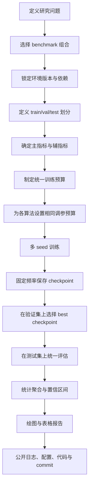
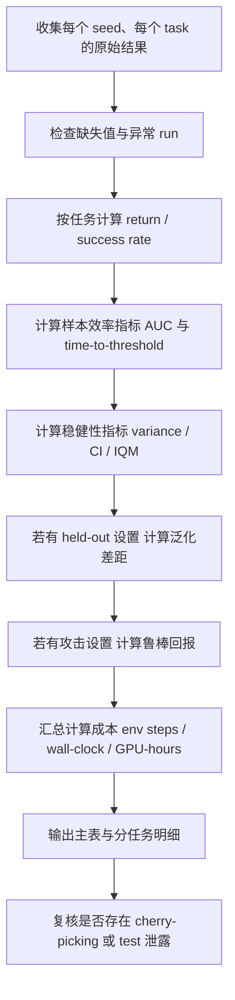

# 强化学习实验验证中的 Benchmark 与 Metric 研究报告

## 执行摘要

强化学习实验验证的核心问题，不是“跑了多少环境”，而是“环境是否覆盖了你要证明的能力维度，指标是否真正反映了算法改进，统计协议是否足以支撑结论”。从今天的主流实践看，benchmark 大致分为四类：像素决策与长期依赖（Atari、Procgen、DeepMind Lab）、标准连续控制（MuJoCo、DMControl）、机器人操作与多任务泛化（Meta-World、robosuite）、以及复杂多智能体/对抗环境（Unity ML-Agents、StarCraft II、Google Research Football）。其中，Atari 和 Procgen 更偏视觉泛化与探索，MuJoCo 和 DMControl 更偏连续控制与优化稳定性，Meta-World 和 robosuite 更偏成功率、泛化与接触操作，SC2LE 与 GRF 更偏协作、对抗、长期规划和部分可观测性。(https://jair.org/index.php/jair/article/download/10819/25823/20168)

如果不指定算力预算或目标应用领域，一个稳妥而严谨的实验组合不是“把所有环境都跑一遍”，而是至少覆盖三层验证：一个经典主 benchmark 用于与文献对比，一个外部 benchmark 用于检验结论可迁移性，一个与目标能力最相关的专项 benchmark 用于证明方法确实解决了你声称的问题。对大多数通用 RL 论文，我更推荐“Atari/Procgen + DMControl/MuJoCo + Meta-World/robosuite 或一个多智能体环境”的三段式组合，而不是只在单一套件上做深度调参。(https://arxiv.org/abs/1709.06560)

指标方面，单报“最终平均回报”已经远远不够。至少要同时报告：任务回报或成功率、样本效率、方差/置信区间、泛化差距、计算成本；若环境是跨任务汇总，最好增加归一化分数与稳健聚合量（如中位数或 IQM）；若方法声称更稳健或更可解释，则必须给出对应扰动强度下的鲁棒回报，或者解释质量的定量指标。只看单点最优 checkpoint、只报最好 seed、只报单环境 SOTA，都是高风险做法。(https://arxiv.org/abs/1709.06560)

实验设计上，当前共识非常明确：少量 seed、缺少不确定性报告、调参与测试混用、环境版本漂移、以及对 benchmark 本身的过拟合，是 RL 论文最常见的失真来源。OpenAI Gym 历史上奠定了标准 API，但官方文档已明确说明 Gym 自 2022 年起不再维护，且旧版 API 在 episode 结束语义和 seeding 上存在可复现性问题，新实验应优先使用其维护分支 Gymnasium 或其他持续维护接口；如果必须复现实验，则必须固定旧版本并明确说明。(https://www.gymlibrary.dev/)

## 研究范围与总体判断

由于你没有指定算力预算，也没有指定目标领域（例如机器人、游戏、多智能体、稀疏奖励、离线 RL），本报告默认面向“通用强化学习算法论文”的实验验证要求：既考虑像素输入，也考虑状态输入；既覆盖单智能体连续控制，也覆盖机器人操作与复杂多智能体。表中的“硬件要求”列因此采用工程分级：**低**表示普通 CPU 即可进行环境仿真；**中**表示 CPU 可跑环境但若要大量并行/像素训练通常需要 GPU；**高**表示环境仿真、渲染或并行训练本身就比较重，通常需要更强 CPU/GPU 与更严格的软件栈管理。这一列是基于官方安装/渲染文档与环境模态做出的工程判断，而不是厂商最低配置声明。(https://ale.farama.org/getting-started/)

一个更实用的选型原则是：**先按“研究问题”选 benchmark，再按“结论风险”选 metric**。如果你关心长期依赖、部分可观测和视觉探索，Atari、Procgen、DeepMind Lab 更合适；如果你关心优化稳定性、连续动作和控制器质量，MuJoCo、DMControl 更合适；如果你关心多任务学习、元强化学习和成功率，Meta-World、robosuite 更合适；如果你关心自博弈、协作-对抗和复杂策略，Unity ML-Agents、StarCraft II、Google Research Football 更合适。(https://ale.farama.org/index.html)

在维护生态上，目前很多经典 benchmark 已经出现“历史影响力仍大，但工程栈已经变化”的情况。由 Farama Foundation 持续维护的 ALE 与 Gymnasium 在 API 与安装上更现代；来自 Google DeepMind 的 dm_control、MuJoCo、PySC2 与 DeepMind Lab 仍然是高影响力来源，但其版本与构建栈需要严格固定；由 Unity Technologies 维护的 Unity ML-Agents 更像“通用研究平台”而不是“单一 benchmark”；SC2LE 则还依赖 Blizzard Entertainment 的游戏资产与运行时。因此，**版本锁定、环境哈希、仓库 commit、依赖清单、ROM/地图/资产来源说明**，在 RL 里不是附属信息，而是实验结果的一部分。(https://github.com/google-deepmind/dm_control)

## 主流 benchmark 平台与套件

下表将主流平台按“任务类型—难度维度—可复现性风险—工程代价”压缩到同一视图中。为了兼顾可读性，我把“许可证与硬件”放在一列里；若某平台的许可证体系并非单一 SPDX，直接注明“多许可证/需复核”。(https://github.com/google-deepmind/dm_control)

| 平台                                | 简介                                                                | 任务类型                              | 典型任务列表                                                                                                                     | 主要难度维度                                         | 可复现性与随机性来源                                                              | 许可证 / 硬件要求                                                              | 官方 / 代表来源                                                                                                |
| --------------------------------- | ----------------------------------------------------------------- | --------------------------------- | -------------------------------------------------------------------------------------------------------------------------- | ---------------------------------------------- | ----------------------------------------------------------------------- | ----------------------------------------------------------------------- | -------------------------------------------------------------------------------------------------------- |
| Atari / ALE                       | Atari 2600 像素 benchmark，强调视觉决策、长期回报与探索。                           | 离散、视觉、长期依赖、稀疏奖励                   | Breakout、Pong、Seaquest、Freeway、Montezuma’s Revenge                                                                         | 高维像素、奖励延迟、探索极难、游戏间异质性极强                        | ROM 安装、sticky actions、动作子集/全动作空间、随机 seed、帧跳设置都会影响结果                     | **GPLv2**；ROM 不随 ale-py 分发且需单独处理；环境仿真本身偏轻，训练视觉 agent 通常需要 GPU           | 官方/安装/动作空间/原始论文/评测协议(https://ale.farama.org/index.html)                                                  |
| OpenAI Gym                        | 历史上最重要的 RL API 与环境集合，统一了实验接口。今天更应把它看成“接口标准与历史基线”，而不是唯一 benchmark。 | 离散、连续、经典控制、Box2D、MuJoCo、Atari 包装器 | CartPole、MountainCar、Acrobot、LunarLander、Taxi、MuJoCo/Atari 家族                                                              | 环境族谱差异大；更多是“统一接口”而不是统一难度                       | 版本后缀与 API 语义重要；旧 `done` 语义、seeding 与 truncation/termination 混淆会影响复现     | **MIT**；官方文档说明 Gym 已自 2022 年起不再维护，且 GitHub 仓库已归档；CPU 需求低到中等             | 官方文档/迁移指南/仓库状态/许可证/白皮书(https://www.gymlibrary.dev/)                                                      |
| MuJoCo                            | 物理引擎本体，广泛通过 Gym/Gymnasium 与 dm_control 暴露为连续控制 benchmark。         | 连续、控制、机器人、接触动力学                   | Ant、HalfCheetah、Hopper、Walker、Humanoid、Reacher、Swimmer                                                                     | 连续动作优化、接触动力学、控制代价与健康约束、奖励设计敏感                  | reset 噪声、接触力、渲染后端、MuJoCo 版本与 wrapper 版本都会改变结果                           | **Apache-2.0**；物理仿真主要吃 CPU；OpenGL 渲染支持 GLFW/EGL/OSMesa，视觉任务与大规模训练常需 GPU | 官方文档/许可证/原始引擎论文/MuJoCo 环境文档(https://github.com/google-deepmind/mujoco/blob/main/LICENSE)                 |
| DMControl                         | 标准化连续控制套件，奖励可解释、任务结构统一；同时包含 locomotion/soccer 等扩展。                | 连续、控制、状态/视觉、单智能体为主，可扩展多智能体        | cartpole-swingup、acrobot-swingup、ball_in_cup-catch、cheetah-run、walker-walk/run、finger-spin、quadruped-walk/run/escape/fetch | 密集/稀疏奖励切换、域内统一比较、从简单控制到四足/取物的层级难度              | 初始状态、任务随机化、物理版本、渲染后端与 release 版本会影响对比                                   | **Apache-2.0**；依赖 MuJoCo；CPU 可跑，视觉/无头硬件加速时 GPU 更有利                      | 官方仓库/套件 README/技术报告/软件论文(https://github.com/google-deepmind/dm_control)                                  |
| MuJoCo Gym / Gymnasium 家族         | 最常见的标准连续控制基准接口层，比直接使用 MuJoCo 更利于与文献对齐。                            | 连续、控制、状态为主                        | HalfCheetah-v5、Hopper-v5、Ant-v5、Walker2d-v5、Humanoid-v5                                                                    | 训练稳定性、reward decomposition、benchmark 饱和与实现细节敏感 | reset 噪声、env version、`mujoco` vs `mujoco-py`、contact force 配置           | 许可证取决于上层库；环境仿真中等，报告时必须写明 env version                                    | 官方环境文档/版本说明(https://gymnasium.farama.org/environments/mujoco/)                                           |
| Procgen                           | 以程序生成关卡测试泛化能力的像素 benchmark。                                       | 离散、视觉、泛化、长期依赖、部分稀疏奖励              | CoinRun、StarPilot、FruitBot、Jumper、Ninja、CaveFlyer 等                                                                        | 训练/测试关卡分布偏移、视觉多样性、对记忆训练关卡的过拟合                  | level seed、训练/测试级别划分、是否使用分布外级别                                          | **MIT**；环境本身相对轻量，像素策略训练通常需要 GPU                                         | 官方仓库/许可证/原始论文([https://meta-world.github.io/](https://github.com/openai/procgen?utm_source=chatgpt.com)) |
| Meta-World                        | 机器人操作多任务/元强化学习 benchmark，包含 50 个操作任务与 ML/MT 评测模式。                 | 连续、控制、机器人、多任务、元学习、成功率导向           | reach、push、pick-place、button-press、drawer-open/close、window-open/close、peg-insert-side；评测模式含 MT1/10/50、ML1/10/45           | 任务间共享结构、多任务干扰、少样本适应、train/test task split      | 目标位置、物体位置、任务 split、同步/异步 vector env、seed 都会影响结果                         | 开源；官方文档支持 Linux/macOS，MT10/50 异步版更吃多进程资源；**当前仓库许可证建议以仓库页复核**            | 官方网站/官方仓库/原始论文(https://meta-world.github.io/)                                                            |
| DeepMind Lab                      | 第一人称 3D 研究平台，突出导航、记忆与谜题求解。                                        | 视觉、3D 导航、部分可观测、长期依赖、稀疏奖励          | nav_maze_static_01、seekavoid_arena_01、lt_chasm，以及更广义的 psychlab/导航类 levels                                                  | 3D 感知、部分可观测、记忆、空间推理、长时序信用分配                    | 关卡脚本、spawn、seed、渲染、构建方式都会带来差异；社区也报告过同 seed 非完全确定性问题                     | **多许可证**：主代码/引擎部分含 GPLv2，部分资源含 CC BY 4.0；Bazel 构建与 3D 渲染带来较高工程门槛        | 官方仓库/levels 文档/许可证/代表性来源(https://github.com/google-deepmind/lab)                                         |
| robosuite                         | 基于 MuJoCo 的模块化机器人学习框架与 benchmark，强调可复现实验与操作任务。                    | 连续、机器人控制、状态/视觉、接触操作、双臂协作          | Lift、Stack、PickPlace、NutAssembly、Door、Wipe、TwoArmLift、TwoArmPegInHole、TwoArmHandover                                       | 接触动力学、相机观测、随机初态、双臂协调、高维动作                      | 物体随机初始化、renderer、hard reset、seed、控制频率、是否使用 offscreen GPU 渲染             | **MIT**；官方支持 macOS/Linux；可有/无 GPU 运行，offscreen 渲染可指定 GPU 设备             | 官方安装/环境文档/许可证/论文(https://github.com/unity-technologies/ml-agents/blob/main/LICENSE.md)                   |
| Unity ML-Agents                   | 基于游戏引擎的通用研究平台，适合视觉、物理、社交复杂度、自博弈和课程学习。                             | 离散/连续、视觉/状态、多智能体、对抗、自博弈、课程学习      | 3DBall、GridWorld、Crawler、Worm、Hallway、SoccerTwos、StrikersVsGoalie、Walker、Pyramids、Match3                                   | 视觉复杂度、物理模拟、社会互动、记忆、稀疏奖励、自博弈训练不稳定               | Unity 物理/时间步、环境参数、行为树、多 agent 同步与自博弈对手池都会引入波动                           | **Apache-2.0**；需要 Unity 编辑器/Player 与 Python 训练栈；视觉与大规模并行通常需要更强 GPU      | 官方许可证/平台论文/示例环境文档(https://github.com/unity-technologies/ml-agents/blob/main/LICENSE.md)                  |
| StarCraft II Learning Environment | RTS 研究环境，原生支持巨大动作空间、部分可观测与长期策略。                                   | 多智能体、对抗、部分可观测、长期依赖、稀疏奖励、视觉/特征并存   | MoveToBeacon、CollectMineralShards、DefeatRoaches、BuildMarines、完整对战                                                          | 实时决策、宏观-微观耦合、超长时序、资源管理、对手博弈                    | fog-of-war、地图、游戏版本、动作延迟、脚本对手与 mini-game 配置都会影响复现                        | **PySC2 仓库 Apache-2.0**；但运行还需要安装 StarCraft II 客户端/地图资源；工程与算力代价高         | 官方仓库/mini-games 文档/许可证/原始论文(https://github.com/google-deepmind/pysc2)                                    |
| Google Research Football          | 物理 3D 足球环境，支持单/多智能体、多人、全场景与 academy 场景。                           | 多智能体、对抗、连续决策、部分可观测、长期依赖           | academy_empty_goal_close、academy_run_to_score、academy_counterattack_easy/hard、全场 benchmark 场景                              | 协同、对抗、稀疏 scoring、全局战术与局部控制并存                   | 场景初始化、物理、对手、观测包装器选择都会影响结果；`simple115` 包装器文档明确指出已知 bug，推荐用 `simple115v2` | **Apache-2.0**；环境与训练成本中到高，多人/全场更重                                       | 官方仓库/论文/许可证/观测文档/示例脚本(https://github.com/google-research/football)                                       |

如果你的论文只解决“优化器更稳定”或“更新规则更高效”，优先用 DMControl/MuJoCo；如果解决“视觉泛化”，优先用 Procgen，并在 Atari 或 DeepMind Lab 做外部验证；如果解决“多任务/元学习/快速适应”，优先用 Meta-World，并在 robosuite 的视觉操作任务做外部泛化；如果解决“对手建模、自博弈或协作”，则需要至少一个真正复杂的多智能体环境，如 Unity SoccerTwos、SC2LE 或 GRF，而不是只在简单 GridWorld 上做证明。(https://arxiv.org/abs/1801.00690)

## 常用评估指标与数学定义

设第 i 次评估 episode 的长度为 T_i，即时奖励为 r_t，折扣因子为 \gamma \in (0,1]。最基础的**累计回报**定义为
$$
G_i=\sum_{t=0}^{T_i-1}\gamma^t r_t.
$$
固定 checkpoint 的**平均回报**定义为
$$
\bar G=\frac{1}{N}\sum_{i=1}^{N} G_i.
$$
对于稀疏操作任务，很多论文更关心是否完成任务，因此**成功率**通常定义为
$$
\mathrm{SR}=\frac{1}{N}\sum_{i=1}^{N}\mathbf{1}\{\text{episode }i\text{ 达成任务条件}\}.
$$
在 Atari 一类跨游戏汇总里，经常还会报告**归一化分数**，最常见的是人类归一化分数
$$
S_{\text{HN}}=\frac{S_{\text{agent}}-S_{\text{random}}}{S_{\text{human}}-S_{\text{random}}}.
$$
这些量分别回答“策略总效用”“期望性能”“任务完成概率”“跨任务可比性”四个不同问题，不能相互替代。(https://jair.org/index.php/jair/article/download/10819/25823/20168)

**样本效率**不应只看“最终分数”，而应看学习曲线整体。若在训练预算横轴 x（通常是 environment steps）上记录若干点 (x_k,R_k)，一种常用离散近似是
$$
\mathrm{AUC}=\frac{1}{x_K-x_1}\sum_{k=1}^{K-1}\frac{R_k+R_{k+1}}{2}(x_{k+1}-x_k),
$$
它衡量“整个训练过程中平均拿到多少性能”。另一个直观指标是**time-to-threshold**
$$
\tau(r^\star)=\inf\{x:\hat R(x)\ge r^\star\},
$$
即首次达到目标性能 $r^\star$ 所需的样本量或时间。$AUC$ 更适合比较整体学习效率，time-to-threshold 更适合“达到可用水平要多久”这一工程问题；但两者都依赖阈值选择或曲线平滑方式，必须预注册或事先固定。(https://arxiv.org/abs/2108.13264)

**稳健性与统计不确定性**至少要报告方差、标准误或置信区间。对某一算法在固定任务上的 seed 级结果 $G^{(1)},\dots,G^{(n)}$，样本方差与标准误分别为
$$
s^2=\frac{1}{n-1}\sum_{j=1}^{n}(G^{(j)}-\bar G)^2,\qquad
\mathrm{SE}=\frac{s}{\sqrt n}.
$$
95% 置信区间可写成
$$
\bar G \pm t_{0.975,n-1}\cdot \mathrm{SE},
$$
或者用 bootstrap 构造。对于跨任务聚合，均值很容易被极端任务主导，因此现在更推荐中位数或 **IQM**（interquartile mean，四分位均值）：
$$
\mathrm{IQM}(x_{1:n})=\frac{2}{n}\sum_{i=n/4+1}^{3n/4}x_{(i)},
$$
其中 x_{(i)} 是排序后的样本。若要直接比较两个算法，还可以报告**概率改进**
$$
\mathrm{PoI}(A,B)=\Pr(X_A>X_B),
$$
它比“平均高多少分”更稳健地回答“随机抽一个任务/seed 时谁更可能更好”。(https://arxiv.org/abs/1806.08295)

**泛化与迁移**最常见的核心量是 train-test gap：
$$
\Delta_{\text{gen}}=\bar G_{\text{train}}-\bar G_{\text{test}},
$$
以及从源任务迁移到目标任务后的相对收益，例如
$$
\mathrm{TE}=\frac{\bar G_{\text{transfer}}-\bar G_{\text{scratch}}}{|\bar G_{\text{scratch}}|+\epsilon}.
$$
如果研究的是 few-shot adaptation，还应报告适应前（zero-shot）与适应后（few-shot / finetuned）的性能曲线，而不是只报单点终值。Procgen、Meta-World 和通用 RL 泛化研究都表明，若没有明确的 train/test split，仅看训练环境上的高分会严重高估算法能力。

==**对抗鲁棒性**在 RL 中通常可定义为扰动预算 $\epsilon$ 下的鲁棒回报
$$
J_{\text{robust}}(\epsilon)=\min_{\delta_t\in\Delta_\epsilon}\mathbb{E}\Big[\sum_{t=0}^{T-1}\gamma^t r_t\Big],
$$
也常报告相对退化率
$$
D_\epsilon=\frac{J(0)-J_{\text{robust}}(\epsilon)}{|J(0)|+\epsilon_0},
$$
以及攻击成功率。这里关键不是“有没有被攻击降分”，而是“在同一扰动预算、同一威胁模型、同一白盒/黑盒设置下，性能下降是否显著更小”。早期工作已经表明，神经网络策略在很小输入扰动下也可能显著掉分，因此如果你的方法声称更 robust，就必须把扰动预算、攻击器、攻击步数和观测空间说清楚。(https://arxiv.org/abs/1702.02284)

**计算成本**至少应拆成四项：环境交互量（$env steps$）、训练总时长（$wall-clock$）、加速卡用量（$accelerator-hours$）与总计算量（近似 $FLOPs$）。最简约而可复现的写法是
$$
\text{GPU-hours}=n_{\text{GPU}}\times \text{训练小时数},
$$
$$
\text{FLOPs}_{\text{total}}\approx \sum_{u=1}^{U}\text{FLOPs}_{\text{fwd+bwd}}(u).
$$
原因很简单：两个方法即使达到同样回报，一个可能花了 10 倍 env steps，另一个可能花了 10 倍 wall-clock，工程意义完全不同。(https://arxiv.org/abs/1709.06560)

**可解释性指标**在 RL 中目前尚无像“平均回报”那样统一的黄金标准，因此更准确地讲，它们是“解释质量指标”。最成熟的一类来自解释学习中的**不忠实度（infidelity）** 与 **敏感度（sensitivity）**。对解释函数 $\Phi$、模型 $f$、输入 $x$，不忠实度可写为
$$
\mathrm{INFD}(\Phi,f,x)=\mathbb{E}_{I}\left[\left(I^\top \Phi(f,x)-\big(f(x)-f(x-I)\big)\right)^2\right],
$$
而敏感度衡量输入小扰动下解释变化有多剧烈，可写成
$$
\mathrm{SENS}(\Phi,f,x,r)=\max_{\|y-x\|\le r}\|\Phi(f,y)-\Phi(f,x)\|.
$$
在 RL 里，这些量更适合拿来比较“解释器”或“状态重要性图”，而不适合直接替代性能分数；如果论文主张“策略更可解释”，最好同时报告解释保真度、解释稳定性，以及人能否据此预测/纠正策略行为。(https://arxiv.org/abs/1901.09392)

### 指标对比表

| 指标                  | 数学定义                                                         | 最适用场景                     | 优点         | 局限与常见误用                         |
| ------------------- | ------------------------------------------------------------ | ------------------------- | ---------- | ------------------------------- |
| 累计回报 $G$            | $\sum_t \gamma^t r_t$                                        | 几乎所有 RL                   | 直接对齐 RL 目标 | 不同 reward scale/不同任务间不可直接横比     |
| 平均回报 $\bar G$       | $\frac1N\sum_i G_i$                                          | 单任务最终性能                   | 简单直观       | 对重尾分布和高方差敏感                     |
| 成功率 $SR$            | $\frac1N\sum_i \mathbf{1}\{\text{success}\}$                 | 机器人操作、稀疏奖励任务              | 容易解释       | 忽略成功前效率与轨迹质量                    |
| 人类归一化分数             | $(S_a-S_r)/(S_h-S_r)$                                        | Atari/跨游戏                 | 便于跨任务聚合    | 受 random/human 基线质量影响，均值易受极端值扭曲 |
| $AUC$               | 学习曲线面积                                                       | 样本效率                      | 综合考虑整段训练   | 依赖预算上限与采样频率                     |
| $Time-to-threshold$ | 首次达到阈值的训练量                                                   | 工程可用性评估                   | 直观回答“多久有用” | 强依赖阈值 $r^\star$选择               |
| 方差 / SE / CI        | $s^2,\ s/\sqrt n$ 等                                          | 所有论文都应报告                  | 呈现不确定性     | 小 seed 下 CI 很宽，不能只报 mean        |
| 中位数 / IQM           | 顺序统计量 / 中间 50% 均值                                            | 跨任务总评                     | 对离群点更稳健    | 需同时配置信区间解释                      |
| 概率改进 PoI            | $\Pr(X_A>X_B)$                                               | 方法 A/B 对比                 | 更接近“谁更可能赢” | 需要完整分布而不是单个平均                   |
| 泛化差距                | $\bar G_{\text{train}}-\bar G_{\text{test}}$                 | Procgen、Meta-World、OOD 设置 | 直接度量过拟合    | 若训练/测试分布没分清则无意义                 |
| 迁移效率 TE             | transfer 与 scratch 的相对差                                      | 迁移/元学习                    | 对问题陈述贴切    | 对分母很小的任务不稳定                     |
| 鲁棒回报                | $\min_{\delta\in\Delta_\epsilon}\mathbb{E}\sum \gamma^t r_t$ | 对抗鲁棒性                     | 明确与威胁模型绑定  | 需要固定攻击器、预算、白/黑盒设定               |
| 计算成本                | $env steps$、$wall-clock$、$GPU-hours$、$FLOP$s                 | 工程与大模型 RL                 | 揭示真实代价     | 很多论文只报 env steps，信息不完整          |
| 解释质量                | infidelity / sensitivity 等                                   | XRL、策略解释                  | 可量化解释器好坏   | 不是统一性能指标，且和人类可用性未必一致            |

以上指标的真正原则可以概括为一句话：**性能、效率、稳健性、泛化、成本必须同时报告，且要与 benchmark 的任务结构匹配。** 例如，在 Meta-World 与 robosuite 中，只报回报而不报成功率通常会掩盖“动作看起来不错但就是没完成任务”的情况；在 Procgen 与 held-out task 设置中，只报训练关卡成绩几乎没有意义；在 Atari 中，只报最终最好游戏而不报跨游戏归一化聚合，会把结论带向 cherry-picking。

## 实验设计与统计协议

如果没有其他约束，我建议默认使用如下**常规论文协议**。首先，**主结果至少使用 10 个随机种子**，尤其是在 Atari、Procgen、DMControl 这类成本相对可控的环境上；如果环境非常昂贵，5 个种子可以作为下限，但必须同时给出置信区间，并在正文中承认统计功效有限；如果方法增益预期很小或者环境噪声很大，则应按效应量做 power analysis，很多情形下需要 20 个甚至更多 seed。这里的关键不是迷信某个固定数字，而是要让“差异是否显著”成为实验设计前置条件，而不是结果出来后再解释。(https://arxiv.org/abs/1806.08295)

统计检验方面，我建议把**置信区间作为主展示，显著性检验作为辅助**。单任务最终性能可报告 95% CI；跨任务聚合推荐同时报告均值/中位数/IQM 中至少两种，并用 bootstrap 给出区间估计。若比较两算法在同一组 task 上的最终得分，可用 Welch t-test、bootstrap 或 permutation test；但不要只给一个 p<0.05 就宣布“显著更优”，因为 RL 数据常常违背正态、同方差和独立同分布假设。更重要的，是直接展示所有 seed 的散点或箱线图，让读者看见分布。(https://arxiv.org/abs/1806.08295)

基线选择上，最常见错误不是“基线太弱”，而是“基线不对题”。如果你的方法改进的是视觉表示学习，就必须对比强视觉基线，而不是只对比状态输入算法；如果你的方法改进的是连续控制优化，就至少要对比该领域公认的强 on-policy / off-policy 基线；如果你的方法主张更好的多任务泛化，就应当与 scratch、多任务共享参数、上下文编码/任务 ID、以及简单正则化方案同时比较。所有基线都应使用**同一训练预算、同一评估协议、同一超参搜索预算**，否则“算法改进”可能只是“你给自己更多调参机会”。(https://arxiv.org/abs/1709.06560)

超参数搜索的更安全做法是：先定义公共搜索空间，再在**验证任务/验证 seed**上搜索，最后冻结配置到测试任务。Procgen、Meta-World、GRF、SC2LE 等具备自然 train/test split、held-out task、held-out level 或 held-out scenario 的平台，尤其不应把测试级别、测试任务、测试对手混进调参闭环。若论文主张泛化，最少要把“训练分布”和“最终报告分布”分开。

早停与 checkpoint 策略也需要规范。推荐按**固定 environment steps**保存 checkpoint，例如每 1e5 或 5e5 steps 保存一次；评估上同时报告两个结果：**last checkpoint** 和 **best validation-selected checkpoint**。前者反映稳定收敛质量，后者反映“如果真的部署时要选一个模型，能做到多好”。千万不要在测试集上挑 best checkpoint，然后把它伪装成“最终性能”；那是典型的数据泄露。(https://arxiv.org/abs/1709.06560)

图表建议上，正文主图我推荐三类。第一，**学习曲线**：横轴优先 env steps，同时在附录给 wall-clock；阴影应是 95% CI 而不只是标准差。第二，**最终性能分布图**：箱线图、violin plot 或 swarm plot，比单个柱状图更真实。第三，**跨任务聚合图**：如果任务很多，用 performance profile 或按任务分组的热力图；雷达图可以作为沟通辅助，但不应作为统计主证据，因为视觉面积会夸大差异。(https://research.google/blog/rliable-towards-reliable-evaluation-reporting-in-reinforcement-learning/)
## 常见陷阱与偏差来源

**过拟合到 benchmark 本身** 是 RL 里非常普遍却经常被低估的问题。最典型的情形是：算法实际上只是学会了 Atari 某些预处理、Procgen 某些训练关卡分布、Meta-World 某些任务共享结构，或者与某个特定 simulator 的 reward engineering 强耦合；一旦换到外部 benchmark，结论就显著衰减。因此，若论文声称“通用提升”，至少要跨套件做一次外部验证。

**选择性报告** 是另一个大坑。只报最好任务、最好 seed、最好 checkpoint、最好环境版本，都会系统性夸大结论。Henderson 等人与后续统计工作都指出，深度 RL 的方差和工程不确定性足够大，以至于少量 run 的偶然波动就能制造出“看起来像改进”的假象。最有效的缓解方法，是公开所有 seed 的原始结果、完整学习曲线与实现 commit，而不是只公开论文图中的汇总值。(https://arxiv.org/abs/1709.06560)

**环境泄露** 主要发生在三处：一是用测试 task/level/opponent 调超参；二是在测试环境上选 checkpoint；三是目标条件、任务 ID、地图特征以显式或隐式方式泄露给策略。对于 Procgen、Meta-World、Generalization benchmark，这会直接让“泛化能力”失真；对于自博弈和足球/RTS 环境，则常见于对手池构造和评测对手复用。缓解方式只有一个：事先固定 split，验证只发生在验证集。

**随机性来源没有分层管理** 也是 RL 论文经常忽视的问题。环境 seed、网络初始化 seed、采样线程顺序、GPU 非确定性算子、物理引擎版本、渲染配置、reset 噪声、sticky action、procedural level seed，本质上不是一个“总 seed”能全部概括的。更严谨的做法是分别固定或记录：代码/依赖版本、环境版本、任务 split、agent seed、环境 seed、并行 workers 配置与硬件后端。(https://arxiv.org/abs/1709.06560)

**API 语义错误** 会悄悄污染结果。一个经典例子是 Gym 老 API 中 `done` 同时混合了任务终止与时间截断，而 Gymnasium 明确将它拆成 `terminated` 与 `truncated`，原因之一就是老接口会导致 bootstrapping、episode return 统计与 replay 切分都出现细微但重要的偏差。复现实验时，如果没有说明自己如何处理 time limit truncation，那么很多 off-policy 与 value-based 结果都可能有不可见偏差。(https://gymnasium.farama.org/introduction/migration_guide/)

**不匹配的主指标** 也是隐蔽陷阱。机器人 manipulation 常常应该把成功率作为主指标、回报作为辅指标；但不少工作反过来做，结果是“训练回报显著提高”却没有带来任务完成率提升。同样，在 Atari/Procgen 上如果只报“最后 1% 训练点的平均成绩”，而不报 AUC 或达到稳定阈值所需样本量，那么所谓“更高效”往往只是“后期更高分”。(https://robosuite.ai/docs/modules/environments.html)

## 可复用清单、表格模板与流程图

### 实验验证清单

1. **明确研究问题**：我要证明的是更高最终性能、更高样本效率、更强泛化、更强鲁棒性，还是更低计算成本。  
2. **选择 benchmark 组合**：至少一个主 benchmark；若宣称“通用提升”，再加一个外部验证 benchmark。  
3. **锁定环境版本**：记录环境名、版本号、仓库 commit、依赖版本、ROM/地图/资产来源。  
4. **定义训练预算**：统一使用 env steps 作为主预算，同时记录 wall-clock 与 GPU-hours。  
5. **写清观测与动作空间**：状态/像素、离散/连续、动作掩码、frame skip、stacking、reward clipping。  
6. **预注册主指标**：主指标只能有一个到两个；其余作为辅指标。  
7. **划分 train/val/test**：若 benchmark 自带 held-out tasks/levels/opponents，只能在 val 上调参。  
8. **统一超参搜索预算**：所有算法使用等规模搜索空间与总试验次数。  
9. **设定 seed 协议**：默认 10 seeds；高成本环境至少 5，并承认统计功效限制。  
10. **固定 checkpoint 频率**：例如每 1e5 steps 存一份；报告 last 与 best-on-val 两种结果。  
11. **输出原始结果文件**：每个 seed、每个 checkpoint、每个 task 的原始日志都保存。  
12. **统计报告**：主文给 mean/median/IQM + 95% CI；附录给全量散点或箱线图。  
13. **成本报告**：env steps、wall-clock、GPU-hours、峰值显存、并行 worker 数。  
14. **异常检查**：确认没有 test 泄露、没有 best-seed 报告、没有版本漂移、没有 API 语义混淆。  
15. **外部复核**：随机抽查 2–3 个任务重跑，确认论文图能从日志重建。  

这份清单的设计逻辑，直接对应当前 RL 领域关于复现危机、seed 数量、统计不确定性与可靠评测的主流经验。citeturn40search0turn39search1turn39search2turn41search2

### 推荐表格模板

**模板一：实验注册表**

| 字段 | 示例/填写说明 |
|---|---|
| 论文问题 | “提升视觉泛化” / “提高连续控制样本效率” |
| 主 benchmark | Procgen / DMControl / Meta-World / SC2LE 等 |
| 外部验证 benchmark | Atari / robosuite / GRF 等 |
| 环境版本 | 例如 `Hopper-v5`, `ale-py==x.y.z`, `dm_control==1.0.xx` |
| 仓库 commit | 训练代码 commit + 环境 wrapper commit |
| 训练预算 | `50M env steps` |
| 评估预算 | `每 checkpoint 100 episodes` |
| 主指标 | `AUC of normalized score` / `Success Rate` |
| 辅指标 | CI、GPU-hours、泛化差距、鲁棒回报 |
| seed 数 | `10` |
| checkpoint 频率 | `每 100k env steps` |
| 调参空间 | 学习率、batch、target update、entropy coef 等 |
| 验证集规则 | held-out levels / held-out tasks / held-out opponents |
| 测试集是否参与调参 | 必须填写“否” |
| 计算资源 | CPU/GPU 型号、数量、显存、RAM |
| 预处理细节 | frame skip、reward clipping、obs normalization 等 |

**模板二：结果总表**

| 算法 | 主指标 | 95% CI | AUC | Time-to-threshold | 成功率 | 泛化差距 | GPU-hours | Wall-clock | Seeds | 备注 |
|---|---:|---:|---:|---:|---:|---:|---:|---:|---:|---|
| Baseline A |  |  |  |  |  |  |  |  |  |  |
| Baseline B |  |  |  |  |  |  |  |  |  |  |
| Ours |  |  |  |  |  |  |  |  |  |  |

**模板三：按任务分解表**

| 任务 | 算法 A mean ± CI | 算法 B mean ± CI | Ours mean ± CI | 胜负关系 | 是否达阈值 |
|---|---:|---:|---:|---|---|
| Task 1 |  |  |  |  |  |
| Task 2 |  |  |  |  |  |
| Task 3 |  |  |  |  |  |

### 实验流程图

### 评估流程图

### 图形报告建议

最推荐的正文图是：**学习曲线图 + 最终性能分布图 + 分任务热力图/性能剖面图**。学习曲线回答“学得怎么样”；分布图回答“稳定不稳定”；热力图或性能剖面回答“到底赢在哪些任务”。箱线图比柱状图更适合 RL，因为 RL 的 run-to-run 波动往往不是高斯噪声，而是多峰或重尾。雷达图可以放在摘要页展示 benchmark 覆盖面，但不要把它当成统计主证据。(https://arxiv.org/abs/1912.05663)

## 开放问题与局限

第一，benchmark 本身也在演化。以 Gym 为例，历史接口与当前维护接口已经发生明显分化；类似地，dm_control、MuJoCo、Unity ML-Agents 的 release 也会持续更新，因此复现旧工作时，**“今天的官方最新版”未必等于“论文当年的环境”**。这一点必须在实验设计中单独说明。(https://www.gymlibrary.dev/)

第二，许多官方文档并不提供严格意义上的“最低硬件需求”，因此本报告中“低/中/高”的硬件分级是工程判断，不应被理解为厂商认证配置；尤其是 Unity、SC2LE、DeepMind Lab 这类 3D/复杂环境，真实瓶颈往往取决于你是否使用像素观测、是否并行仿真、是否自博弈、是否需要视频记录与离屏渲染。(https://github.com/google-deepmind/lab)

第三，Meta-World 的当前官方仓库许可证我在本次报告中没有像其他仓库那样逐行核验证书文本，因此在“许可证”一栏只保守写为开源并建议复核当前仓库页；如果你的论文需要合规审查，这一项应在落地前单独再次确认。(https://github.com/Farama-Foundation/Metaworld)

综合来看，一套高质量的 RL 实验验证，不是 benchmark 名单越长越好，而是要形成**“问题—环境—指标—统计协议—成本”**的一致闭环。只要这个闭环成立，结论才有外推价值；否则，再高的单一 benchmark 分数，也很难说明算法真正进步了。(https://arxiv.org/abs/1709.06560)