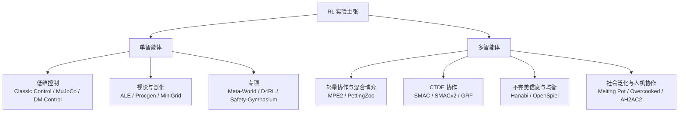
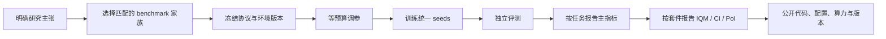

# 强化学习实验验证中的 Benchmark 与 Metric

## 执行摘要

强化学习实验验证里，**benchmark 不是单纯的“环境列表”**，而是“任务分布、观测模态、奖励结构、随机性、接口规范、计算预算与报告协议”的组合；**metric 也不是单纯的平均回报**，而是与研究主张一一对应的测量系统。单智能体研究最常见的基准大致分为：低维控制（Classic Control、MuJoCo、DeepMind Control Suite）、视觉与泛化（ALE/Atari、Procgen、MiniGrid/BabyAI）、专项基准（Meta-World、D4RL、Safety-Gymnasium）；多智能体研究则主要分为：轻量协作/混合博弈（MPE2/PettingZoo）、CTDE 协作（SMAC/SMACv2、Google Research Football）、不完美信息协作（Hanabi）、社会泛化与人机协作（Melting Pot、Overcooked-AI、AH2AC2）。这些基准由 Farama Foundation、Google DeepMind、OpenAI 等生态长期推动，接口层面则基本向 Gymnasium / PettingZoo / OpenSpiel 一类标准化 API 收敛。[1](https://arxiv.org/abs/2407.17032)

如果研究主张是“**样本效率更高**”，应优先选固定交互预算且有清晰 train/test protocol 的基准，如 ALE、Procgen、DM Control、Google Research Football，并报告 AUC、time-to-threshold、最终性能和置信区间；如果主张是“**泛化更好**”，那么 Procgen、SMACv2、Melting Pot、Overcooked Generalisation Challenge 比普通 MuJoCo 更有解释力；如果主张是“**更安全**”，则必须进入带成本信号和约束预算的 Safety Gym / Safety-Gymnasium，并报告奖励、成本、违反率、constraint regret、CVaR；如果主张是“**更会协调或更接近博弈均衡**”，则多智能体 benchmark 之外还需要补充 cross-play、social welfare、NashConv、exploitability、AlphaRank 一类指标。[2](https://openai.com/index/procgen-benchmark/)

当前 RL 论文中最常见的评测失误不是“算法做得不够复杂”，而是**benchmark 与 metric 不匹配**、**环境版本与协议未锁定**、**仅报最好 seed**、**只报 mean 不报置信区间**。Henderson 等指出深度 RL 的方差、实现细节与环境非确定性会显著左右结论；Agarwal 等进一步证明，在少量 seeds 条件下，仅靠均值或中位数常导致错误比较，因而更推荐 IQM、performance profile 与 bootstrap 置信区间；Patterson 等则系统化总结了调参与统计检验的经验设计原则。[3](https://arxiv.org/abs/1709.06560)

## Benchmark 版图与选择逻辑

严格地说，RL benchmark 至少沿着五个轴变化：**动作空间**（离散/连续）、**观测模态**（低维状态/像素/语言/多模态）、**可观测性**（MDP/POMDP/DEC-POMDP/不完美信息博弈）、**数据采样方式**（在线交互/离线数据集/人类代理或背景群体）、以及**研究目标**（控制、泛化、安全、协调、均衡、人与 AI 协作）。Gymnasium 统一了单智能体环境接口，PettingZoo 统一了 MARL 的 AEC/Parallel API，OpenSpiel 则把广义博弈与均衡评测一并纳入同一框架。D4RL 把评测从“环境”扩展到“环境+固定数据集”，Safety-Gymnasium 把“回报+成本”纳入 benchmark 原生接口，而 Melting Pot 与 AH2AC2 则把“与未见伙伴交互的泛化”作为主任务而非附加测试。[4](https://gymnasium.farama.org/index.html)

**版本与协议锁定**是 benchmark 选择的第一原则，而不是实验后再补充的“实现细节”。ALE 的现代协议强调 sticky actions 等随机化设置；Gymnasium 的 MuJoCo 不同版本（v2/v3、v4、v5）训练结果不直接可比；Meta-World+ 明确指出 Meta-World 历史上存在未文档化变更；SMAC 官方仓库也直接提醒，旧论文随附 runs 与当前版本 StarCraft II 的结果不可直接比较。换言之，任何“比前人高 x%”的结论，必须先回答“**是不是同一个 benchmark 实例与 protocol**”。[5](https://arxiv.org/abs/1709.06009)

## 单智能体 RL benchmark

下表优先覆盖**在线交互式**基准；需要注意，表中的“常见基线结果”是**paper-native、protocol-native** 的代表性结论，用来说明 benchmark 的区分度与主流基线，而不是跨论文可直接横向排序的 leaderboard。[5](https://arxiv.org/abs/1709.06009)

| Benchmark                 | 官方名称与链接                                                                                                                   | 奠基 / 近期代表论文                                              | 任务类型                    | 环境特性                                                                                              | 规模、API、成本、复现                                                                                                    | 常见基线与代表结果                                                                                                                                            |
| ------------------------- | ------------------------------------------------------------------------------------------------------------------------- | -------------------------------------------------------- | ----------------------- | ------------------------------------------------------------------------------------------------- | --------------------------------------------------------------------------------------------------------------- | ---------------------------------------------------------------------------------------------------------------------------------------------------- |
| Gymnasium Classic Control | **Gymnasium Classic Control**；`https://gymnasium.farama.org/environments/classic_control/`                                | Gymnasium 标准化论文（2024）                                    | 低维、离散/连续控制              | 5 个环境；随机初始态；情节式；多为 dense reward；状态维度很小                                                            | Gymnasium API；CPU 即可；复现难度低；最适合 sanity check 与 ablation 起点                                                       | DQN/A2C/PPO 一类方法通常很快接近饱和分数，因此它更适合查错、调参和验证收敛性，不适合作为“高区分度 SOTA 基准”。 https://gymnasium.farama.org/environments/classic_control/                         |
| ALE                       | **Arcade Learning Environment**；`https://ale.farama.org/`                                                                 | ALE（2013）；DQN（2015）；Rainbow（2018）；Agent57（2020）          | 视觉、离散控制                 | Atari 2600 像素输入；常视作 POMDP；情节式；不同游戏稀疏/稠密奖励差异很大；现代协议常用 sticky actions 注入随机性                         | Gymnasium / Python / C++；官方平台支持 Atari 2600 ROM，研究上常用 Atari57；计算成本中高；预处理、frameskip、life loss、sticky actions 必须锁定 | DQN 建立了像素控制基线；Rainbow 同时提升 data efficiency 与最终性能；Agent57 首次在标准 Atari57 上“全部 57 个游戏都超过标准人类基线”。 https://ale.farama.org/index.html                      |
| Gymnasium MuJoCo          | **Gymnasium MuJoCo**；`https://gymnasium.farama.org/environments/mujoco/`；`https://github.com/google-deepmind/mujoco`      | MuJoCo 引擎（2012）；PPO（2017）；TD3（2018）                      | 连续控制、机器人运动学             | 11 个环境；低维状态由 qpos/qvel 拼接；连续动作；随机初始态；情节式；通常 dense reward                                          | Gymnasium API；CPU/GPU 均可；成本中等；需要严格固定 simulator 与 env version，v2/v3/v4/v5 不可随意横比                                 | PPO 是通用 on-policy 强基线；TD3 表明在经典 MuJoCo 连续控制上系统性优于 DDPG；常用于比较样本效率与最终回报。https://gymnasium.farama.org/environments/mujoco/                              |
| DM Control                | **DeepMind Control Suite**；`https://github.com/google-deepmind/dm_control`                                                | DM Control Suite（2018）；DrQ-v2（2021）；DreamerV3（2023/2025） | 连续控制；既可低维也可视觉控制         | 标准化、可解释 reward；基于 MuJoCo；多域多任务；官方 `suite.BENCHMARKING` 暴露标准任务集，另含 quadruped 4 任务；多为情节式            | Python API；与 JAX/PyTorch wrapper 生态相容；低维设定成本中等，像素设定中高；渲染 backend 与 MuJoCo 版本需固定                                 | DrQ-v2 在视觉连续控制上是长期强基线，并报告多数任务单 GPU 约 8 小时即可训练；DreamerV3 展示了跨 150+ 任务统一超参的可扩展性。https://arxiv.org/abs/1801.00690                                       |
| Procgen                   | **Procgen Benchmark**；`https://openai.com/index/procgen-benchmark/`                                                       | Procgen（2019）；近期泛化改进（2024）                               | 视觉、离散、程序生成              | 16 个环境；train/test level 可区分；天然用于测样本效率与泛化；情节式；奖励密度随任务变化                                            | Gym 风格 API；计算成本中等到较高；复现关键在于 level split、训练 level 数量与 evaluation seeds                                           | 原始工作表明 PPO 等方法存在明显 overfitting 与 train-test gap；2024 年工作通过简单架构缩放将 Procgen optimality gap 从 0.58 降到 0.36。 https://openai.com/index/procgen-benchmark/ |
| Minigrid / BabyAI         | **Minigrid**；`https://minigrid.farama.org/`                                                                               | MiniGrid / MiniWorld 综述与统一 API（2023）；BabyAI 扩展           | 2D 网格、离散控制、部分可观测、可带语言指令 | 面向导航、记忆、钥匙门、房间、多房间与指令跟随；POMDP；任务是族而非固定单一集合；可轻松参数化难度；reward 可稀疏                                    | Gymnasium API；极低计算成本；复现友好；尤其适合研究探索、记忆、分层、指令跟随与 curriculum                                                       | 常见做法是 PPO/RNN/IL 组合；比较通常看 success rate、steps-to-solve 与泛化至更大地图或未见指令；其优势在于低成本与高度可控。 https://minigrid.farama.org/index.html                            |
| Meta-World                | **Meta-World**；`https://metaworld.farama.org/`；`https://meta-world.github.io/`                                            | Meta-World（2019）；Meta-World+（2025）                       | 多任务/元强化学习、连续控制机械臂操控     | 50 个操作任务；MT1/10/50 与 ML1/10/45；低维状态、连续动作；成功率是最常用指标；任务含共同结构但测试任务保留分布外变化                            | Gymnasium API；机械臂仿真成本中等到高；复现难点在于版本漂移与 benchmark split；Meta-World+ 专门解决历史不可比问题                                   | 原始论文中，multi-headed SAC 在 MT50 上约 40% 成功率；ML10 上 MAML 与 RL^2 约 40% 与 10%，PEARL 在 ML45 测试上约 30%。 https://github.com/Farama-Foundation/Metaworld        |
| D4RL                      | **D4RL**；`https://github.com/Farama-Foundation/D4RL`；`https://sites.google.com/view/d4rl-anonymous/`                      | D4RL（2020）；IQL（2021）                                     | 离线 RL                   | 静态数据集训练；含 Maze2D、AntMaze、Adroit、Gym、Flow、CARLA、FrankaKitchen 等 7 类域；总计 40+ 任务；常报 normalized score | 原始接口为 Gym；现有 Minari 复刻；无在线采样，训练成本主要来自更新步数；复现难点在于数据版本与归一化协议                                                      | IQL 被广泛视为 D4RL 强基线之一；D4RL 的核心价值不在环境本身，而在“固定数据分布”对外推误差与 policy constraint 的检验。 https://bair.berkeley.edu/blog/2020/06/25/D4RL/                        |
| Safety-Gymnasium          | **Safety-Gymnasium**；`https://sites.google.com/view/safety-gymnasium`；`https://github.com/PKU-Alignment/safety-gymnasium` | Safety-Gymnasium（2023）                                   | 安全 RL；单/多智能体；向量与视觉输入    | 安全约束原生化；54 个环境；同时评奖励与成本；既有 goal-navigation 式任务，也可扩展更多 safety-critical 设置                          | SafeRL API 与 Gymnasium 风格兼容；成本中高；复现时必须同时固定 reward、cost、budget 与算法约束实现                                           | 官方同时提供 16 个 SafeRL 算法基线；论文强调现有方法距离“高回报 + 低违反 + 低成本 regret”的联合目标仍有明显差距。 https://arxiv.org/abs/2310.12567                                              |

单智能体 benchmark 的经验性结论很清楚：**不要只用一种 benchmark 家族就声称“通用改进”**。Classic Control 主要回答“能否正确实现”；MuJoCo/DM Control 主要回答“连续控制是否有效”；ALE/Procgen 更适合检验视觉学习、样本效率与泛化；Meta-World 检查多任务与快速适应；D4RL 回答静态数据分布下能否稳定学到比行为策略更好的策略；Safety-Gymnasium 则把 reward-maximization 与 safety-compliance 同时纳入实验目标。若论文主张涉及“泛化”“安全”“离线增强”“快速适应”，只报 MuJoCo 回报通常没有足够说服力。(https://openai.com/index/procgen-benchmark/)

## 多智能体 RL benchmark

多智能体 benchmark 的差异比单智能体更大，因为除了状态、动作、观测外，还要考虑**伙伴/对手分布是否固定**、**是否部分可观测**、**是否允许集中训练分散执行（CTDE）**、**是否需要推理他人策略与协议**、以及**评价目标是团队完成、社会泛化还是博弈均衡**。对协作 MARL 而言，只在 self-play 上看平均回报远远不够。(https://pettingzoo.farama.org/index.html)

| Benchmark                | 官方名称与链接                                               | 奠基 / 近期代表论文                                          | 任务类型                                | 环境特性                                                     | 规模、API、成本、复现                                        | 常见基线与代表结果                                           |
| ------------------------ | ------------------------------------------------------------ | ------------------------------------------------------------ | --------------------------------------- | ------------------------------------------------------------ | ------------------------------------------------------------ | ------------------------------------------------------------ |
| MPE2 / PettingZoo        | **Multi Particle Environments 2**；`https://mpe2.farama.org/`；`https://pettingzoo.farama.org/` | MADDPG / MPE 原始论文（2017）；MAPPO 统一基线（2022）        | 协作、对抗、混合博弈                    | 2D 粒子世界；局部观测；连续几何关系但常用离散动作；通信/追逐/覆盖/对抗等；情节式 | 9 个经典场景；PettingZoo AEC/Parallel 生态；CPU 成本低；复现难度低 | MADDPG 是原始强基线；MAPPO 论文显示在 cooperative MPE 中，PPO 系方法在最终回报和样本效率上都可作为现代强对照。 https://pettingzoo.farama.org/environments/mpe/ |
| SMAC                     | **StarCraft Multi-Agent Challenge**；`https://github.com/oxwhirl/smac` | SMAC（2019）；MAPPO（2022）                                  | 协作、部分可观测、CTDE                  | 基于 entity["video_game","StarCraft II","rts game 2010"] 微操；每个单位一个 agent；局部观测、高维输入、稀疏信用分配；情节式；标准指标是 test win rate | 14 个多样化 combat scenarios；依赖 StarCraft II、PySC2、maps；成本高；官方明确提醒旧 runs 与当前 SC2 版本不可直接比较 | 原始论文中 QMIX 平均 test win 最高，并在 easy 场景上超过 95%；IQL/VDN/QMIX 明显强于 COMA；之后 MAPPO 被证明是非常强的统一对照基线。 https://arxiv.org/pdf/1902.04043 |
| SMACv2                   | **SMACv2**；`https://github.com/oxwhirl/smacv2`              | SMACv2（2023）                                               | 协作、泛化、部分可观测                  | 用程序生成替代固定地图；评测要求在同分布未见设置上泛化；并加入 EPO 扩展部分可观测挑战；从“记住脚本”转向“闭环反应” | 固定地图计数不再是核心，重点是 scenario distributions；API 与 SMAC 保持一致；成本高；对算法泛化能力区分度强 | 官方分析表明原 SMAC 的不少场景可被 open-loop 策略非平凡解决，而 SMACv2 明确修复了这一缺陷；对现有 SOTA 仍有显著挑战。 https://github.com/oxwhirl/smacv2 |
| Hanabi Challenge         | **Hanabi Learning Environment**；`https://github.com/google-deepmind/hanabi-learning-environment` | Hanabi Challenge（2019/2020）；MAPPO 统一基线（2022）        | 纯协作、不完美信息、隐式通信            | 卡牌博弈；2–5 玩家设置；符号观测而非像素，但状态/信念空间组合爆炸；强调 convention、theory of mind 与信用分配 | 单一 canonical game + 多玩家配置；RL API 类 Gym；环境 repo 已在 2024-04-18 归档只读；环境步成本低但策略复杂度高 | 平均 game score 是最常用指标；原始挑战论文提供标准化实验框架；MAPPO 工作表明 PPO 系方法可成为与 SAD/其他 off-policy 方法并列的强基线。 https://arxiv.org/abs/1902.00506 |
| Google Research Football | **Google Research Football**；`https://github.com/google-research/football` | GRF（2019/2020）；11v11 multi-agent study（2023/2024）       | 协作/对抗、视觉或向量观测、单/多智能体  | 3D 物理足球环境；支持 raw features 与像素；11v11 full-game + academy scenarios；奖励可用 sparse scoring 或 checkpoint shaping | 3 个 full-game benchmark + 11 个 Football Academy 场景；Gym 风格 API；安装依赖较重；计算成本高 | 原始论文中 easy benchmark 三种基线都较快解决；medium benchmark 只有 IMPALA 在 500M steps 时勉强打正；hard benchmark 只有 IMPALA+checkpoint reward 在 500M steps 时出现正分。 https://github.com/google-research/football |
| Melting Pot              | **Melting Pot**；`https://github.com/google-deepmind/meltingpot` | Melting Pot（2021）；Melting Pot 2.0（2022）                 | 社会困境、社会泛化、未见伙伴交互        | 多主体游戏基底 + held-out social scenarios；覆盖合作、竞争、欺骗、互惠、信任等；不是只看单局得分，而是看对新社会情境和陌生个体的泛化 | 50+ substrates、256+ test scenarios；Python 包；训练往往需大规模分布式 actor-learner；复现难度很高 | Melting Pot 2.0 使用 ACB、V-MPO、OPRE 及 prosocial 变体；官方训练规模达到 $10^9$ steps，并用 CPU actor + TPU learner 的分布式架构，明确说明这是高算力 benchmark。 https://github.com/google-deepmind/meltingpot |
| Overcooked-AI / OGC      | **Overcooked-AI**；`https://github.com/HumanCompatibleAI/overcooked_ai` | Overcooked-AI（2019）；Overcooked Generalisation Challenge（2024/2025） | 完全协作、人机协作、零样本 coordination | 双人厨房任务；共享回报；强调分工、避碰、 convention 与 ad-hoc teaming；常以不同 layout、不同 partner 测试 generalization | 多 canonical layouts + 可编程生成；Python 环境 + web interface；步成本低，partner diversity 是真正难点 | OGC 表明当前 SOTA 仍难同时泛化到未见布局和未见伙伴；这使其成为检验“zero-shot cooperation”比普通 self-play 更有力的基准。 https://github.com/HumanCompatibleAI/overcooked_ai |

如果研究目标是**人与 AI 的 ad-hoc coordination**，2025 年提出的 **AH2AC2** 值得单独加入评测：它在 Hanabi 上构建受控的人类代理评测系统，使用 **3,079 局人类游戏**训练 human-like proxy，并报告 2 人与 3 人设置下的基线成绩；它的重要性在于把“与真正人类配合太贵、太噪声、不可重现”的问题转化成可公开重复的 benchmark。**如果研究目标是博弈均衡收敛、可剥削性或策略族排序**，则应把 **OpenSpiel** 作为补充评测层，因为它内建 exploitability、NashConv、AlphaRank 等工具，并覆盖 70+ 游戏/环境。https://openreview.net/forum?id=FuGps5Zyia

## Metric 体系与比较

记单智能体轨迹回报为 $G_t=\sum_{k=0}^{T-t-1}\gamma^k r_{t+k+1}$，策略性能为 $J(\pi)=\mathbb{E}_\pi[G_0]$；多智能体里第 $i$ 个体的效用写作 $u_i(\pi)$ 或个体回报 $J_i(\pi)$。很多论文把 metric 混在一起讨论，但严格说应区分为三层：**任务层**（return、success、score、cost）、**学习过程层**（sample efficiency、regret、stability）、**群体/博弈层**（social welfare、cross-play、NashConv、exploitability、ranking）。(https://web.stanford.edu/class/psych209/Readings/SuttonBartoIPRLBook2ndEd.pdf)

### 通用 RL metric 比较表

| Metric                     | 形式定义                                                                                                                                              | 实现注意事项                                                                               | 优点                         | 局限                                       | 适用场景                                                                                                                                   |
| -------------------------- | ------------------------------------------------------------------------------------------------------------------------------------------------- | ------------------------------------------------------------------------------------ | -------------------------- | ---------------------------------------- | -------------------------------------------------------------------------------------------------------------------------------------- |
| 期望折扣回报                     | $J(\pi)=\mathbb{E}_\pi[\sum_{t=0}^{T-1}\gamma^t r_t]$                                                                                             | 明确 $\gamma$、episode truncation、是否把 time-limit 当 terminal；连续任务可报平均 reward rate        | 最通用，直接对应 RL 目标             | 不同 benchmark 奖励尺度不可直接比；对 outlier task 敏感 | 几乎所有在线 RL 主指标。https://web.stanford.edu/class/psych209/Readings/SuttonBartoIPRLBook2ndEd.pdf                                            |
| 未折扣 episodic return        | $J_{\text{epi}}(\pi)=\mathbb{E}_\pi[\sum_{t=0}^{T-1} r_t]$                                                                                        | 固定 horizon；需注明是否 reward clipping / shaping                                           | 解释性强，便于工程任务沟通              | 长任务中不同 horizon 不可比                       | 机器人、GRF、Overcooked 等固定 episode 长度任务。https://web.stanford.edu/class/psych209/Readings/SuttonBartoIPRLBook2ndEd.pdf                      |
| 成功率                        | $\text{SR}=\frac{1}{N}\sum_{i=1}^N \mathbf{1}\{\text{success}_i\}$                                                                                | success 条件要事先定义并冻结；多任务时应同时报 per-task success                                         | 对稀疏奖励和操作任务更直观              | 丢失“接近成功”的细粒度信息                           | Meta-World、MiniGrid、某些机器人操作/导航任务。https://zhanpenghe.github.io/publications/meta_world.pdf                                              |
| 归一化分数                      | Atari HNS 常写作 $100\!\times\!\frac{S_{\text{agent}}-S_{\text{random}}}{S_{\text{human}}-S_{\text{random}}}$；D4RL 常用 task-specific normalized score | **只能在同一归一化协议内比较**；报告随机/人类/专家锚点来源；同一环境不同版本锚点也可能变化                                     | 便于跨任务聚合                    | 非线性、对锚点敏感；不同 benchmark 归一化不可互换           | Atari、D4RL 等套件汇总。https://proceedings.mlr.press/v119/badia20a.html                                                                      |
| 样本效率                       | 常用 AUC：$\text{AUC}(T)=\frac{1}{T}\int_0^T \bar J(t)\,dt$；或 steps-to-threshold                                                                     | 横轴必须明确是 env steps、frames、episodes 还是 wall-clock；多进程环境要报告 aggregate interaction count | 捕捉“多快学会”而非只看终点             | 对评测频率和 smoothing 敏感                      | Procgen、ALE、DM Control、GRF 等。https://openai.com/index/procgen-benchmark/                                                               |
| 渐近性能                       | 常用最后 $K$ 个 eval 点的均值：$\frac1K\sum_{k=T-K+1}^{T}\bar J(k)$                                                                                         | $K$ 要固定；不要只报单次 best checkpoint                                                       | 反映最终能力                     | 忽略学习早期成本                                 | 当论文主张“最终上限更高”时。https://proceedings.neurips.cc/paper/2021/hash/f514cec81cb148559cf475e7426eed5e-Abstract.html                           |
| Regret                     | $Reg(T)=\sum_{t=1}^T(V^\star_t - V^{\pi_t}_t)$；bandit 里常写 pseudo-regret                                                                           | 需给出最优基准是谁：最优臂、最优 policy 还是 oracle                                                    | 很适合在线决策与探索分析               | 深度 RL 中真实 $V^\star$ 往往未知，不易精确估计          | bandit、在线最优性分析、探索论文。https://web.stanford.edu/class/psych209/Readings/SuttonBartoIPRLBook2ndEd.pdf                                      |
| 稳定性 / 不确定性                 | 按 seeds 统计；推荐 IQM：对 pooled scores 去掉上下四分位后求均值；并报 stratified bootstrap CI                                                                          | 不应只报 mean±std；few-run regime 推荐 IQM、median、optimality gap、probability of improvement | 对 outlier 更稳，统计效率优于 median | 读者对 IQM 直觉较弱，需要解释                        | benchmark suite 聚合、少 seeds 深度 RL。https://research.google/blog/rliable-towards-reliable-evaluation-reporting-in-reinforcement-learning/ |
| Probability of Improvement | $\Pr(X>Y)$，实践中可用 task-wise Mann–Whitney 型估计                                                                                                       | 应在相同任务集合与 seed budget 上比较；最好配 CI                                                     | 直观回答“算法 A 是否通常优于 B”        | 不是效应大小的完整替代                              | 两算法 benchmark-level 比较。https://araffin.github.io/post/rliable/                                                                         |
| 泛化差距                       | $\text{Gap}=J_{\text{train}}-J_{\text{test}}$；也可报 OOD success / score                                                                             | train/test split 必须在 benchmark 级别预先定义；不能用 test tasks 调参                              | 直接衡量 overfitting           | split 设计本身会强影响结果                         | Procgen、SMACv2、Melting Pot、OGC。https://arxiv.org/pdf/1812.02341                                                                        |
| 鲁棒性 / 风险                   | 扰动平均性能 $J_{\mathcal P}(\pi)=\mathbb{E}_{\xi\sim\mathcal P}[J(\pi;\xi)]$；风险常用 $\text{CVaR}_\alpha(Z)=\mathbb{E}[Z\mid Z\le q_\alpha(Z)]$           | 需定义扰动分布：观测噪声、动力学偏移、对手变化、伙伴变化；CVaR 要注明 $\alpha$ 与对 reward 还是 cost 计算                  | 能看均值之外的尾部失败                | 计算与报告成本高                                 | 安全、部署、domain shift 研究。https://arxiv.org/abs/2206.04436                                                                                 |
| 安全指标                       | 期望累计成本 $J_c(\pi)=\mathbb{E}[\sum_t \gamma^t c_t]$；违反率 $\Pr(c_t>d)$；constraint regret 常写成训练期累计超预算                                                  | 必须同时报告 reward 与 cost；单报“低成本”或单报“高回报”都不充分                                             | 直接反映安全合规                   | 安全目标常与回报冲突，需 Pareto 式阅读                  | Safety Gym / Safety-Gymnasium / constrained RL。https://cdn.openai.com/safexp-short.pdf                                                 |

### 多智能体与博弈特有 metric 比较表

| Metric                              | 形式定义                                                                                                                                     | 实现注意事项                                                | 优点                                      | 局限                                  | 适用场景                                                                                |
| ----------------------------------- | ---------------------------------------------------------------------------------------------------------------------------------------- | ----------------------------------------------------- | --------------------------------------- | ----------------------------------- | ----------------------------------------------------------------------------------- |
| 团队回报 / 平均个体回报                       | $J_{\text{team}}=\sum_i J_i$ 或 $\frac1n\sum_i J_i$                                                                                       | 共享奖励环境里常与单个个体回报等价；必须说明是联合回报还是 per-agent 平均            | 协作任务直观                                  | 不能揭示不公平分配与搭便车                       | SMAC、MPE cooperative、GRF cooperative。https://arxiv.org/abs/1902.04043               |
| Social Welfare                      | Utilitarian welfare 常取 $W=\sum_i J_i$；公平性更强时常考虑 Nash social welfare $W_{\text{NSW}}=\prod_i (J_i+\epsilon)$ 或 $\sum_i\log(J_i+\epsilon)$ | 需处理负回报与零值稳定性；最好同时报个体回报分布                              | 兼顾集体收益，NSW 还能鼓励公平                       | 解释依赖 welfare 选择，跨论文不统一              | 社会困境、资源分配、合作公平性。https://www.southampton.ac.uk/~eg/AAMAS2023/pdfs/p1991.pdf          |
| Cross-play / Partner Generalization |  $CP(\pi)=\frac1{\|P\|}\sum_{p\in P}J(\pi,p)$；也可报 $worst-partner (\min_{p\in P}J(\pi,p))$                                             | $\displaystyle X_{ab}=J(\pi_a,\pi_b)$, 再汇总其均值/最小值/IQM | Hanabi、Overcooked、population-based MARL | 伙伴/对手集合必须固定并可公开；最好给整张 cross-play 矩阵 | 直接测零样本协作与鲁棒性https://arxiv.org/html/2512.08877v2                                     |
| NashConv                            | $\text{NashConv}(\pi)=\sum_i \delta_i(\pi)$，其中 $\delta_i(\pi)=\max_{\pi_i'}u_i(\pi_i',\pi_{-i})-u_i(\pi)$                                | 需要可计算 best response；大博弈通常要近似                          | 直接度量离 Nash equilibrium 还有多远，0 最好        | 大规模博弈计算昂贵                           | OpenSpiel、扑克、Goofspiel、Leduc 等。https://www.ijcai.org/proceedings/2022/0484.pdf      |
| Exploitability                      | 二人零和时常写作 $\text{Exploitability}(\pi)=\text{NashConv}(\pi)/n$                                                                             | exact BR 往往不可算，实践中常用 approximate exploitability       | 与“最坏对手能赢你多少”直接相关                        | 对通用-sum 或大状态空间不总是方便                 | 不完美信息博弈、策略安全性评估。https://www.ijcai.org/proceedings/2022/0484.pdf                     |
| AlphaRank                           | 基于经验 payoff table 上的进化动力学构造 Markov chain，对策略/群体给出稳态 ranking mass                                                                         | 先要有足够密集的对战 payoff 矩阵；非传递博弈里比 Elo 更稳妥                  | 能处理 non-transitive 关系                   | 需要成对对战成本                            | 多策略族评测、population-based training。https://www.nature.com/articles/s41598-019-45619-9 |
| Elo / TrueSkill 类评级                 | 由 head-to-head 胜负迭代更新标量实力值                                                                                                               | 适合近传递的一对一对战；遇到石头剪刀布式非传递关系时会误导                         | 简单、直观、工程上常用                             | 不适合强 non-transitivity、多方博弈和合作博弈     | 自对弈竞技、联赛式对战。https://arxiv.org/html/2408.01072v1                                     |

一个常被忽略但非常重要的事实是：**“主指标”和“汇总指标”必须同时存在**。例如，SMAC 的主指标是 map-level win rate，D4RL 的主指标是 normalized score，Meta-World 的主指标通常是 success rate，Safety benchmark 里则至少要同时报 reward 与 cost；但当你要在整套 benchmark 上得出“算法 A 整体更强”的结论时，应该再用 IQM、probability of improvement、performance profile 等统计层指标来汇总，而不是只给出 1 个均值。(https://zhanpenghe.github.io/publications/meta_world.pdf)

## 实验协议与最佳实践

下表给出一个更实用的“**研究主张—benchmark—metric**”对应关系。真正严谨的实验，不是把所有环境都跑一遍，而是让 benchmark 和 metric 正好检验你的主张。(https://jmlr.org/papers/volume25/23-0183/23-0183.pdf)

| 研究主张         | 推荐 benchmark                   | 主指标                                                      | 必报补充项                                                                                        |
| ------------ | ------------------------------ | -------------------------------------------------------- | -------------------------------------------------------------------------------------------- |
| 样本效率更高       | ALE、Procgen、DM Control、GRF     | AUC、steps-to-threshold、early/mid training return         | 最终回报、wall-clock、actor 数、硬件。https://openai.com/index/procgen-benchmark/                       |
| 最终性能更高       | MuJoCo、DM Control、ALE          | final $K$-eval mean / median return                      | seeds、CI、同版本说明。https://gymnasium.farama.org/environments/mujoco/                             |
| 泛化更好         | Procgen、SMACv2、Melting Pot、OGC | test score、generalization gap、cross-play                 | train/test split、partner split、禁止 test 调参。https://arxiv.org/abs/2212.07489                   |
| 更安全          | Safety-Gymnasium               | reward、cost return、violation rate、constraint regret、CVaR | budget、cost shaping、是否用 shield / constraint layer。https://openreview.net/forum?id=WZmlxIuIGR |
| 更会协调 / 更接近均衡 | SMAC、Hanabi、OpenSpiel          | win rate / score、social welfare、NashConv、exploitability  | self-play + cross-play + approximate BR 细节。https://arxiv.org/pdf/1902.04043                  |

具体协议上，建议至少做到以下六点。

1. **固定环境与协议版本。** 报告环境名、版本号、模拟器版本、观测预处理、reward shaping、时间截断、action repeat / frameskip、sticky actions、地图或关卡 split。对 Atari、MuJoCo、Meta-World、SMAC 这类协议敏感 benchmark，这一步不是附录装饰，而是结论成立的前提。(https://jmlr.org/papers/volume25/23-0183/23-0183.pdf)

2. **等预算调参，调参集与测试集严格分离。** 同一 benchmark 上，所有算法应当享有同等调参预算，并在验证任务、验证 seeds 或开发集上调参；不能在 test tasks、held-out levels、未见伙伴上反复试到最好为止。经验设计与 benchmark 论文都反复强调，调参泄漏会把“泛化改进”偷换成“test-set fitting”。(https://jmlr.org/papers/volume25/23-0183/23-0183.pdf)

3. **报告足够多的随机种子。** 深度 RL 文献普遍认为 5 个 seeds 只是最低限，若方差大或主张细微改进，10 个或更多更可靠；关键不是机械记一个数字，而是让 seeds 对所有算法一致，并把每个 seed 的完整学习曲线保存下来。(https://arxiv.org/abs/1709.06560)

4. **同时报告任务层结果与统计层汇总。** 每个任务给出学习曲线与终点指标；跨任务再给 IQM、median、bootstrap 置信区间、probability of improvement。不要只给 averaged learning curve，更不要只给 best seed 或 single checkpoint。(https://proceedings.neurips.cc/paper/2021/hash/f514cec81cb148559cf475e7426eed5e-Abstract.html)

5. **多智能体必须把 self-play 与 cross-play 分开。** 只在 self-play 上好，不能推出对陌生伙伴、陌生对手或未见社会情境也好。对协作任务，至少给 partner generalization / cross-play matrix；对博弈问题，若状态空间允许，再给 NashConv 或 exploitability。Melting Pot、OGC、AH2AC2 的核心意义，恰恰在于纠正“只看自对弈平均分”的偏差。(https://github.com/google-deepmind/meltingpot)

6. **报告算力与吞吐。** 仅报 environment steps 不够；应同时给 wall-clock、CPU/GPU/TPU 型号、actor/learner 架构、并行环境数、batch size、梯度更新步数、replay ratio、显存占用与是否使用分布式系统。尤其在 SMAC、GRF、Melting Pot 这类基准上，“谁更有效”往往取决于你按样本、按时间还是按总计算量评估。(https://arxiv.org/pdf/2211.13746)

最后，一个实务上很有用的最小报告模板是：**(a)** benchmark 与版本；**(b)** 训练/验证/测试 split；**(c)** 主指标与汇总指标；**(d)** seeds 与 CI；**(e)** 计算预算；**(f)** 开源代码、配置、依赖、commit hash 与 checkpoints。满足这六项，读者才有可能判断你的改进到底来自算法本身，还是来自 benchmark 选择、实现细节、算力规模或统计偶然性。(https://arxiv.org/abs/1709.06560)