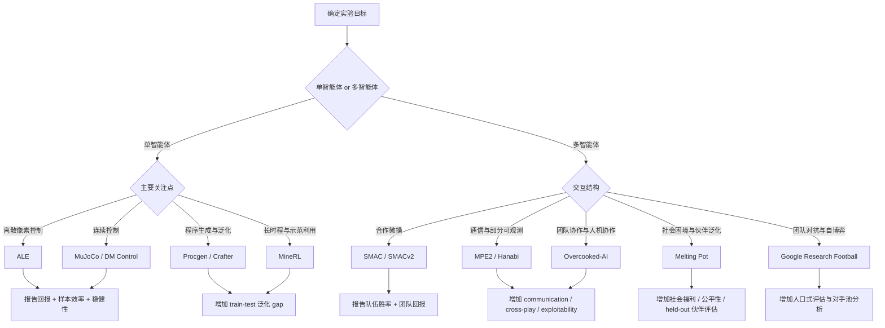

执行摘要：在研究方向、预算与算力均未指定时，最稳妥的实验设计是采用“分层 benchmark + 多维 metric”方案：单智能体至少覆盖 ALE、MuJoCo/DeepMind Control、Procgen 三类离散/连续/泛化场景；多智能体至少覆盖 MPE2、SMACv2、Hanabi/Overcooked-AI 三类沟通、合作微操与协作泛化场景；评价上不要只报平均回报，至少同时报告样本效率、稳健性与带置信区间的聚合指标（如 IQM、AUC、胜率/社会福利）。(https://ale.farama.org/index.html)

## 研究范围与选型框架

这份报告把“常用 benchmark”理解为：在近年的强化学习与多智能体强化学习论文中，被反复用于**算法比较、样本效率评估、稳健性报告、泛化测试或人口式评估**的基准环境。由于实验预算、计算资源和研究方向均未指定，以下建议按“低成本快速迭代—中等成本标准对比—高成本长时程/自博弈/社会泛化”三个层次组织，并优先推荐**官方文档、原始论文、官方代码仓库**和近五年**标准化评测论文**作为依据。近年的 MARL 标准化工作也明确指出，社区长期过度依赖少数基准，导致算法能力画像不完整；更可靠的做法是跨多类环境、跨多指标、跨多随机种子报告。(https://arxiv.org/abs/2502.04773)

**优先来源清单**可按如下顺序使用：  
其一，官方文档/官方仓库，例如来自 Farama Foundation 的 ALE、Gymnasium MuJoCo、MPE2、PettingZoo、MAgent2 文档，以及来自 Google DeepMind 的 dm_control、Hanabi、Melting Pot 仓库；其二，原始 benchmark 论文，例如 Procgen、SMAC、Hanabi Challenge、Google Research Football、Crafter、Overcooked-AI；其三，近五年的标准化与评测论文/工具，例如 rliable、RL Reliability Metrics、BenchMARL 和 2025 年的扩展 benchmarking 研究。(https://ale.farama.org/environments/)

下图给出在“研究方向未指定”时的 benchmark 选择流程，便于直接落到实验设计章节中。图中的分支依据官方文档与原始 benchmark 论文整理而成。(https://ale.farama.org/index.html)

## 常用 Benchmark 总览对比

下表给出一个可直接用于“为什么选这些 benchmark”的摘要视图。它不是替代后文细节，而是帮助你在论文中快速说明：**这些环境覆盖了强化学习实验最常见的难点维度**。(https://arxiv.org/abs/2103.01955)

| Benchmark                                                                              | 类别   | 观测/动作与可观测性                       | 并行化支持 | 常用主指标                                | 最适合验证什么                 |
| -------------------------------------------------------------------------------------- | ---- | -------------------------------- | ----- | ------------------------------------ | ----------------------- |
| ALE / Atari (https://ale.farama.org/index.html)                                        | 单智能体 | RGB/灰度/RAM；离散≤18；像素下近似部分可观测      | 中     | HNS、IQM、AUC                          | 离散控制、样本效率、表示学习          |
| MuJoCo via Gymnasium (https://gymnasium.farama.org/environments/mujoco/)               | 单智能体 | 连续 Box；任务维度差异大；多为全状态             | 高     | 平均回报、收敛速度、AUC                        | 连续控制、actor-critic、模型式控制 |
| DeepMind Control Suite  (https://arxiv.org/abs/2006.12983)                             | 单智能体 | 连续控制；状态或像素；状态版近似全可观测             | 高     | 平均回报、样本效率                            | 标准化连续控制、像素控制            |
| Procgen (https://github.com/openai/procgen)                                            | 单智能体 | 64×64×3；离散15；程序生成泛化              | 很高    | train/test return、generalization gap | 泛化、OOD、程序生成             |
| Crafter (https://github.com/danijar/crafter)                                           | 单智能体 | 64×64×3；离散17；局部像素视角              | 高     | 22 成就成功率、几何平均分                       | 探索、长时程规划、能力谱评估          |
| MineRL (https://minerl.readthedocs.io/en/latest/environments/index.html)               | 单智能体 | 第一人称像素；大规模字典/混合动作；部分可观测          | 低     | 任务完成率、回报、演示利用效率                      | 层级规划、示范利用、超长时程          |
| MPE2 (https://mpe2.farama.org/index.html)                                              | 多智能体 | 向量观测；离散/连续动作；局部观测                | 高     | 团队回报、成功率、cross-play                  | 通信、信用分配、混合合作竞争          |
| SMAC (https://arxiv.org/abs/1902.04043)                                                | 多智能体 | 局部向量观测+全局 state；离散 7–70；部分可观测    | 中     | 胜率、团队回报                              | 合作微操、值分解、CTDE           |
| SMACv2 (https://github.com/oxwhirl/smacv2)                                             | 多智能体 | 同 SMAC API，但更随机、更异质              | 中     | 胜率、AUC、泛化                            | 更真实的随机性与稳健性             |
| Hanabi Challenge (https://www.sciencedirect.com/science/article/pii/S0004370219300116) | 多智能体 | 默认 658 维向量；最大 20 动作；强 POMDP      | 低到中   | 平均分、完美局率、cross-play                  | 隐式通信、信念建模、约定形成          |
| Melting Pot (https://github.com/google-deepmind/meltingpot)                            | 多智能体 | 多主体像素；动作/观测随 substrate 变         | 中     | 社会回报、held-out score、公平性              | 社会困境、伙伴泛化、群体规范          |
| Overcooked-AI (https://github.com/HumanCompatibleAI/overcooked_ai)                     | 多智能体 | 常见封装为 6 离散动作、H×W×26 特征；可导出全状态    | 高     | 团队回报、cross-play、零样本协作                | 协调、ad hoc teamwork、人机协作 |
| Google Research Football (https://github.com/google-research/football)                 | 多智能体 | 19/20 离散动作；simple115/像素/SMM；表示相关 | 中     | 进球差、胜率、AUC                           | 团队对抗、自博弈、层级策略           |

## 单智能体 Benchmark 详解

**ALE / Atari。** 官方文档/代码：[文档](https://ale.farama.org/)｜[代码](https://github.com/Farama-Foundation/Arcade-Learning-Environment)；代表论文：[Machado et al. 2018，DOI:10.1613/jair.5699](https://jair.org/index.php/jair/article/view/11182)。**环境类型**：官方支持 RGB `(210,160,3)`、灰度 `(210,160)` 与 RAM `(128,)` 观测；完整 Atari 动作集最多 18 个动作；从像素输入角度，常把它视为近似 POMDP，因此主流设置会做 frame stack，常见预处理为 `84×84×4`。**典型任务与难点**：Atari 57、Atari 100k、稀疏回报、长时程信用分配、探索与表示学习。**依赖与安装要点**：通常经 ALE/Gymnasium 接口使用，最关键的不是“能跑”，而是固定 `sticky actions`、`frameskip`、minimal/full action set、reward clipping 和 frame stacking；这些开关不一致会直接使结果不可比。**常见配置与基准设置**：报告 human-normalized score、IQM、AUC；若做样本效率，明确是 100k、200k 还是完整长期训练。**适用算法**：DQN/Rainbow/分布式值函数方法、像素 actor-critic、世界模型、表示学习与离线预训练。**优点**：覆盖面广、历史结果多。**缺点**：预处理细节差异非常敏感。**复现注意事项**：少随机种子会导致结论不稳；官方与可靠评测论文都强调不要只报单次最优分数。(https://ale.farama.org/index.html)

**MuJoCo via Gymnasium。** 官方文档/代码：[Gymnasium MuJoCo 文档](https://gymnasium.farama.org/environments/mujoco/)｜[MuJoCo 引擎](https://mujoco.org/)｜[引擎代码](https://github.com/google-deepmind/mujoco)；代表论文：[Todorov et al. 2012，DOI:10.1109/IROS.2012.6386109](https://doi.org/10.1109/IROS.2012.6386109)。**环境类型**：连续 Box 动作，状态维度因任务差异很大；例如官方页面给出 Humanoid 动作维度 17、观测维度 376/378，HalfCheetah 观测维度 17/18。**典型任务与难点**：HalfCheetah、Walker2d、Ant、Humanoid 等步态与接触动力学控制。**依赖与安装要点**：核心依赖是 MuJoCo 物理引擎与 Gymnasium 封装；安装成功后，要特别固定环境版本、终止条件和 `exclude_current_positions_from_observation` 等选项。**常见配置与基准设置**：常报告 1M/3M env steps 下的回报、AUC 和最终性能；若做世界模型，需单独说明观测是 full state 还是像素渲染。**适用算法**：PPO、SAC、TD3、REDQ、MBPO、Dreamer 类。**优点**：运行快、连续控制标准化程度高。**缺点**：某些任务随机性有限，容易把“超参数适配”误看成“算法进步”。**复现注意事项**：不同 Gymnasium/MuJoCo 版本、不同终止规则、不同 observation exclusion 选项都可能改变绝对分数。(https://gymnasium.farama.org/environments/mujoco/)

**DeepMind Control Suite。** 官方/代码：[代码仓库](https://github.com/google-deepmind/dm_control)｜[PyPI](https://pypi.org/project/dm-control/)；代表论文：[DeepMind Control Suite](https://arxiv.org/abs/1801.00690) 与 [dm_control: Software and Tasks for Continuous Control](https://arxiv.org/abs/2006.12983)。**环境类型**：连续控制任务族，支持标准化状态接口和像素渲染；典型 wrapper 下，`cartpole-balance` 可对应 `act=1, obs=5`，`ball_in_cup-catch` 可对应 `act=2, obs=8`。状态版更接近完全可观测，像素版则更适合表征学习与像素控制。**典型任务与难点**：平衡、摆动、步态、操控；奖励通常可解释，便于分析学习曲线。**依赖与安装要点**：依赖 MuJoCo，引擎与 Python 绑定安装后再布置 `dm_control`；若使用 Gymnasium 生态，常用 `shimmy` 或其他兼容 wrapper。**常见配置与基准设置**：明确 state-based 还是 pixel-based、action repeat、camera 设置和 episode horizon。**适用算法**：SAC、DrQ-v2、Dreamer、PlaNet、世界模型与像素 actor-critic。**优点**：任务结构统一、奖励解释好。**缺点**：不同 wrapper 可能改变观测维数和时间步语义。**复现注意事项**：不要混用不同 wrapper 的默认 action repeat/observation preprocessing；像素实验须单列。(https://arxiv.org/abs/2006.12983)

**Procgen Benchmark。** 官方/代码：[代码仓库](https://github.com/openai/procgen)；代表论文：[Cobbe et al. 2019，arXiv:1912.01588](https://arxiv.org/abs/1912.01588)。**环境类型**：16 个程序生成游戏，默认 RGB 观测 `(64,64,3)`，默认离散动作 15；支持 gym3 向量化环境，天然适合大并发采样。**典型任务与难点**：核心不是“把某个固定关卡打通”，而是跨随机 level 的**泛化**；关键配置是 `num_levels`、`start_level` 和 `distribution_mode`，后者默认 `"hard"`，也支持 `"easy"` 等模式。**依赖与安装要点**：可直接使用发布包，也可源码安装；源码构建依赖 C++、Qt、conda 环境。**常见配置与基准设置**：必须明确 train levels 与 held-out test levels；只报 seen-level return 的论文很容易高估泛化能力。**适用算法**：PPO、IMPALA、数据增强、世界模型、泛化 RL。**优点**：高效、可并行、适合研究 generalization。**缺点**：环境版本与 level 采样设置高度影响结果。**复现注意事项**：官方仓库明确建议固定库版本；仓库还列出少量已知“不可解/异常生成”关卡，且为保持可复现性不会回溯修补。(https://github.com/openai/procgen)

**Crafter。** 官方/代码：[代码仓库](https://github.com/danijar/crafter)；代表论文：[Hafner 2021，arXiv:2109.06780](https://arxiv.org/abs/2109.06780)。**环境类型**：观察为 `(64,64,3)` 图像，动作是 17 个类别动作；开放世界、长期目标、局部视觉输入，使它对探索和规划都更敏感。**典型任务与难点**：单一环境内涵盖 22 个语义成就，从采集资源到制作工具、建造设施和生存。难点在于深探索、长时程推理、成就链依赖和稀疏奖励。**依赖与安装要点**：安装简单，`pip install crafter` 即可；若要人工试玩需额外装 `pygame`。**常见配置与基准设置**：官方推荐 1M 环境步预算，并用 22 个成就成功率和几何平均的 Crafter score 作为主指标，而不是只报累计 reward。**适用算法**：Dreamer、PPO、内在动机、层级/世界模型方法。**优点**：单位算力下能力覆盖广。**缺点**：不是高保真物理平台，不适合验证 low-level control。**复现注意事项**：一定区分“reward”与“Crafter score”；只报 reward 会掩盖能力谱差异。(https://github.com/danijar/crafter)

**MineRL。** 官方/代码：[文档](https://minerl.readthedocs.io/)｜[代码](https://github.com/minerllabs/minerl)；代表论文：[Guss et al. 2019，arXiv:1907.13440](https://arxiv.org/abs/1907.13440)。**环境类型**：在最新版文档中，大多数环境默认观测是 `Dict(pov: Box(shape=(360,640,3)))`；动作是由很多二值按钮加 `camera: Box(shape=(2,))` 组成的大字典/混合动作空间，典型第一人称部分可观测。**典型任务与难点**：ObtainDiamond、BASALT 等；主要难点是极长时程、层级子任务链、示范利用、稀疏回报和高环境成本。**依赖与安装要点**：依赖 Minecraft 客户端与 Java 环境，安装和渲染通常比一般 benchmark 更重。**常见配置与基准设置**：必须明确使用的是 0.4.x 还是 1.x；官方仓库列出了 v1.0 的重大变化，例如默认分辨率从 `64×64` 提到 `640×360`、动作空间更接近人类操作、默认不再提供 inventory 观测。**适用算法**：模仿学习、offline-to-online、层级 RL、技能发现、世界模型。**优点**：逼近真实开放世界任务。**缺点**：重、慢、变量多。**复现注意事项**：跨版本结果不可直接比较；需同时报环境版本、示范来源、动作离散化与观测裁剪方式。(https://minerl.readthedocs.io/en/latest/environments/index.html)

## 多智能体 Benchmark 详解

**MPE2。** 官方/代码：[文档](https://mpe2.farama.org/)｜[代码](https://github.com/Farama-Foundation/MPE2)；代表论文：[Lowe et al. 2017，arXiv:1706.02275](https://arxiv.org/abs/1706.02275)。**环境类型**：二维粒子世界，既支持离散动作，也支持连续动作；如 `simple_spread`，官方给出默认 3 agent 时 action shape 为 5、observation shape 为 18、state shape 为 54，属于典型局部观测、集中训练可访问全局状态的 MARL 小型 testbed。**典型任务与难点**：`simple_spread` 的覆盖协作、`simple_tag` 的追逃、`simple_speaker_listener` 的通信；难点是非平稳性、通信、局部观测与混合合作竞争。**依赖与安装要点**：安装轻量，Python 生态友好，可直接与 PettingZoo API 配套。**常见配置与基准设置**：最常见开关是 `continuous_actions`、`max_cycles`、`local_ratio` 和 agent 数；这些必须写入论文。**适用算法**：MADDPG、MAPPO、IPPO、QMIX/VDN 变体、通信模型。**优点**：轻量、易调试、适合作为新算法第一站。**缺点**：物理与规模都偏简化。**复现注意事项**：旧 PettingZoo MPE 与独立的 MPE2 存在迁移与维护差异；引用时要写清楚版本和任务名。(https://mpe2.farama.org/index.html)

**SMAC。** 官方/代码：[代码](https://github.com/oxwhirl/smac)；代表论文：[Samvelyan et al. 2019，arXiv:1902.04043](https://arxiv.org/abs/1902.04043)。**环境类型**：基于 StarCraft II 的合作微操 benchmark；每个单位一个 agent，局部观测为低维向量，训练时可取全局 state；动作是离散集合，官方文档给出不同场景 action 数在 7 到 70 之间。**典型任务与难点**：`3m`、`8m`、`MMM2` 等地图，难点包括局部观测、异质单位、信用分配与集中训练分散执行。**依赖与安装要点**：不仅要装 `smac` 包，还要安装 StarCraft II、设置 `SC2PATH`、放置 SMAC maps。**常见配置与基准设置**：以地图名作为实验单元，并报告测试胜率、训练回报与环境步数。**适用算法**：VDN、QMIX、QPLEX、COMA、MAPPO、transformer mixing 等。**优点**：长期以来是合作微操的主 benchmark。**缺点**：部分地图随机性不足，容易被 open-loop 策略“投机”；同时 SC2 客户端开销较大。**复现注意事项**：官方 README 明确警告 SC2 版本不可乱比，原论文结果使用 `SC2.4.6.2.69232` 而非 `SC2.4.10`；这点若不写清楚，表格里的数字没有可比性。(https://arxiv.org/abs/1902.04043)

**SMACv2。** 官方/代码：[代码](https://github.com/oxwhirl/smacv2)；代表论文：[Ellis et al. 2023，OpenReview](https://openreview.net/forum?id=5OjLGiJW3u)。**环境类型**：与 SMAC 保持同 API，但把随机起始位置、随机单位类型和视野/攻击范围改得更接近 StarCraft 真实设置；因此相同算法代码通常只需改配置，但**观测和 state 尺寸会变化**。**典型任务与难点**：比 SMAC 更强调稳健性、适应性和组合泛化，而不是在固定地图上记忆式微操。**依赖与安装要点**：与 SMAC 类似，仍依赖 SC2 与 maps。**常见配置与基准设置**：能力配置由 `capability_config` 管理，包含 unit generation 与 start positions 生成策略。**适用算法**：QPLEX、MAPPO、model-based MARL、鲁棒/泛化 MARL。**优点**：显著缓解 SMAC 随机性不足的问题。**缺点**：方差更大、比较所需种子更多。**复现注意事项**：SMAC 与 SMACv2 的结果不能混表；如果同文同时做二者，必须分开报告。(https://github.com/oxwhirl/smacv2)

**Hanabi Challenge。** 官方/代码：[代码](https://github.com/google-deepmind/hanabi-learning-environment)；代表论文：[Bard et al. 2020，DOI:10.1016/j.artint.2019.103216](https://www.sciencedirect.com/science/article/pii/S0004370219300116)。**环境类型**：典型强 POMDP；PettingZoo 文档给出默认主观测为 658 维向量，动作是标量、默认最大 20 种走子；作为回合制环境，它更适合 AEC/turn-based 训练循环，而不是同步并行动作。**典型任务与难点**：限制通信、隐式约定、信念建模、伙伴适配。**依赖与安装要点**：官方实现是 C++/Python 混合，编译环境要稳定；另一个现实问题是官方仓库在 2024 年已归档为只读。**常见配置与基准设置**：需写清楚玩家数、手牌数、颜色/点数配置，以及 self-play 还是 ad-hoc/cross-play。**适用算法**：R2D2 类、信念建模、搜索/规划、人口式训练。**优点**：是研究隐式通信与 convention formation 的经典试验台。**缺点**：工程接口较老，且 turn-based 细节容易出错。**复现注意事项**：跨实现（官方 HLE、PettingZoo wrapper、自定义 action masking）要小心对齐；只报 self-play 分数通常不够。(https://www.sciencedirect.com/science/article/pii/S0004370219300116)

**Melting Pot。** 官方/代码：[代码](https://github.com/google-deepmind/meltingpot)；代表论文：[Melting Pot，arXiv:2107.06857](https://arxiv.org/abs/2107.06857)。**环境类型**：面向“合作 AI/社会智能”的多主体基准集合，建立在像素观察和多智能体社会互动之上；观测和动作维数随 substrate 改变，并强调 train/test 场景切分与 unfamiliar partners 的 held-out 评测。**典型任务与难点**：资源竞争、互惠、规范形成、公共物品、排斥/接纳、与陌生伙伴协作。**依赖与安装要点**：安装通常比普通 gridworld 更重，经常连带 DeepMind Lab2D 相关依赖；适合容器化。**常见配置与基准设置**：不要把训练场景回报当最终结论，必须加入 held-out partner 或 held-out scenario 评测。**适用算法**：人口式自博弈、社会偏好建模、伙伴泛化、合作 AI。**优点**：是目前研究“社会泛化”最有代表性的公开 benchmark 之一。**缺点**：构建与评估流程复杂，单一指标不够。**复现注意事项**：务必写清 substrate 名称、scenario split、人口池大小和 partnership protocol。(https://github.com/google-deepmind/meltingpot)

**Overcooked-AI。** 官方/代码：[代码](https://github.com/HumanCompatibleAI/overcooked_ai)；代表论文：[Carroll et al. 2019，arXiv:1910.05789](https://arxiv.org/abs/1910.05789)。**环境类型**：两智能体完全合作任务；原始环境可直接访问完整状态，常见 MARL 封装则使用 6 个离散原子动作与 `layout_height × layout_width × 26` 的稀疏特征图。**典型任务与难点**：厨房布局变化、动态角色分工、互相等待与让路、零样本协作、人机协作。**依赖与安装要点**：安装较轻，官方仓库已提供 PyPI 包和源码方式。**常见配置与基准设置**：需要报告 layout 集合、self-play 还是 cross-play、是否使用人类/模型伙伴，以及团队 soup delivery 奖励。**适用算法**：规划、行为克隆、PBT、自适应伙伴建模、ZSC。**优点**：对“协调”与“可与人合作”研究高度贴近。**缺点**：任务规模较小，容易学到布局特定 convention。**复现注意事项**：官方仓库已声明早期 DRL/BC 实现已 deprecated；更适合把它当**标准环境**而不是直接复用旧训练脚本。近年的工作也指出原版 Overcooked 在零样本协作评测上存在环境覆盖不足的问题，因此如果研究重点是 ZSC，建议同时参考更新的评测工具链。(https://github.com/HumanCompatibleAI/overcooked_ai)

**Google Research Football。** 官方/代码：[代码](https://github.com/google-research/football)；代表论文：[Kurach et al. 2020，arXiv:1907.11180](https://arxiv.org/abs/1907.11180)。**环境类型**：支持单智能体、多智能体、自博弈与多人设置；动作集默认 19 个动作，也有增加 built-in AI 动作的 20 维 v2 action set；观测可用 `simple115`/`simple115_v2` 的 115 维浮点表示，也可用 72×96 像素/SMM，像素与 factored 表示的难度和训练成本差异很大。**典型任务与难点**：Football Academy、全场 11v11、进攻防守配合、长时程策略、对抗训练。**依赖与安装要点**：官方仓库明确把 Docker 方式列为 Linux 推荐路径；本地安装要准备 SDL/Boost 等系统依赖。**常见配置与基准设置**：需要明确控制 player 数、表示类型、默认 action set 还是 v2、reward shaping 与对手类型。**适用算法**：IMPALA、PPO、自博弈、人口式训练、值分解/混合策略模型。**优点**：兼具团队对抗、长时程决策与真实随机性。**缺点**：环境较重，奖励设计非常影响学习速度。**复现注意事项**：官方文档明确指出 `simple115` 存在红牌后观测移位 bug，因此推荐 `simple115_v2`；若切换 action set 或表示，必须分表报告。(https://github.com/google-research/football)

## 评估 Metric 与统计检验

只报“平均 episodic return”几乎从来不够。可靠评测论文反复指出：RL/MARL 结果往往具有**跨任务长尾分布、跨随机种子高方差、曲线早期与晚期表现脱钩**的特征，因此应至少把指标分成四层来报告：性能、效率、稳健性、结构性能力。特别是 rliable 建议在跨任务汇总时优先使用**区间估计、performance profiles 和 IQM**；RL Reliability Metrics 则把可靠性拆成训练中/训练后的波动和风险。(https://arxiv.org/abs/2108.13264)

| Metric                    | 数学定义或计算方式                                                                                     | 适用场景                     | 优点                                                                                       | 缺点/实现细节                                |
| ------------------------- | --------------------------------------------------------------------------------------------- | ------------------------ | ---------------------------------------------------------------------------------------- | -------------------------------------- |
| 平均回报                      | 设第 $i$条轨迹回报为 $G_i=\sum_{t=0}^{T_i-1}\gamma^t r_t$，则$\hat J=\frac{1}{N}\sum_{i=1}^N G_i$       | 所有 RL/MARL               | 最通用、最容易解释                                                                                | 对长尾和异常值敏感；跨任务聚合时不稳                     |
| 团队平均回报                    | $\hat J_{team}=\frac{1}{N}\sum_i \sum_{a=1}^A G_i^{(a)}$或环境直接给 team reward                    | 合作 MARL                  | 直接对应整体目标                                                                                 | 会掩盖个体失衡与搭便车                            |
| 成功率 / 胜率                  | $SR=\frac{1}{N}\sum_i \mathbf{1}\{\mathrm{success}_i\}$                                       | 目标达成、SMAC/GRF            | 语义清晰                                                                                     | 忽略接近成功与失败幅度；需定义 success                |
| 样本效率 AUC                  | 在预算 $B$ 下，$AUC(B)=\frac{1}{B}\int_0^B R(s)\,ds$；离散时用学习曲线梯形积分                                  | 比较早期学习速度                 | 比只看最终分数更稳                                                                                | 需统一横轴单位（env steps、episodes、wall-clock） |
| 到阈值时间                     | $\tau_\kappa=\inf\{s:R(s)\ge \kappa\}$                                                        | 工程部署、快速达标研究              | 易于给出“多久够用”                                                                               | 需要预先定义阈值 \(\kappa\)                    |
| 最终性能 / 渐近性能               | 取最后 $K$ 个 checkpoint 的均值 $\bar R_{final}$                                                     | 长训练预算实验                  | 与 leaderboard 习惯一致                                                                       | 容易忽略前期学习、对后期噪声敏感                       |
| 归一化分数                     | 例如 $R_{norm}=\frac{R-R_{rand}}{R_{ref}-R_{rand}}$；Atari 常用 human/random 归一化                   | 跨任务聚合                    | 让不同量纲任务可合并                                                                               | 参考基线选取会影响结论                            |
| IQM                       | 把所有 task-seed 分数合并后，去掉上下各 25%，对中间 50% 求均值                                                     | 跨任务聚合                    | 比均值更抗离群值，比中位数更高效 https://github.com/google-research/rliable                              | 需保存原始 task-seed 得分                     |
| 稳定性 / 波动性                 | 可报告 $\mathrm{Std}[R]、\mathrm{CV}=\sigma/\mu$、或相邻 checkpoint 方差                                | 比较训练是否平滑                 | 揭示“学得会不会抖”                                                                               | 单独看 std 常受量纲影响                         |
| 风险敏感指标                    | $\mathrm{CVaR}_\alpha(G)=\mathbb E[G\mid G\le q_\alpha]$                                      | 安全、最坏情况、机器人              | 反映尾部失败                                                                                   | 需要足够多 rollout                          |
| 泛化 gap                    | $\Delta_{gen}=J_{train}-J_{test}$                                                             | Procgen、Melting Pot、伙伴泛化 | 直接测已见到未见场景差距                                                                             | 需要严格 train/test split                  |
| 扰动稳健性                     | $Rob=\frac{1}{E}\sum_{e\in E}J(\pi;e)$；或 $drop =1-\frac{J_{pert}}{J_{clean}}$                 | 噪声、遮挡、动力学变化              | 贴近部署                                                                                     | 必须明确扰动集合                               |
| 对抗鲁棒性                     | $J_{wc}=\min_{\delta\in\Delta}J(\pi;\delta)$或对手池最坏/分位表现                                       | 对抗、自博弈                   | 能测最坏情况                                                                                   | 求最小值昂贵，可能过于悲观                          |
| NashConv / exploitability | $\mathrm{NashConv}(\pi)=\sum_i \left[\max_{\pi_i'}u_i(\pi_i',\pi_{-i})-u_i(\pi)\right]$       | 零和/一般和博弈                 | 与博弈论接轨                                                                                   | 在大游戏中精确计算难                             |
| Elo / TrueSkill / α-Rank  | Elo 基于对战结果更新评分；α-Rank 基于经验博弈转移链的稳态分布                                                          | 自博弈、人口评估                 | 能做 population ranking；α-Rank 更适合非传递对局 https://www.nature.com/articles/s41598-019-45619-9 | Elo 近传递假设较强；α-Rank 需构建 meta-game       |
| 社会福利                      | $W(\pi)=\sum_{a=1}^A J_a(\pi)$                                                                | 合作/资源分配                  | 与总效益直接对应                                                                                 | 会掩盖不公平分配                               |
| Jain 公平性指数                | $F_{Jain}=\frac{(\sum_a J_a)^2}{A\sum_a J_a^2}\in(0,1]$                                       | 多智能体资源与收益公平              | 简洁                                                                                       | 对负回报要先平移或换指标                           |
| Gini 不平等系数                | $G=\frac{\sum_i\sum_j  J_i-J_j }{2A\sum_i J_i}$（正收益情形）                                        | 分配不均衡分析                  | 解释性强                                                                                     | 对零/负值敏感                                |
| Nash Social Welfare       | $NSW=\prod_a (J_a-c)_+$或其对数均值形式                                                               | 社会公平与效率折中                | 同时鼓励总效益和均衡分配 https://arxiv.org/abs/2212.01382                                            | 对零或负收益敏感                               |
| 个体回报分布                    | 报告 $\{J_a\}$ 的均值、分位数、箱线图或 tail risk                                                           | 合作、异质 agent              | 能看出“谁在牺牲”                                                                                | 结果维度高                                  |
| Cross-play gap / 协作泛化     | 设配对矩阵为 $M$，则 $\Delta_{xp}=\mathrm{mean}(\mathrm{diag}(M))-\mathrm{mean}(\mathrm{offdiag}(M))$ | Hanabi、Overcooked、伙伴泛化   | 直接测 ad-hoc teamwork 能力                                                                   | 需构造足够大的伙伴池                             |
| 通信效率                      | $C_{msg}=\frac{1}{T}\sum_t \|m_t\|_0$或平均 bit-rate；也可报 $J/C_{msg}$                             | 显式通信 MARL                | 能衡量“每比特收益”                                                                               | 必须定义消息编码和压缩策略                          |
| 能耗 / 计算效率                 | $E=\sum_t P_t\Delta t$；实践上可报 return per GPU-hour / kWh                                        | 机器人、大模型 MARL             | 适合工程决策                                                                                   | 电力/硬件记录不易统一                            |

把这些指标放到实验中时，最推荐的**最小可执行组合**是：  
- 单智能体实验至少报 **平均回报 + AUC + IQM/CI + 泛化 gap（若有 test split）**；  
- 合作 MARL 至少报 **团队回报/胜率 + 样本效率 + 个体收益分布 + cross-play/held-out partner**；  
- 对抗或自博弈实验至少再加 **Elo/α-Rank 或 exploitability/NashConv**；  
- 显式通信或多机器人实验再加 **通信开销与能耗**。这是因为“一个标量分数”无法反映学习速度、尾部失败和伙伴适配能力。(https://github.com/google-research/rliable)

统计检验方面，建议把“显著性”当成实验协议的一部分，而不是事后补充。实践上可直接采用如下模板：  
- 先保存**每个 task、每个 seed、每个 checkpoint**的原始分数；对跨任务结论，优先用 **IQM + stratified bootstrap 95% CI** 与 **performance profiles**；
- 对同任务同预算的两算法比较，用**配对 bootstrap**或**置换检验**比较 final score/AUC；
- 对胜率用 **Wilson 区间**或精确二项分布区间；
- 若一篇文章同时比较很多算法和很多任务，再用 Holm 校正控制多重比较风险。rliable 与 RL Reliability Metrics 都已经把这套流程工具化了。
若预算允许，常见经验是 10 个随机种子更稳；预算有限时至少 5 个，并公开所有 run，而不是只报最好一次。(https://github.com/google-research/rliable)

## 实验设计建议与复现清单

如果你的研究方向尚未收敛，最有效的策略不是“一口气跑所有 benchmark”，而是建立一套**主 benchmark + 迁移 benchmark + 压力测试 benchmark**的三级结构。对单智能体，建议以 **ALE + MuJoCo/DM Control + Procgen** 作为主干：ALE 看离散控制与样本效率，MuJoCo/DM Control 看连续控制与优化稳定性，Procgen 看泛化。若方法强调长时程探索或示范学习，再加入 Crafter 或 MineRL。对多智能体，建议以 **MPE2 + SMACv2 + Hanabi/Overcooked-AI** 作为最小闭环：MPE2 验证通信与信用分配，SMACv2 验证合作微操与 CTDE，Hanabi 或 Overcooked-AI 验证伙伴适配、隐式通信或协作泛化；如果研究目标涉及社会规范、陌生伙伴或群体公平，则扩展到 Melting Pot。(https://mpe2.farama.org/index.html)

从论文写作角度，一个执行性很强的实验部分可以直接按下面的字面结构展开，而不需要另起炉灶：  
先写**benchmark 选择理由**，说明分别覆盖离散/连续、合作/竞争、已见/未见场景；再写**统一训练预算**，例如“所有单智能体环境在 1M/5M 环境步下比较，所有合作 MARL 环境在相同 wall-clock 与 env-step 双轴下报告”；接着写**统一评估指标**，至少包含 return、AUC、seed CI，与 MARL 特有的 team win rate、social welfare 或 cross-play；最后写**复现约束**，显式固定所有会改变结果的环境开关：ALE 的 sticky actions 与 frame-stack，Procgen 的 `num_levels/start_level/distribution_mode`，MineRL 版本族，MPE2 的 `continuous_actions/max_cycles/local_ratio`，SMAC/SMACv2 的 SC2 patch 与 map/config，Hanabi 的玩家数与 action masking，Overcooked 的 layout 与 partner protocol，GRF 的 action set 与 `simple115_v2`。(https://ale.farama.org/environments/)

若你需要一个**默认实验套餐**，在未指定算力的情况下我建议如下：  
低成本套餐：Crafter + MPE2 + Overcooked-AI。它们安装轻、迭代快、很适合新算法初筛。  
中成本套餐：ALE + MuJoCo + SMAC + Hanabi。它们覆盖面最经典，但需要更规范的评测。  
高成本套餐：Procgen + MineRL + SMACv2 + Melting Pot + GRF。它们更接近“真正困难”的泛化、自博弈与社会协作问题，但对工程与统计都提出更高要求。近年的标准化基准研究之所以强调更丰富的 benchmark 组合，正是因为很多在 SMAC/GRF 上看似最强的方法，一旦换到更复杂或更强调泛化的合作任务上，并不一定保持优势。(https://arxiv.org/abs/2502.04773)

最后给出一份可直接贴进实验附录的**复现清单**：  
记录环境名、版本号、仓库 commit、wrapper、随机种子、训练预算、评估频率、checkpoint 选择规则；公开所有 task-seed 原始分数与曲线；把 benchmark 特定开关写入配置表而不是只写在代码里；把“环境表示变化”与“算法变化”分开消融，例如 GRF 的 `simple115` vs `simple115_v2`、SMAC vs SMACv2、state-based vs pixel-based dm_control；对 MARL 额外发布 cross-play 矩阵或至少 self-play/cross-play 差值；对社会/协调任务额外报告个体收益分布，而不是只报 team score。按近年的可靠评测标准，这是比“多跑几个分数”更重要的复现实践。(https://github.com/google-research/rliable)

**开放问题与局限。** 这份报告把重点放在**在线 RL 与 MARL 的主流基准**上，因此没有展开离线 RL、safe RL、meta-RL 等专门基准。若你的方法明确针对离线数据、约束优化或快速适应，建议把 D4RL、Safety-Gymnasium、Meta-World 一并纳入第二轮 benchmark 设计；但在“研究方向未指定”的前提下，把主实验先建在本文这套在线 RL/MARL 主干上，通常最符合论文比较性与执行成本的平衡。(https://arxiv.org/abs/2310.12567?utm_source=chatgpt.com)