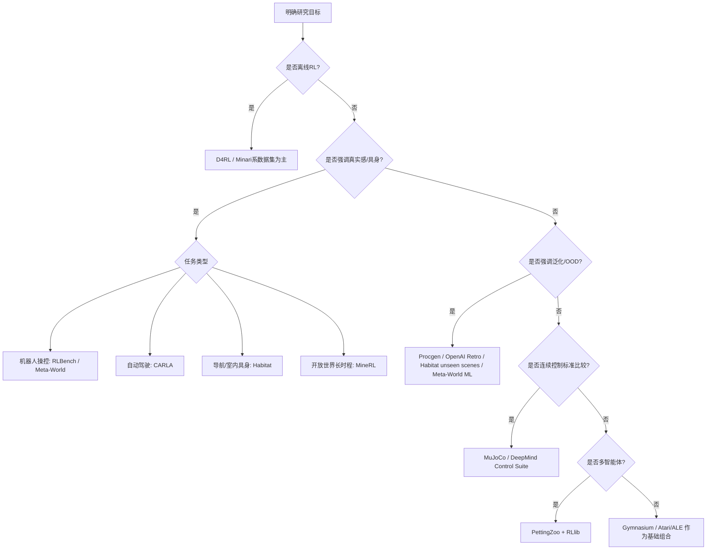
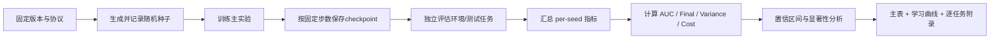

## 执行摘要

强化学习实验并不存在“通用最好”的 benchmark。更准确的做法，是先明确研究目标，再反推环境族与评估协议：如果目标是**标准在线单智能体算法比较**，Gymnasium、MuJoCo、Atari/ALE 仍然是最常见的基础组合；如果目标是**样本效率与分布外泛化**，Procgen、OpenAI Retro、Habitat 的 unseen scenes、Meta-World 的 train/test 任务拆分更有辨识度；如果目标是**离线强化学习**，D4RL 仍是引用最广、协议最清晰的基准之一；如果目标是**高保真具身控制或接近真实世界的闭环控制**，RLBench、CARLA、Habitat、MineRL 更能暴露视觉、层级规划、感知偏差与长时程信用分配问题。今天的新项目通常应优先使用由 Farama Foundation 维护的 Gymnasium 生态，而不是继续把历史上的 OpenAI Gym 当作首选主线。(https://gymnasium.farama.org/index.html)

对 metric 的理解同样需要“按任务选指标”。单独报告“最终平均回报”通常不够，因为它混合了**学习速度、峰值性能、稳定性与方差**。在线 RL 至少应同时报告：学习曲线、AUC 或固定预算下的回报、最终性能、跨随机种子方差/置信区间、环境步数与 wall-clock；离线 RL 还应明确 normalized score 的定义，并说明是否允许在线调参或在线测试；泛化研究则必须把**训练分布内表现**与**分布外表现**分开报告。D4RL 明确给出了 expert-normalized score 与 train/eval task split；Procgen 明确面向 sample efficiency 与 generalization；Habitat challenge 明确在 unseen environments 上测试泛化。(https://github.com/Farama-Foundation/D4RL)

从可复现性的角度看，环境名字相同并不等于环境“可比”。MuJoCo 的不同版本之间并不总能直接对齐训练曲线；Gymnasium 自身也在持续发布新版本；D4RL 近年又把在线环境与离线数据分别迁移到 Gymnasium / Minari；Habitat、Meta-World、RLBench、Procgen 都有各自的任务切分、场景切分或 seed 生成规则。严谨的论文必须固定：环境版本、ROM/数据集版本、随机种子、评估频率、每次评估 episode 数、训练/测试拆分，以及任何 frame-skip、sticky actions、domain randomization 和 reward shaping 选项。(https://gymnasium.farama.org/environments/mujoco/)

因此，本报告的核心结论是：**benchmark 选择要服务研究问题；metric 组合要分解能力维度；评估协议要优先防止“看起来进步、实际上不可复现”的假增益。**在“无特定约束”的前提下，最稳妥的默认实验包通常是：一个标准控制族（MuJoCo 或 dm_control）、一个像素决策族（Atari/ALE 或 Procgen）、一个泛化/多任务族（Meta-World、RLBench 或 Habitat），并同时报告 AUC、最终性能、方差、样本预算与 wall-clock。(https://ale.farama.org/environments/?utm_source=chatgpt.com)

## Benchmark 生态与选择逻辑

强化学习 benchmark 可以按五个轴来理解：**在线 vs 离线**、**低维状态 vs 高维像素**、**单任务 vs 多任务/元学习**、**单智能体 vs 多智能体**、**抽象模拟 vs 高保真具身/真实世界近似**。Gymnasium 与历史上的 OpenAI Gym 更像“API 与参考环境集合”；MuJoCo 与 DeepMind Control Suite 强调连续控制；Atari/ALE、Procgen、OpenAI Retro 强调像素决策与泛化；Meta-World、RLBench 强调多任务操控；D4RL 强调离线数据协议；CARLA、Habitat、MineRL 强调高保真视觉与长时程任务；PettingZoo 与 RLlib 则更偏向多智能体与系统化实验基础设施。(https://gymnasium.farama.org/index.html)

一个实用的选择逻辑如下。

这个决策树的关键不是“把所有 benchmark 都跑一遍”，而是用最少但互补的环境族覆盖你的能力假设。例如，一个新在线 RL 算法如果只在 MuJoCo 上好，并不能推出它对像素控制、泛化、具身操控或真实感仿真同样有效；相反，如果它同时在 MuJoCo、Procgen 和 Meta-World 上都稳定优于强基线，那么结论的外推性会明显更强。(https://farama.org/Gymnasium-MuJoCo-v5_Environments)
## 主流 Benchmark 与套件对照

下表优先使用官方文档、官方仓库与原始论文。需要特别说明的是：**Gym/Gymnasium、PettingZoo、RLlib、Stable Baselines3 更像实验接口层或生态层，不是单一 benchmark 本身**；但它们直接决定了并行化、环境兼容性、日志接口和复现实验成本，所以在实验设计中必须单列。(https://gymnasium.farama.org/index.html)

### 通用在线控制与像素决策套件

| 套件                     | 简介与典型任务                                                                                                                                                                                       | 观测 / 动作空间                                                                                       | 随机性 / 难度维度                                                              | 并行 / 分布式                                                          | 许可证与安装来源                                                   | 代表论文与官方入口                                                            |
| ---------------------- | --------------------------------------------------------------------------------------------------------------------------------------------------------------------------------------------- | ----------------------------------------------------------------------------------------------- | ----------------------------------------------------------------------- | ----------------------------------------------------------------- | ---------------------------------------------------------- | -------------------------------------------------------------------- |
| OpenAI Gym             | 历史上最重要的单智能体 RL 标准 API 与参考环境集合，覆盖 classic control、toy text、Box2D、以及历史上的 Atari/MuJoCo 接入；今天更适合作为**旧论文复现接口**而非新项目主线。                                                                             | API 允许 Box / Discrete / Dict / Tuple 等任意空间；具体空间取决于环境族。                                          | 随机性与难度取决于具体环境；其最大价值是“统一接口”，不是单一难度标尺。                                    | 新工作通常转由 Gymnasium、SB3、RLlib 提供现代并行化与实验封装。                         | 官方仓库与文档可直接安装和使用 Gym；维护主线已转向 Gymnasium。                     | https://github.com/openai/gym                                        |
| Gymnasium              | Farama 维护的 Gym 继承者；既是标准 API，也是常用参考环境集合。新工作默认优先使用。                                                                                                                                             | 单智能体任意环境空间；文档明确区分 `step/reset`、terminated / truncated 等语义。                                      | 难度依环境而定；优势在于接口更清晰、版本管理更规范。                                              | 原生提供 `SyncVectorEnv` / `AsyncVectorEnv` 与 `make_vec()`，适合标准化并行采样。 | **MIT**；官方安装入口为 `pip install gymnasium`。                   | https://gymnasium.farama.org/index.html                              |
| DeepMind Control Suite | 由 DeepMind 发布的连续控制标准套件，论文给出 **7 个 domain、37 个任务**；常用于连续控制、表征学习、world model 与 pixel control。pMind","ai lab"] 发布的连续控制标准套件，论文给出 **7 个 domain、37 个任务**；常用于连续控制、表征学习、world model 与 pixel control。 | 低维状态与渲染像素都支持；动作通常为连续控制。                                                                         | 物理动力学较平滑，适合研究控制稳定性、表征与样本效率；难度主要来自长时程控制与连续动作优化。                          | 通常通过多进程 / 外层训练框架并行；并非以分布式系统能力见长。                                  | 官方仓库为 **Apache-2.0**；安装入口见官方仓库 / Python 包。                 | https://github.com/google-deepmind/dm_control?utm_source=chatgpt.com |
| Atari / ALE            | Atari 2600 游戏 benchmark 的标准底座；ALE 文档明确它是基于 Stella 的 Atari 2600 研究框架，是深度 RL 中最经典的像素决策环境之一。                                                                                                     | 以图像观测为主；动作是离散按钮组合，默认通常使用“合法动作子集”，可选 `full_action_space=True`。                                   | 现代评测强调 **sticky actions**、模式/难度开关与 ROM/预处理细节；难度来自像素输入、长时程延迟奖励、探索与稀疏反馈。  | 可通过 Gymnasium、SB3、RLlib 等外层做向量化与分布式训练。                            | 官方安装入口在 ALE / Gymnasium Atari 文档；许可证应以官方仓库 LICENSE 为准。     | https://ale.farama.org/index.html                                    |
| MuJoCo                 | 既是物理引擎，也是 RL 中最常见的连续控制 benchmark 基座；Gymnasium/MuJoCo 任务长期是算法论文“标准体测”。                                                                                                                         | Gymnasium/MuJoCo 文档明确观测通常由 `qpos` 与 `qvel` 展平拼接而成；动作通常为连续 Box 控制。                               | 官方文档明确这些环境在初始状态上带高斯噪声；难度在连续控制、稳定行走、复杂接触。需注意不同版本的可比性问题。                  | 可结合 Gymnasium 向量环境、SB3 VecEnv 与 RLlib 分布式采样。                      | MuJoCo Python 绑定 **Apache-2.0**；官方推荐 `pip install mujoco`。 | https://github.com/deepmind/mujoco/blob/main/python/README.md        |
| Procgen                | 由 OpenAI 发布的程序化生成像素 benchmark；设计目标非常明确：**同时测样本效率与泛化**。                                                                                                                                        | README 明确观测为 `(64,64,3)` RGB，动作空间为 `Discrete(15)`；向量环境下观测可为字典形式。                                | `num_levels` 与 `start_level` 明确控制训练/测试分布；难度来自程序生成、O O D 关卡、视觉变化与有限训练关卡。 | 官方 README 直接支持 VecEnv；环境速度高，适合大规模并行采样。                            | 官方安装入口为 `pip install procgen`；许可证以官方仓库为准。                  | https://github.com/openai/procgen                                    |
| OpenAI Retro           | 以大量经典游戏为基础的泛化 benchmark；官方说明其可覆盖约 **1000** 个游戏整合，并支持研究同游戏不同关卡乃至跨游戏迁移。                                                                                                                         | 观测与动作依游戏与 emulator 而变；官方集成文件包含 reward function、episode end condition 与 memory variable mapping。 | 难度来自长时程层级目标、极强视觉多样性、游戏机制差异与稀疏奖励。                                        | 原生更偏单环境接口；通常借助外部 VecEnv / 分布式训练框架并行。                              | **MIT**；官方主入口为 GitHub / 文档，ROM 需用户自行获取。                    | https://github.com/openai/retro                                      |

### 机器人、多任务、离线(off-line rl [Sergey Levine](https://arxiv.org/search/cs?searchtype=author&query=Levine,+S))、具身与系统集成套件

| 套件                            | 简介与典型任务                                                                                                         | 观测 / 动作空间                                                                                                           | 随机性 / 难度维度                                                                          | 并行 / 分布式                                                                       | 许可证与安装来源                                                                      | 代表论文与官方入口                                                              |
| ----------------------------- | --------------------------------------------------------------------------------------------------------------- | ------------------------------------------------------------------------------------------------------------------- | ----------------------------------------------------------------------------------- | ------------------------------------------------------------------------------ | ----------------------------------------------------------------------------- | ---------------------------------------------------------------------- |
| RLBench                       | 大规模机器人操控 benchmark，官网与论文都强调其 **100 个手工设计任务**，覆盖 reach、door open 到 oven/tray 等长时程多阶段任务。                          | 论文明确支持本体感觉 + 视觉观测（RGB、depth、segmentation）；README 展示连续机械臂动作 + 离散 gripper 动作模式。                                       | 难度来自视觉引导操控、多阶段任务、few-shot / meta-learning 任务集、演示利用与 sim-to-real。                    | 支持 headless 运行、Gym 接口与多实例扩展，但不是“原生分布式系统”。                                      | **自定义学术/非商业许可**；安装依赖 CoppeliaSim + PyRep，官方推荐从 GitHub 安装。                     | https://sites.google.com/view/rlbench                                  |
| Meta-World                    | 多任务与 meta-RL 操控 benchmark，核心是 **50 个 manipulation tasks**，并定义 MT1/10/50、ML1/10/45 等标准协议。                        | 使用 Gymnasium API；多任务基准会在观测中追加 one-hot task ID，元学习基准则区分 train/test 环境并支持部分可观测设置。                                     | 难度显式由 benchmark mode 定义：从单任务目标变化到 held-out 新任务适应。                                   | 官方直接支持同步与异步向量环境。                                                               | **MIT**；官方安装为 `pip install metaworld`。                                        | https://meta-world.github.io/                                          |
| D4RL                          | 离线 RL 的标志性 benchmark，提供标准化环境 + 固定数据集；目标是让离线 RL 比较脱离“只在专家轨迹上做行为克隆式胜利”的局限。                                        | 官方 README 明确数据集包含 observations / actions / rewards / terminals / timeouts；仍遵循 Gym 接口加载环境。                           | 论文系统强调数据偏置、undirected data、stitching、sparse reward、partial observability 等离线 RL 难点。 | 训练本身不依赖在线并行采样；但评估通常仍需在线 rollout。                                               | 代码 **Apache-2.0**、数据默认 **CC BY 4.0**；官方安装可 git clone 或 `pip install git+...`。 | https://github.com/Farama-Foundation/D4RL                              |
| CARLA                         | 高保真自动驾驶模拟器；官方首页与论文都强调其用于 autonomous driving 的训练、验证与传感器配置。                                                       | 支持相机、深度、GPS、LiDAR 等多传感器；驾驶动作为油门、转向、刹车等。                                                                             | 难度来自感知复杂度、动态交通、天气与场景变化、闭环驾驶稳定性；D4RL 论文还指出其具有 partial observability 与视觉复杂度。          | 官方明确支持 **server multi-client** 架构，可多客户端多节点控制不同 actor。                          | 代码 **MIT**、资产 **CC-BY**；官方提供 package 安装与源码构建文档。                               | https://carla.org/                                                     |
| Habitat                       | 具身 AI 平台，含 Habitat-Sim 与 Habitat-Lab；原始论文强调高性能 3D 模拟与 embodied task framework。                                  | 传感器、机器人形态与任务高度可配置；官方 README 列出 navigation、rearrangement、instruction following、question answering、human following 等。 | 关键难度在 photorealistic 视觉、多任务、具身交互与 **unseen environments** 泛化。                       | 论文报告单 GPU 多进程极高吞吐；Habitat-Lab 支持单/多智能体训练。                                      | Habitat-Lab **MIT**，但场景数据集各自有额外条款；官方安装为 conda 安装 habitat-sim、再安装 habitat-lab。 | https://arxiv.org/abs/1904.01201                                       |
| MineRL                        | 以 Minecraft 为载体的大规模人类演示 + 环境接口；适合研究长时程任务、模仿学习、层级决策与开放世界探索。                                                      | 官方文档明确多数环境默认观测是 `(360,640,3)` RGB；动作是字典空间，含 camera 连续控制与多种离散二值操作。                                                   | 难度来自极长地平线、稀疏奖励、层级技能组合与现实感强的开放世界状态空间。                                                | 官方文档提供 headless / xvfb / GPU 渲染建议，但“原生分布式 benchmark 协议”不是其重点。                  | 官方仓库当前 LICENSE 文本为 **CC BY-NC-SA 4.0**；安装需 JDK8，并从 GitHub 安装 `minerl`。        |  https://arxiv.org/abs/1907.13440                                   |
| PettingZoo                    | 多智能体 RL API 与参考环境集合；其核心贡献是 AEC/parallel 环境模型与统一多智能体接口。                                                          | 观测与动作依环境家族而定；既有 Atari，也有 MPE、Butterfly、SISL 等。                                                                      | 难度来自多智能体非平稳性、协作/对抗结构与信用分配。                                                          | 官方支持 family extras 安装，并有 parallel API；与 RLlib 集成成熟。                            | 官方安装为 `pip install pettingzoo` 或 family extras；许可证应以仓库 LICENSE 为准。            | https://github.com/Farama-Foundation/PettingZoo                        |
| RLlib / Stable Baselines3 集成层 | 这两者不是 benchmark，而是**实验系统层**。SB3 强在可靠单机基线与 VecEnv；RLlib 强在基于 Ray 的分布式、容错与多智能体。它们决定“同一个 benchmark 能否可靠复现、如何高效并行”。 | SB3 主要面对 Gymnasium 风格单智能体环境；RLlib 同时支持 Gymnasium、PettingZoo 与多种自定义向量/多智能体格式。                                        | 难度不在环境本身，而在实验编排与系统吞吐。                                                               | SB3 提供 DummyVecEnv/SubprocVecEnv；RLlib 明确有 EnvRunner、vector env、Learner 三条扩展轴。 | SB3 官方安装为 `pip install stable-baselines3[extra]`；RLlib 为 Ray 官方组件，安装入口见官方文档。  | https://stable-baselines3.readthedocs.io/en/master/guide/vec_envs.html |

### 选择这些 benchmark 时最容易忽略的事实

第一，**Gym / Gymnasium / PettingZoo / RLlib / SB3 是“接口与生态”，不是能力维度本身**。真正决定结论外推性的，是你底层选了 MuJoCo 还是 Procgen、是 D4RL 还是 CARLA、是 Meta-World 的 MT 还是 ML 模式。(https://gymnasium.farama.org/index.html)

第二，**许多 benchmark 内部自带 train/test 概念**。Procgen 的 `num_levels/start_level` 实际上就是训练与测试分布控制杆；Meta-World 的 ML10/ML45 有显式 train/test 任务划分；RLBench 定义了 FS10/25/50/95 task sets；Habitat challenge 明确在 novel scenes 上评估；D4RL 论文也明确倡导 training tasks 与 evaluation tasks 分开。忽略这些协议，论文就会把“记忆训练分布”误说成“泛化”。(https://github.com/openai/procgen)

第三，**高保真不等于更好**。高保真环境更接近现实，但实验成本更高、变量更多、复现更难；抽象环境更容易隔离算法机制。严谨的工作常常应该组合“一个抽象 benchmark + 一个高保真 benchmark”，而不是只追求单一极端。(https://farama.org/Gymnasium-MuJoCo-v5_Environments)

## 评估 Metric 体系

benchmark 只是“题库”，metric 才是你真正的评分规则。实践中最常见的问题不是“没指标”，而是**只用一个指标**。例如，只看最终回报时，无法区分算法是“学得更快”还是“只是在末期偶然更高”；只看成功率时，容易忽略 reward shaping、部分成功与成本；只看 normalized score 时，又会掩盖任务间天花板与基线定义的可变性。Procgen、D4RL、Habitat、Meta-World/ RLBench 的官方协议都在不同程度上提醒我们：**学习速度、泛化、稳定性、计算成本与最终表现是不同维度**.(https://cdn.openai.com/procgen.pdf)

| Metric      | 定义与计算                                                                                                                                                  | 优点                                                      | 适用场景                                                                 | 常见陷阱                                                           |
| ----------- | ------------------------------------------------------------------------------------------------------------------------------------------------------ | ------------------------------------------------------- | -------------------------------------------------------------------- | -------------------------------------------------------------- |
| 平均回报        | 对 $N$ 次评估$episode$ 的 episode return 取均值：$\bar{G}=\frac{1}{N}\sum_{i=1}^N G_i$；其中 $G_i=\sum_{t=0}^{T_i-1}\gamma^t r_t$ 或未折扣总奖励。                         | 直观、可与大多数 RL 文献对齐。                                       | 标准在线 RL、连续控制、Atari。                                                  | 容易掩盖方差与长尾失败；不同 reward scale 不可直接横比。                            |
| 累计回报        | 单个 episode 的总奖励，可折扣也可不折扣。                                                                                                                              | 保留轨迹级别信息，可进一步做分布分析。                                     | 长时程任务、离线 OPE、失败案例审计。                                                 | 单条轨迹噪声大；只报均值时会回到平均回报问题。                                        |
| 成功率         | $\text{SR}=\frac{1}{N}\sum_i \mathbf{1}[\text{success}_i]$。                                                                                            | 对操控、导航、稀疏目标任务最清晰。                                       | Meta-World、RLBench、Habitat、CARLA waypoint/goal 任务。                   | success 定义必须预先固定；reward shaping 改了、成功标准也可能隐式改变。                |
| 样本效率        | 在固定环境步数预算 $B$ 下的性能，或学习曲线下面积 $AUC$：$\text{AUC}=\frac{1}{B}\int_0^B m(b)\,db$。离散实现通常取 trapezoid 近似。                                                      | 区分“学得快”与“最终高”。                                          | Procgen、Atari、MuJoCo、新算法样本效率主张。                                      | AUC 对评估频率敏感；横轴必须统一成 env steps，而非更新步。                           |
| 收敛速度        | 达到某个阈值 $\tau$ 所需的最小预算：$b^*=\min\{b:m(b)\ge \tau\}$。                                                                                                    | 对“多久能到可用水平”很有解释力。                                       | 工程部署、实时预算受限设置。                                                       | 阈值 \(\tau\) 的定义主观；若曲线不稳定，首次越线并不等于真正收敛。                         |
| 峰值性能        | 训练过程中达到的最好评估值：$\max_b m(b)$。                                                                                                                           | 能反映“理论上能多好”。                                            | 算法能力上限探索、ablation。                                                   | 容易奖励不稳定算法；若只报 peak，常常高估真实可复现收益。                                |
| 稳定性         | 跨 seeds 的标准差、方差、IQR，或训练过程中 rolling std。                                                                                                                | 直接暴露算法是否“靠运气”。                                          | 几乎所有 benchmark；像素任务尤其重要。                                             | 只报均值不报 dispersion 是最常见错误；极端 outlier 会扭曲方差。                     |
| 稳健性 / 泛化    | 在 held-out 关卡、held-out 任务、unseen scenes、domain randomization 条件下评估；可报告 OOD 平均值、worst-case、ID-OOD gap。                                                  | 真正衡量外推能力。                                               | Procgen、Retro、Meta-World ML、RLBench task sets、Habitat unseen scenes。 | 混淆 train 与 test 分布；不说明 seed/level split；只在训练分布采样。              |
| 在线 / 离线评估差异 | 离线 RL 中，训练不接触环境，但最终常需在线 rollout 测试；若调参也用在线环境，结论会偏乐观。                                                                                                   | 迫使论文区分“offline training”与“online selection/evaluation”。 | D4RL、真实日志学习。                                                         | 把在线调参伪装成离线；不说明是不是按 evaluation tasks 选超参。                       |
| 计算成本        | 至少同时报告 env steps、gradient updates、评估 episode 数、wall-clock、硬件。                                                                                          | 避免把“更多算力”误当“更强算法”。                                      | SB3、RLlib、大规模像素任务、具身仿真。                                              | 只报 wall-clock 不报 steps，或只报 steps 不报吞吐，都不完整。                    |
| 人类基线 / 相对分数 | 通式可写作 $\text{RelScore}=100\times\frac{s-s_{\min}}{s_{\text{ref}}-s_{\min}}$。D4RL 的官方 $normalized score$就是以 random/expert 作为$s_{\min}, s_{\text{ref}}$。 | 便于跨任务粗略对齐量纲。                                            | D4RL；以及游戏类 benchmark 中常见的相对分数。                                       | 分母定义不一致会严重误导；必须写清 random / expert / human / clipped-human 的口径。 |

其中有两个口径必须写在论文正文而不是只放在附录。第一，D4RL 的 normalized score 是官方推荐比较口径，0 对应随机策略参考，100 对应专家参考；而且论文明确提醒，如果允许大量在线调参，就会得到对离线部署过于乐观的结论。第二，在 Atari/ALE 中，必须写清是否使用 sticky actions、是默认 legal-action 子集还是 full action space、以及具体预处理方式。(https://ar5iv.labs.arxiv.org/html/2004.07219)

如果论文只能选一组“默认 metric 组合”，本报告建议如下：  
- 对**在线单智能体**，用“**AUC + 最终平均回报/成功率 + 95% CI + env steps + wall-clock**”；  
- 对**泛化**，用“**ID 平均分 + OOD 平均分 + ID-OOD gap + worst-case score**”；  
- 对**离线 RL**，用“**normalized score + 原始回报 + 是否允许在线调参/在线 test**”；  
- 对**具身控制**，再额外加上“**成功率 / 碰撞率 / 完成时间 / 安全约束违例**”。这种组合比“只看 final return”稳定得多。

## 可复现性与公平比较实践

可复现性的第一原则是：**先固定协议，再训练模型**Gymnasium 的 API 改进、MuJoCo 多版本并存、D4RL 的迁移、Meta-World 的多模式拆分、Procgen 的 level 生成器、Habitat 的 unseen scenes，都说明同一个 benchmark 名称下面可能隐藏了完全不同的实验条件。(https://gymnasium.farama.org/index.html)

最重要的协议项有五类。

- **环境与数据版本。** MuJoCo v2/v3 与 v4/v5 并不总是可直接比较；Gymnasium/MuJoCo 文档明确指出某些版本切换后训练性能不应直接横比。D4RL 也明确说明其在线环境与离线数据已经迁移到 Gymnasium / Minari 生态，旧版、修复版和迁移版都可能导致结果差异。(https://gymnasium.farama.org/environments/mujoco/)

- **训练 / 测试拆分。** Procgen 必须冻结训练关卡数与起始 level；Meta-World 的 ML benchmark 需要分别构造 train/test 环境；RLBench 的 few-shot task sets 必须固定；Habitat challenge 本身就是在 novel scenes 上测试；D4RL 论文也要求用 training tasks 做调参、用 evaluation tasks 报告最终表现。(https://github.com/openai/procgen)

- **随机种子管理。** 至少要固定 Python / NumPy / 框架 / 环境 seed，并在 reset 时显式传入；官方文档示例里，Gymnasium、Meta-World、PettingZoo 都提供了清晰的 seed/reset 入口。(https://gymnasium.farama.org/api/env/)

- **评估频率与平滑方式。** 训练曲线建议以固定 env steps 周期评估，而不是固定 wall-clock；如果使用滑动窗口平滑，要同时保留原始点或至少说明窗口宽度。AUC、到阈值步数、final score 都会受到评估间隔影响，因此评估间隔本身就是协议的一部分。Gymnasium、SB3、RLlib 对向量化与吞吐的支持也意味着“每秒钟训练多少”不再与“学了多少环境步”同义。(https://gymnasium.farama.org/introduction/speed_up_env/)

- **统计显著性。** 在无特定约束下，实践上建议把每个 seed 的“任务级汇总分”作为独立样本，报告 95% 置信区间；若做显著性检验，优先对**预先声明的主指标**做检验，而不是事后从几十个指标里挑最显著的一个。对于 AUC、final score、success rate 这类主指标，bootstrap CI 往往比只报 p-value 更有信息量；如果分布明显偏斜，可辅以非参数检验。这里的重点不是“必须某一种检验”，而是**检验口径要预先固定**。  

图表展示方面，最推荐的组合是：  
学习过程用**学习曲线**；  
跨种子离散性用**箱线图/小提琴图**；  
最终任务横向比较用**条形图 + 误差线**；  
泛化用**ID vs OOD 双柱图或 heatmap**。  
对于 D4RL / 多任务 benchmark，建议额外给出**逐任务表格**，避免平均后掩盖大幅退化任务。(https://ar5iv.labs.arxiv.org/html/2004.07219)

一个推荐的评估流水线如下。

## 实验设计建议与推荐配置

如果研究目标是“提出新算法”，最好的默认策略不是把所有 benchmark 都跑一遍，而是挑三类互补环境：**一个标准连续控制族、一个像素泛化族、一个多任务或高保真族**。这样能同时回答“能不能优化”“快不快”“稳不稳”“能不能泛化”“换任务后是否还成立”。(https://farama.org/Gymnasium-MuJoCo-v5_Environments)

### 推荐的 metric 组合

| 研究重点 | 推荐 benchmark 组合 | 主指标 | 次指标 |
|---|---|---|---|
| 新在线 RL 算法 | MuJoCo / dm_control + Atari/ALE | AUC、final return、方差 | wall-clock、峰值性能 |
| 样本效率 | Procgen 或 Atari/ALE + MuJoCo | AUC、达到阈值步数 | fixed-budget return、吞吐 |
| 泛化 / OOD | Procgen + Meta-World ML / Habitat unseen scenes / Retro | OOD 平均分、ID-OOD gap、worst-case | 方差、训练分布表现 |
| 多任务 / 元学习 | Meta-World MT/ML + RLBench task sets | success rate、few-shot adaptation gain | AUC、任务间方差 |
| 离线 RL | D4RL | normalized score、原始 return | 是否在线调参、OPE 设定 |
| 真实世界近似控制 | CARLA / Habitat / RLBench / MineRL | success、碰撞/违例率、完成时间 | wall-clock、样本成本 |

在“无特定约束”下，一个**最小可接受**的实验设置可以采用下面这套经验性下限。它不是唯一标准，但足以避免最常见的薄弱设计。

**重复次数。** 默认至少 **5 个 seeds**；对高方差像素任务或高保真具身任务，建议 **8–10 个 seeds**。  
**预算。** 必须同时声明 **env steps** 与 **wall-clock**；若是离线 RL，还要声明**梯度更新步数**或**dataset passes**。  
**基线。** 至少包含一个强基线与一个朴素基线；比如在线连续控制里可选 PPO / SAC / TD3，离线 RL 里至少包含 BC 与一个强 offline baseline。  
**评估。** 每次 checkpoint 在独立 eval 环境上跑固定 episode 数；成功率类任务通常不宜少于 50–100 个 eval episodes。  
**日志。** 至少记录：版本、随机种子、checkpoint、原始 learning curve、eval raw scores、硬件、依赖锁定文件。  

日志与可视化工具方面，最实用的组合仍然是**结构化标量日志 + 可回放原始 eval 结果 + 实验跟踪平台**。无论你使用 CSV、TensorBoard 还是更完整的实验追踪器，关键不在品牌，而在于能否**从最终图表追溯到 checkpoint 与原始 seed-level 结果**。  

开源发布时，建议最少公开以下内容：  
代码；  
随机种子列表；  
环境名称与确切版本；  
ROM / 数据集 / 场景资产获取说明；  
依赖锁定文件；  
训练与评估脚本；  
原始结果表与绘图脚本；  
如果用了 RLlib / SB3 / Gymnasium wrapper，还应把 wrapper 栈写清楚。这样读者才能判断你的改进来自算法，而不是隐含预处理差异。(https://stable-baselines3.readthedocs.io/en/master/guide/vec_envs.html)

## 面向不同研究目标的推荐矩阵与实验模板

### 面向研究目标的优先 benchmark 与 metric 对照表

| 研究目标          | 优先 benchmark                                             | 首要 metric                     | 次要 metric            | 选择理由                                                                                                     |
| ------------- | -------------------------------------------------------- | ----------------------------- | -------------------- | -------------------------------------------------------------------------------------------------------- |
| 算法提出          | MuJoCo / dm_control + Atari/ALE                          | AUC、final return、方差           | wall-clock、峰值性能      | 标准、社区可比性强，能先建立“是否优于常用基线”的基本证据。(https://farama.org/Gymnasium-MuJoCo-v5_Environments)                      |
| 样本效率          | Procgen + MuJoCo                                         | AUC、fixed-budget return       | 达阈值步数、吞吐             | Procgen 本身就是为 sample efficiency 与 generalization 设计；MuJoCo 适合验证控制效率。(https://cdn.openai.com/procgen.pdf) |
| 泛化            | Procgen、OpenAI Retro、Meta-World ML、Habitat unseen scenes | OOD 平均分、ID-OOD gap、worst-case | 方差、训练分布表现            | 这些套件都显式提供程序生成、held-out 任务或 unseen scenes。(https://github.com/openai/procgen)                             |
| 对抗鲁棒性 / 扰动鲁棒性 | Atari/ALE、Procgen、CARLA、Habitat                          | 扰动下性能下降幅度、成功率、违例率             | clean score、恢复速度     | 图像输入、多样视觉条件与闭环控制更容易揭示鲁棒性缺陷。(https://ale.farama.org/index.html)                                           |
| 真实世界控制近似      | RLBench、CARLA、Habitat、MineRL                             | success、碰撞/安全约束、完成时间          | wall-clock、样本成本、泛化差值 | 与真实感知、长时程规划、具身约束更接近。(https://arxiv.org/abs/1909.12271)                                                   |
| 离线 RL         | D4RL                                                     | normalized score、原始 return    | 是否在线调参、训练稳定性         | D4RL 提供最清晰的 offline 协议与跨域任务设计。(https://ar5iv.labs.arxiv.org/html/2004.07219)                             |
| 多智能体          | PettingZoo + RLlib                                       | 团队回报、胜率/成功率、方差                | 样本效率、通信/协作开销         | PettingZoo 提供标准多智能体环境 API，RLlib 便于系统化并行实验。(https://github.com/Farama-Foundation/PettingZoo)              |

### 示例实验模板

#### 模板一

| 项目           | 设计                                                                                                                                    |
| ------------ | ------------------------------------------------------------------------------------------------------------------------------------- |
| 研究目标         | 提出新的**离线 RL**算法，主张在“多种数据质量与任务结构”下更稳定                                                                                                  |
| 选用 benchmark | **D4RL**                                                                                                                              |
| 环境列表         | Gym-MuJoCo（HalfCheetah / Hopper / Walker2d 的 medium、medium-expert）、AntMaze（umaze / medium）、Franka Kitchen（complete / partial / mixed） |
| 主评估 metric   | D4RL normalized score、原始 undiscounted return                                                                                          |
| 次评估 metric   | 训练稳定性（跨 seed 方差）、训练耗时、每次评估所用在线 rollout 数                                                                                              |
| 训练预算         | 不新增在线交互；声明固定 gradient updates 或 dataset passes；保存固定 checkpoint                                                                        |
| 重复次数         | 建议 8 seeds                                                                                                                            |
| 统计分析方法       | 以“按任务平均后的 per-seed 分数”为样本，报告 95% CI；主指标做 bootstrap CI，必要时做预注册显著性检验                                                                    |
| 预期结果阈值       | 相比强基线，若平均 normalized score 提升 **≥5 分**，且多数任务不退化，同时方差不显著扩大，可视为有说服力的进步                                                                  |
| 备注           | 必须在正文明确：是否允许在线调参、是否遵守 training/evaluation task split、normalized score 的具体定义。 (https://ar5iv.labs.arxiv.org/html/2004.07219)           |

#### 模板二

| 项目           | 设计                                                                                                                   |
| ------------ | -------------------------------------------------------------------------------------------------------------------- |
| 研究目标         | 提出同时改善**样本效率与泛化**的在线 RL / 表征学习方法                                                                                     |
| 选用 benchmark | **Procgen + Meta-World ML10/ML45**                                                                                   |
| 环境列表         | Procgen 16 环境或常用子集；Meta-World 的 ML10 与 ML45 train/test 协议                                                            |
| 主评估 metric   | Procgen 的 fixed-budget AUC 与 test-level score；Meta-World 的 held-out task success rate                                |
| 次评估 metric   | ID-OOD gap、跨 seed 方差、wall-clock                                                                                      |
| 训练预算         | 固定 env step 预算；Procgen 明确 `num_levels/start_level`；Meta-World 明确 train/test benchmark 创建方式                           |
| 重复次数         | 建议 8–10 seeds                                                                                                        |
| 统计分析方法       | 分别对 ID 与 OOD 指标做汇总；报告均值、IQR/CI 与 worst-case                                                                          |
| 预期结果阈值       | 若 OOD 平均分提升 **≥10% 相对增益**，且 ID 分数不显著下滑，ID-OOD gap 同时缩小，可视为“泛化改进而非记忆训练分布”                                             |
| 备注           | 训练分布、测试分布、seed 与 task split 必须写清楚；不能只报 training levels 或 MT benchmark 结果就声称“泛化”。 (https://github.com/openai/procgen) |

## 开放问题与局限

本文优先使用了官方文档、官方仓库与原始论文，因此对**环境定义、任务拆分、版本与安装入口**的结论置信度较高。需要说明的是，少数“生态层”项目（例如 OpenAI Gym、PettingZoo、ALE、RLlib、Stable Baselines3）的**许可证具体条款名称**，本文并未全部逐一展开到仓库 LICENSE 文本级别；如果你的工作涉及法务合规、商业部署或数据再分发，应直接核对相应仓库的 LICENSE 文件与数据条款。(https://github.com/Farama-Foundation/Gymnasium/blob/main/LICENSE)

另一个边界是：benchmark 本身正在持续演进。Gymnasium 在 2026 年仍持续更新，MuJoCo/Gymnasium 的环境版本继续演进，D4RL 生态也已部分迁移到 Minari / Gymnasium，意味着“复现老论文”与“开展新比较”往往应该使用不同的环境版本策略。复现老论文时，应尽量贴近原始版本；做新比较时，则应优先使用当前维护主线，但必须在文中给出迁移说明。(https://gymnasium.farama.org/gymnasium_release_notes/index.html)