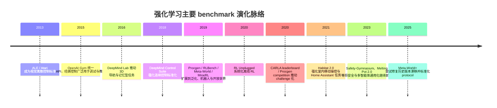
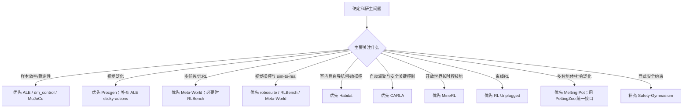

## 执行摘要

强化学习科研里并不存在单一“最优 benchmark”，而是存在一组面向不同研究问题的基准族。若目标是**算法样本效率**与历史可比性，Atari / Arcade Learning Environment 仍是最强公共坐标；若目标是**低维连续控制**，MuJoCo 与 DeepMind Control Suite 仍然是最常用的主干；若目标是**视觉泛化**，Procgen 明显优于固定关卡类基准；若目标是**多任务/元强化学习**，Meta-World 是经典入口，但必须注意版本漂移，当前更建议基于 Farama 维护版与 Meta-World+ 的标准化约定来做实验；若目标是**视觉操控与 sim-to-real 相关性**，RLBench、robosuite、Meta-World 三者各有侧重；若目标是**具身导航/移动操控**，Habitat 与 CARLA 分别覆盖室内与自动驾驶；若目标是**开放世界长时程学习**，MineRL 的上限最高，但工程门槛也最高；若目标是**离线强化学习**，RL Unplugged 是最有代表性的“协议先行”型基准之一。(https://github.com/farama-foundation/arcade-learning-environment)

从科研方法论看，benchmark 选择其实是五个轴上的权衡：**状态表示**（低维状态 vs. 像素/多模态）、**动作空间**（离散 vs. 连续）、**训练数据来源**（在线交互 vs. 离线日志）、**泛化要求**（固定任务 vs. 程序生成/跨任务/跨场景）、以及**部署关联性**（纯算法测试 vs. sim-to-real / 安全关键应用）。多数论文失败并不是“算法差”，而是 benchmark 与研究问题不匹配，或者 protocol 没有钉死：例如 ALE 必须说明 sticky actions 与 action set；Procgen 必须说明训练/测试 level 划分；Meta-World 必须说明具体版本与 benchmark mode；CARLA/Habitat 必须说明 challenge 版本与场景划分；MineRL 必须说明是 v0.4 还是 v1.0 / BASALT；OpenAI Gym 相关实验现在还必须说明是否迁移到 Gymnasium，因为 Gym 主仓库已在 2026 年 4 月归档。(https://arxiv.org/abs/1709.06009)

一个简明判断是：**想测“学得快”**，优先 ALE、Procgen、dm_control；**想测“多任务/泛化”**，优先 Procgen、Meta-World、Habitat，必要时扩展到 Melting Pot；**想测“机器人可迁移性”**，优先 robosuite、RLBench、Meta-World；**想测“安全/鲁棒性”**，在已列 benchmark 中优先 CARLA、Habitat、ALE sticky-actions/Procgen，而若需要显式约束安全，最好补充 Safety-Gymnasium；**想测“离线 RL”**，优先 RL Unplugged。(https://openai.com/index/procgen-benchmark/)

## 基准谱系与演化

从时间线上看，RL benchmark 大致经历了这样一条路径：经典控制提供调试级最小闭环；ALE 把视觉离散控制标准化；MuJoCo / dm_control 把连续控制推成算法主战场；DMLab、MineRL、Habitat、CARLA 则把问题推向长时程、三维、具身与真实部署相关场景；Procgen、Meta-World、Melting Pot、RL Unplugged 分别把**泛化、多任务、多智能体、离线数据协议**推向前台。今天真正“像科研 benchmark”的，不只是环境本身，而是**环境 + 协议 + leaderboard/challenge + 可重现实验脚手架**这一整套基础设施。(https://www.gymlibrary.dev/environments/classic_control/)

如果把 benchmark 选择当成项目立项的一部分，一个实用的决策流程如下。它的核心不是“哪个最火”，而是“你的科学问题在哪一层失真最小”。例如，研究 actor-critic 的收敛性，不应从 CARLA 起步；研究 sim-to-real 上的视觉操控，经典控制与 ALE 都太弱；研究多智能体社会泛化，单智能体机器人套件根本不在同一问题族里。(https://www.gymlibrary.dev/environments/classic_control/)

## 主要 benchmark 逐项解析

**Atari / Arcade Learning Environment**：用途是视觉离散控制与通用游戏能力评测；任务是 Atari 2600 多游戏；观测通常是像素帧，动作是离散动作集（最小动作集或 full action set），典型指标是 raw score、human-normalized score、median/mean across games；难度来自跨游戏聚合与稀疏奖励；资源需求中等，官方仓库已提供打包 ROM、Gymnasium 接口与 C++ vectorization；可复现性较高，但前提是明确 sticky actions、mode/difficulty、action set、frame stacking、frame skip；社区与工具非常成熟，由 Farama Foundation 维护；代表论文是 2013 ALE 与 2018 protocol paper；本次查阅到官方仓库提供引用与文档，但未见持续维护的官方在线 leaderboard；常见坑是用不同 protocol 比较、只报最好种子、忽略 stochasticity。许可为 GPL-2.0。(https://github.com/farama-foundation/arcade-learning-environment)

**MuJoCo / DeepMind Control Suite**：用途是低维连续控制与模型类/无模型 RL 的核心试验田；任务覆盖 locomotion、balance、manipulation、point-mass 等，动作通常为连续 torque/control，观测多为 qpos/qvel 拼接或 named observation；典型指标是 episode return，少数任务有稀疏奖励或 success-like proxy；MuJoCo 在 Gymnasium 侧有 11 个经典环境，dm_control 强调统一结构、可解释奖励和更整洁的任务设计；工程上需要稳定的渲染后端或 headless EGL/OSMesa，MuJoCo 和 dm_control 目前都为 Apache-2.0；可复现性总体很高，但必须固定版本、初始噪声、termination 语义和动作 repeat；社区极强，代表源包括 dm_control 原始论文与官方仓库。常见坑是把不同 wrappers、不同 reward/termination 版本直接横比，以及忽略像 Ant-v3/v5 一类历史 observation 差异。(https://github.com/farama-foundation/arcade-learning-environment)

**OpenAI Gym classic control**：用途是最小化调试、教学与快速 sanity check；任务包括 CartPole、Acrobot、MountainCar、Pendulum 等五个经典环境；观测通常是极低维状态向量，动作多为离散，小部分是连续；指标几乎总是 episode return 或是否达到 environment reward threshold；难度低、资源需求极低、复现性高，但**科研区分度很低**，不适合作为主 benchmark；由 OpenAI 发起的 Gym 生态在科研史上非常重要，但当前维护主线已转到 Gymnasium，而 Gym 主仓库已在 2026 年 4 月归档；许可细节在本次检索中未按子包逐一展开，若用当前实现，建议直接引用 Gymnasium 与具体环境文档。常见坑是把“能解 CartPole”误判为“算法已稳定”，以及不同 Gym/Gymnasium 版本之间 reset/step 语义差异未说明。(https://www.gymlibrary.dev/environments/classic_control/)

**Procgen**：用途是样本效率与泛化并重的程序生成视觉 benchmark；包含 16 个环境，训练/测试 level 可显式划分，支持 easy/hard 以及若干游戏特定模式；观测是像素，动作是离散；典型指标是 normalized return、训练集外测试回报；难度与规模都适中到高，优势是单核即可达到每秒数千步，适合大规模 ablation；许可为 MIT，社区代码与 AIcrowd 比赛都很成熟。最常见的 protocol 是限定训练 levels 数量、在 held-out levels 上评估 generalization；常见坑是没有报告 `num_levels`、`start_level`、`distribution_mode`，导致结果不可比。(https://github.com/openai/procgen)

**DeepMind Lab**：用途是三维第一人称导航、记忆、规划与视觉理解；任务以 3D 导航和 puzzle-solving 为主，观测来自第一人称 RGB，也可以提供 RGBD，动作允许 agent 在三维里移动并转动视角；典型指标多是 level score/episodic return；难度高于 Atari 与经典连续控制，更接近具身感知问题；工程上依赖 Bazel 与较重的构建链，复现性比 ALE/dm_control 更依赖 build 版本；官方仓库强调其作为 testbed 的作用，但当前社区主流关注度已部分转向 Habitat、MineRL、Melting Pot 等 newer embodied benchmarks。许可是混合式的：仓库 LICENSE 中至少明确 `assets` 使用 Creative Commons Attribution 4.0，代码许可需按仓库 LICENSE 具体核对。常见坑是把它当作“只是 3D ALE”，低估了 partial observability 与 memory 需求。(https://github.com/google-deepmind/lab)

**Meta-World**：用途是多任务 RL 与 meta-RL；原始 benchmark 含 50 个机器人操控任务，经典分法包括 ML1/ML10/ML45 与 MT1/MT10/MT50；观测以低维状态为主，动作为连续控制；指标通常是 success rate、平均回报以及 held-out task/goal generalization；资源需求中等，但 MT50/ML45 会显著抬高并行环境与训练稳定性要求；当前由 Farama Foundation 维护的版本支持 Gymnasium API、同步/异步 vector env，并明确了 benchmark 创建方式；许可为 MIT。它最重要的坑不是“难练”，而是**历史版本漂移**：Meta-World+ 2025 专门把“过去大量 undocumented changes 导致结果不可公平比较”作为问题来修复，因此论文里必须写具体 repo、版本、benchmark mode 与 observation convention。官方文档本身不是 leaderboard，但提供 paper code 指针；当前更适合拿来做多任务/元学习主 benchmark，而不是单任务控制。(https://arxiv.org/abs/1910.10897)

**RLBench**：用途是视觉引导操控、few-shot learning、模仿学习、多任务学习；官方站点与论文给出 100 个手工设计任务，从 reach 与 door opening 到 multi-stage manipulation；观测同时提供 proprioception 与视觉输入，包括 RGB、depth、segmentation，来自肩部立体相机与手眼单目相机；动作一般是连续机械臂控制；典型指标是 task success rate、few-shot transfer 表现；任务广度很强，并且通过 motion planner 与 waypoints 为每个任务提供“几乎无限”的 demonstrations；但工程门槛较高，依赖 CoppeliaSim 4.1.0 与 PyRep，headless 渲染配置复杂。许可也是要特别注意的一项：仓库 LICENSE 不是常见 SPDX 短许可，而是 Imperial College London 的自定义许可协议。官方未见长期在线 leaderboard；常见坑是把大量 demo 当成“样本效率证据”，却没有区分 RL、IL 和 few-shot protocol。(https://arxiv.org/abs/1909.12271)

**robosuite**：用途是机器人学习基础设施与可复现操控 benchmark；任务覆盖标准 manipulation，并持续扩展到更复杂 embodiment、控制器和传感器；观测既可用低维物理状态，也可用 RGB、depth、proprioception，多模态支持非常好；动作为连续控制，且 controller 选择本身会显著影响学习难度；指标一般是 normalized return、success、学习曲线 AUC。它的优势在于“环境 + controller + benchmark repo”一起提供：官方 benchmark 文档给出了 SAC 基线、500 epochs × 500 steps、5 seeds，并报告了使用 2 CPU / 12GB VRAM、约两天能跑完一组标准实验；官方还建议用 Panda + OSC_POSE 作为标准比较设置。当前仓库活跃，论文、文档与 task-zoo 生态都不错；但 GitHub 组织页把仓库许可证标成 `Other`，而主页只显示有 license file，因此若涉及再分发或商业使用，应直接核对仓库 LICENSE 文件。常见坑是忽略 controller choice、把不同 robot embodiment 混在一起比较。(https://github.com/ARISE-Initiative/robosuite)

**CARLA**：用途是自动驾驶训练、验证与 leaderboard 比较；任务形式是让 agent 在未见地图和多种天气中完成给定 route，并处理 lane merge、intersection、roundabout、行人、自行车、紧急车辆等 traffic scenario；观测是可配置传感器套件，动作是连续驾驶控制；典型主指标是 Driving Score = Route Completion × Infraction Penalty，此外还统计碰撞、闯红灯、偏航、超时等多类 infractions；现实相关性高，安全研究价值强，但资源需求也高，官方 leaderboard 当前在 AWS g5.12xlarge 上评测。CARLA 的优点是 challenge/leaderboard 很制度化，版本 2.1 仍在支持旧版；许可方面，CARLA 代码是 MIT，资产是 CC-BY。常见坑是离线或开环指标替代闭环 leaderboard、使用 privileged simulator information、或忽略 leaderboard version 差异。(https://leaderboard.carla.org/)

**Habitat**：用途是室内具身 AI，包括 PointNav、ObjectNav、ImageNav、rearrangement，以及更广义的 home assistant 场景；观测通常是 RGB、depth、语义或机器人传感器，多数任务是连续位姿/速度控制或离散导航动作；典型指标以 Success、SPL、Distance-to-goal 为主，在 Habitat 2.0 / HAB 中还扩展到更复杂的移动操控任务。由 Meta 推动的 Habitat-Lab 强调模块化与高性能，Habitat 2.0 论文报告在 8-GPU 节点上可超过 25,000 sim steps/s；仓库 MIT 许可，但任务数据集与场景数据通常另有条款，需要区分代码与数据。它的优势是 challenge protocol 明确、室内导航研究沉淀深；常见坑是只报单一场景结果、没有区分 train/val/test scene split，或把 PointNav 与 ObjectNav 的 metric 混用。(https://github.com/facebookresearch/habitat-lab)

**MineRL**：用途是开放世界、长时程、层级技能、从人类示范学习到 RL；环境以 Minecraft 为基础，既有 ObtainDiamond 一类奖励明确任务，也有 BASALT 一类“难以写出 reward、需要人类评估”的任务；观测在老版本可包含 POV、inventory、compass 等，v1.0 则改为更接近人类操作的 GUI + mouse control、默认像素观测；动作空间复杂且长时程依赖强；常用指标包括 task completion、competition score、人类评估或 pairwise preference。**MineRL 的研究价值极高，但工程成本也最高：安装链路要求 JDK 8，远程/headless 渲染与版本兼容问题长期存在，数据镜像在 2024 年发生过迁移；BASALT benchmark repo 给出的一个训练示例就需要 16 核、64GB RAM、Tesla T4，整个流程约 2–3 天。** MineRL 文档、比赛与 BASALT/BEDD 数据集使其具有独特价值，但复现成本显著高于前面多数 benchmark。许可方面，本次检索中主 MineRL 包未清晰展开到单一 SPDX；BASALT benchmark repo 和 2024 年 Zenodo 备份数据记录为 MIT。常见坑是版本不统一、evaluation 依赖人工判断却没有固定流程、以及把 demonstration-rich setting 与纯 RL setting 混为一谈。(https://minerl.readthedocs.io/)

**Gym Retro**：用途是把大量经典游戏通过 emulator 暴露成 Gym 环境，适合长尾游戏、复古控制与自定义 reward engineering；观测默认是 RGB，也可切换到 RAM；动作空间可设为 MultiBinary、filtered、Discrete 或 MultiDiscrete；指标通常是游戏分数、自定义 reward、关卡完成度；它比 ALE 覆盖的游戏更多，官方仓库提到约 1000 个 game integrations，但 ROM 不随仓库分发，必须用户自行获取。许可为 MIT，工程状态为 maintenance only，支持的 Python 版本也偏旧；因此它更适合做“环境桥接”和自定义任务，而不太适合做当代主 benchmark。常见坑是 ROM 法律问题、reward 定义随项目而变、以及不同自定义 integration 之间不可比。(https://github.com/openai/retro)

**RL Unplugged**：用途是离线强化学习；它不是单一环境，而是“多域数据集 + 明确 protocol”的 benchmark 套件，覆盖 Atari、DM Control 等离散/连续、部分可观测/全可观测、随机/确定性动态；核心指标是 offline policy evaluation 后的 normalized return 或绑定环境的标准回报；论文与官方博客都把“统一 API、明确 evaluation protocol、参考 baselines、让 offline RL 更可复现”作为主要贡献。它的优点是协议清晰、对 offline RL 非常合适；缺点是如果你的研究问题是 representation transfer 或平台工程，单纯离线集未必够。许可与数据分发细则在本次检索页面中未明确展开。常见坑是在线 fine-tuning 混入主结果、dataset provenance 未写清、以及不同 dataset slice 直接横比。(https://arxiv.org/abs/2006.13888)

## 跨基准比较表与方法学差异

下表把科研最常用的维度压缩到一张主表里。为了控制可读性，表中的“多智能体”“程序生成”“复现/许可”都只给研究决策级判断；若要真正开题，仍应回到对应官方协议逐条核对。(https://github.com/farama-foundation/arcade-learning-environment)

| 基准                  | 主域               | 观测 / 动作                      | 典型指标                                         | 难度 / 规模                 | 样本效率研究      | sim-to-real 相关性 | 多智能体支持                        | 程序生成 / 随机性                         | 复现与许可要点                       | 官方榜单 / 挑战                 | 主来源                                                              |
| ------------------- | ---------------- | ---------------------------- | -------------------------------------------- | ----------------------- | ----------- | --------------- | ----------------------------- | ---------------------------------- | ----------------------------- | ------------------------- | ---------------------------------------------------------------- |
| ALE / Atari         | 视觉离散控制           | 像素 / 离散                      | raw score, HNS                               | 中到高；50+ 游戏              | 强           | 低               | 否                             | 需显式加 sticky actions                | protocol 很关键；GPL-2.0          | 无统一长期官方榜单                 | https://github.com/farama-foundation/arcade-learning-environment |
| MuJoCo              | 低维连续控制           | qpos+qvel / 连续 torque        | return                                       | 中；11 个 Gymnasium 经典环境   | 强           | 中               | 否                             | 初始态随机，动力学多接近确定                     | Apache-2.0；版本差异要钉死            | 无统一官方榜单                   | https://gymnasium.farama.org/environments/mujoco/                |
| dm_control          | 连续控制             | named observations / 连续      | return                                       | 中到高；多 domain            | 强           | 中               | 有扩展足球任务                       | 初始随机，任务结构更统一                       | Apache-2.0；render backend 需固定 | 无统一官方榜单                   | https://arxiv.org/abs/1801.00690                                 |
| Gym classic control | 调试 / 教学          | 低维状态 / 离散或连续                 | return                                       | 低；5 个经典环境               | 弱到中         | 极低              | 否                             | 初始态随机                              | Gym 已归档，应转 Gymnasium          | 无                         | https://www.gymlibrary.dev/environments/classic_control/         |
| Procgen             | 视觉泛化             | 像素 / 离散                      | normalized return                            | 中到高；16 环境 + level split | 很强          | 低               | 否                             | 强程序生成                              | MIT；必须写明 levels/split         | 有比赛与 leaderboard 历史       | https://openai.com/index/procgen-benchmark/                      |
| DeepMind Lab        | 3D 导航 / 记忆       | 第一人称 RGB/RGBD / 离散组合动作       | score / return                               | 高；3D 任务族                | 中           | 中               | 有扩展可能，但非主线                    | 部分 level 可变                        | build 较重；许可混合                 | 无持续官方榜单                   | https://github.com/google-deepmind/lab                           |
| Meta-World          | 多任务 / meta-RL 操控 | 低维状态 / 连续                    | success, return                              | 中到高；50 任务，ML/MT modes   | 中           | 中到高             | 否                             | 任务/goal 泛化强                        | MIT；版本漂移是大坑                   | 无统一榜单                     | https://github.com/Farama-Foundation/Metaworld                   |
| RLBench             | 视觉操控 / few-shot  | RGB+depth+seg+state / 连续     | success                                      | 高；100 任务 + demos        | 中           | 高               | 否                             | 任务变化强，演示丰富                         | 自定义许可；依赖 CoppeliaSim/PyRep    | 无统一榜单                     | https://arxiv.org/abs/1909.12271                                 |
| robosuite           | 机器人学习基础设施        | state/RGB/depth/proprio / 连续 | normalized return, success                   | 中到高；标准操控任务              | 中           | 高               | 非 MARL，更多是多机器人/多控制器           | 可程序化组装                             | benchmark repo 完整；许可需核对       | 无在线总榜，但有官方 benchmark repo | https://robosuite.ai/docs/algorithms/benchmarking.html           |
| CARLA               | 自动驾驶             | 传感器套件 / 连续驾驶控制               | Driving Score, Route Completion, infractions | 很高                      | 中           | 很高              | 单 ego 为主                      | 天气/地图/route 随机化强                   | 代码 MIT，资产 CC-BY；版本化 challenge | 有官方 leaderboard           | https://leaderboard.carla.org/evaluation_v2_0/                   |
| Habitat             | 室内具身导航 / 操控      | RGB/depth/语义 / 导航或速度控制       | SPL, Success, DtG                            | 很高                      | 中           | 高               | 有单/多智能体任务                     | scene split 与 episode generation 强 | 代码 MIT，数据条款另计                 | 有官方 challenge             | https://github.com/facebookresearch/habitat-lab                  |
| MineRL              | 开放世界长时程          | POV/像素等 / 高维复杂动作             | completion, human eval, competition score    | 极高                      | 中到弱         | 中               | 环境世界可含多体，但 benchmark 多单 agent | 世界生成强                              | 依赖重、版本多；许可按具体组件核对             | 有比赛历史与 BASALT 基准数据        | https://minerl.readthedocs.io/                                   |
| Gym Retro           | 长尾复古游戏           | RGB 或 RAM / 离散或 MultiBinary  | score / custom reward                        | 中到高；~1000 integrations  | 中           | 低               | 否                             | 关卡通常固定                             | MIT，但 ROM 不附带；维护较弱            | 有历史 contest               | https://github.com/openai/retro                                  |
| RL Unplugged        | 离线 RL            | 多域离线数据 / 离线学习                | normalized return                            | 中到高；多域                  | 很强（offline） | 依任务而异           | 不是主打                          | 取决于来源环境                            | 协议清晰；许可细节本次未展开                | 无统一公开总榜                   | https://arxiv.org/abs/2006.13888                                 |

横向比较时，最容易犯的错误有三个。第一，把**固定任务优化**与**泛化能力**混在一起：ALE、Gym classic、不少 MuJoCo 结果主要测“在固定 MDP 上学到多好”，而 Procgen、Meta-World、Habitat、Melting Pot 明确把 held-out 测试分布放进 benchmark 核心。第二，把**在线 RL**与**离线 RL**混在一起：RL Unplugged 的价值恰恰在于把 dataset 与 protocol 钉死，不能拿在线收集数据的结果直接横放。第三，把**环境复杂度**等同于**科研价值**：复杂环境不自动产生更好的科学结论，尤其在 seed 数不足、版本不固定、算力巨大时，噪声往往超过算法差异。(https://openai.com/index/procgen-benchmark/)

如果只看“随机性/确定性”，ALE 与很多 MuJoCo 任务在默认设置下都没有表面上看起来那么“随机”，因此 protocol 细节会直接改变研究结论；相反，Procgen、MineRL、CARLA、Habitat 天生就把环境变化写进 benchmark。若论文目标是鲁棒性或 OOD generalization，后者通常比前者更有信息量。(https://arxiv.org/abs/1709.06009)

## 面向研究目标的推荐

| 研究目标              | 首选 benchmark             | 备选 / 补充                      | 为什么                                                                                          | 最关键的 protocol 注意事项                                                | 来源                                                               |
| ----------------- | ------------------------ | ---------------------------- | -------------------------------------------------------------------------------------------- | ----------------------------------------------------------------- | ---------------------------------------------------------------- |
| 算法样本效率            | ALE、dm_control           | Procgen、RL Unplugged         | 历史可比性强；训练曲线成熟；既可做低维也可做像素                                                                     | ALE 需 sticky actions / action set；dm_control 需固定版本与 backend       | https://github.com/farama-foundation/arcade-learning-environment |
| 视觉泛化              | Procgen                  | ALE + sticky actions，Habitat | Procgen 直接有 train/test level split，是视觉泛化 benchmark 的“天然协议”                                   | 必须写 `num_levels`、`start_level`、difficulty                         | https://openai.com/index/procgen-benchmark/                      |
| 多任务 / meta-RL     | Meta-World               | RLBench                      | Meta-World 的 ML/MT 模式非常贴合 few-shot / transfer 研究；RLBench 更偏视觉与 few-shot 机器人                  | 必须写 MT/ML 模式、版本、是否 one-hot task id                                | https://github.com/Farama-Foundation/Metaworld                   |
| sim-to-real 机器人操控 | robosuite、RLBench        | Meta-World                   | 三者都在机器人操控域，但 robosuite 更强调 controller 与可复现，RLBench 更强调视觉与 demonstrations，Meta-World 更强调多任务泛化 | 固定 robot/controller/camera/task variation；先做 state-only 再做 pixels | https://robosuite.ai/docs/algorithms/benchmarking.html           |
| 室内具身导航 / 移动操控     | Habitat                  | MineRL（开放世界），DMLab（历史 3D）    | Habitat 的 SPL / challenge 协议最成熟，且已扩展到 rearrangement/home assistant                           | 场景 split、导航 vs. 操控任务不要混报                                          | https://aihabitat.org/challenge/2023/                            |
| 自动驾驶 / 安全关键控制     | CARLA                    | Habitat                      | CARLA 自带闭环 leaderboard 与安全违规计分，更适合“能不能安全完成任务”                                                | 严禁 privileged info；写清 leaderboard 版本和赛道                           | https://leaderboard.carla.org/evaluation_v2_0/                   |
| 多智能体              | Melting Pot + PettingZoo | Habitat 多智能体任务               | Melting Pot 明确评估 social generalization；PettingZoo 提供 Gym-like MARL API                       | 写清训练人口、测试 population、held-out social scenario                     | https://github.com/google-deepmind/meltingpot                    |
| 安全 / 鲁棒性          | CARLA、Habitat、Procgen    | Safety-Gymnasium             | 在已列主 benchmark 中，CARLA/Habitat 最接近安全关键部署；若要显式成本约束，应补充 Safety-Gymnasium                       | 报告违规/约束成本，不只报 return                                              | https://leaderboard.carla.org/evaluation_v2_0/                   |
| 离线 RL             | RL Unplugged             | MineRL demos、RLBench demos   | RL Unplugged 在“数据集 + protocol”层面最完整                                                          | 不要混入 online fine-tune 主结果                                         | https://arxiv.org/abs/2006.13888                                 |

若只能给一个“通用组合”，我会推荐如下三层结构。第一层，用 **Gym classic + dm_control** 做算法正确性与主要 ablation；第二层，用 **ALE 或 Procgen** 做像素级样本效率与泛化；第三层，根据论文方向再加 **Meta-World / robosuite / RLBench / Habitat / CARLA / RL Unplugged** 中的一个重 benchmark。这样可以避免一开始就在重环境里“调参调到看不见科学问题”。(https://www.gymlibrary.dev/environments/classic_control/)

## 最小可复现实验配置

下面给出的是**建议模板**，不是 benchmark 官方强制 protocol。它们的目标是：在尽量少的自由度下，让结果能被别人复现、也能支撑论文主结论。

| 目标 | 环境 / 协议建议 | 建议基础算法与网络 | 建议最小超参 | 评估协议 |
|---|---|---|---|---|
| ALE 视觉样本效率 | ALE/Breakout-v5 或 Atari-57 子集；84×84 灰度；frame stack=4；sticky actions=0.25；full action space 写清 | DQN/Rainbow 类或 PPO+IMPALA-CNN 二选一，别在同一表里混 | 5 seeds；总训练预算至少 100k/500k/10M/200M 四档之一写清；每 250k～1M frame eval 一次 | 报 raw score 与 HNS；10–30 eval episodes；train/test seed 分离 |
| Procgen 泛化 | 16 环境或其子集；`distribution_mode=hard`；训练 `num_levels=200`，测试 unlimited held-out | PPO + IMPALA-CNN 或 DrQ 风格像素策略 | 5 seeds；64 env 并行；rollout 128；lr 2.5e-4 作为 reproducible 默认 | 同时报 train-level 与 test-level normalized return；不要只报最终分 |
| MuJoCo / dm_control 连续控制 | HalfCheetah/Hopper/Walker2d 或 dm_control walker / cheetah；state-only 先行 | SAC 作为默认强基线 | 5 seeds；actor/critic MLP=3×256；lr=3e-4；batch=1024；replay=1e6 | 每 10k–20k env steps 评估 10 episodes；报 mean±std 与 AUC |
| Meta-World 多任务 / 元学习 | MT10 与 ML10 各选一个；明确是否使用 one-hot task id、是否 v3 | Multi-task SAC / PPO 均可，但整篇只选一个主算法 | 5 seeds；共享 trunk + task conditioning；batch 按任务均衡采样；至少同时报 success 与 return | 分别报 train task、held-out goal、held-out task；不要把 MT 和 ML 混成一个数字 |
| robosuite / RLBench 视觉操控 | robosuite 先用 Panda + OSC_POSE；RLBench 固定 CoppeliaSim 4.1.0 与相机设置 | 先做 state baseline，再做像素 DrQ-v2 / SAC | 5 seeds；84×84 RGB；随机平移增强；domain randomization 只在第二阶段加 | 报 success rate；区分 state-only、pixels、pixels+DR 三组 |
| CARLA / Habitat 安全鲁棒性 | 直接基于官方 starter kit / challenge config；严格禁止 privileged info | 先用官方 baseline 或已开源 reproducible baseline | 3–5 seeds；Docker；固定 challenge version、地图/场景 split、传感器套件 | CARLA 报 Driving Score、Route Completion、各类 infractions；Habitat 报 Success、SPL、Distance-to-goal |
| RL Unplugged 离线 RL | 选 Atari offline 或 dm_control offline 子集；不做 online fine-tune 主结果 | IQL 或 CQL 作为默认离线强基线 | 3–5 seeds；batch=1024；1–3M gradient steps；固定 dataset slice | 报 normalized return；模型选择规则写清，最好固定 checkpoint budget |

这些模板之所以有效，不是因为超参“最优”，而是因为它们把最常见的不可复现来源压缩到了最少：环境版本、观测管线、动作语义、seed、评估频次、以及 train/test split。对 ALE、Procgen、CARLA、Habitat 这类 protocol 敏感基准，**环境参数不钉死，调参越多，论文越弱**。(https://arxiv.org/abs/1709.06009)

一个更通用的最小复现清单是：固定 Docker 镜像；固定 benchmark 版本/commit hash；记录 ROM 或数据集 hash；训练至少 5 个 seeds（昂贵基准至少 3 个）；报告原始指标和归一化指标；把训练 budget 写成**环境交互步数**而不是 wall-clock；把 evaluation 环境与训练环境分开写；把失败率或超时率作为主表附列，而不是只报成功结果。对 Meta-World、Gym/Gymnasium、MineRL 这类版本漂移明显的生态，最好在附录贴出 `pip freeze` 或 `conda env export`。(https://github.com/Farama-Foundation/Metaworld)

## 主要来源与开放问题

如果你要真的把这些 benchmark 用到论文里，最应该优先读的不是二手博客，而是三类一手资料。第一类是**官方 docs / 官方仓库 README**，因为 observation、action、installation、license、challenge version 最常在这里更新，例如 ALE/Gymnasium、dm_control、Meta-World v3、robosuite、CARLA leaderboard、Habitat-Lab、MineRL docs。第二类是**原始 benchmark 论文**，因为 benchmark 的科学目标和 protocol 原则只在论文里说得最清楚，例如 ALE 2013/2018、DeepMind Control Suite、Meta-World 2019、RLBench 2019、robosuite 2020、CARLA 2017、Habitat 2019/2021、RL Unplugged 2020。第三类是**官方 challenge / leaderboard 页面**，因为真正的“社区协议”经常体现在 challenge 里，而不是论文正文里，例如 CARLA leaderboard、Habitat challenge、Procgen competition、MineRL BASALT。(https://github.com/farama-foundation/arcade-learning-environment)

本报告中仍有几项需要读者在实际立项时继续核对。其一，**许可**：DeepMind Lab、robosuite、MineRL 主包与部分数据/资产的许可在本次检索中呈现为混合或未简化为单一 SPDX，正式再分发前应直接核查仓库 LICENSE 与数据条款。其二，**榜单**：并非每个 benchmark 都有持续维护的官方 leaderboard，很多只有 challenge 时期榜单或仅有论文基线。其三，**版本漂移**：Meta-World、Gym/Gymnasium、MineRL、部分 MuJoCo wrapper 都存在历史版本不兼容或语义变化问题；没有版本说明的对比，科研可信度会明显下降。(https://github.com/deepmind/lab/blob/master/LICENSE)

总体上，如果你的研究不是特定行业导向，我的默认建议是：**以 dm_control 或 MuJoCo 做算法主体，以 ALE 或 Procgen 做视觉泛化验证，再加一个与你应用最相关的重 benchmark**。这比“只在一个大环境里追单一 SOTA 数字”更容易得到可解释、可复现、也更有说服力的科研结论。citeturn16view6turn36search1turn29view0turn31view3turn16view4turn16view2turn19view4turn35view0