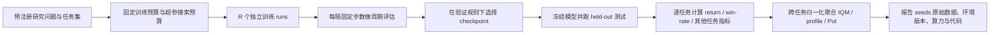

# 多智能体强化学习实验验证中的 Benchmark 与 Metric 研究报告

## 执行摘要

多智能体强化学习（MARL）的实验验证，已经从“在一个环境里跑出更高回报”转向“在一组具有代表性的环境上，以可复现、可比较、统计上可信的方式，回答算法到底改进了什么”。这一变化的核心原因有三点：第一，单一固定任务极易被过拟合，尤其是在经典 cooperative benchmark 上；第二，MARL 的方差、实现细节敏感性和训练不稳定性远高于单智能体 RL；第三，不同研究目标对应的 benchmark 与 metric 并不相同——协作、竞争、混合博弈、通信、泛化、鲁棒性、可扩展性，实际上需要不同的任务设计与评价口径。(https://arxiv.org/abs/1902.04043)

就 benchmark 格局而言，可以把主流 MARL 平台分成四类。第一类是“固定协作任务”基准，如 SMAC、Multi-Agent MuJoCo、Hanabi、RWARE；它们利于算法回归测试和 ablation，但对泛化和分布外鲁棒性的覆盖有限。第二类是“程序生成/ held-out 评测”基准，如 SMACv2、Melting Pot、Overcooked Generalisation Challenge；它们更适合研究 closed-loop policy、train-test gap、跨伙伴协作与社会泛化。第三类是“平台型套件”，如 PettingZoo、OpenSpiel、Unity ML-Agents；它们更像统一接口与环境超集，而不是单一 leaderboard benchmark。第四类是“强对抗/真实感竞技类”环境，如 Google Research Football、Pommerman、RoboCup；它们特别适合评估自博弈、对手泛化、排名系统与鲁棒性。(https://pettingzoo.farama.org/index.html)

就 metric 而言，episodic return 与 win-rate 仍然是基础指标，但它们远远不够。协作任务至少应同时报告 team return、每 agent 回报、learning curve、跨 seed 方差和不确定性区间；竞争任务通常需要胜率之外的 Elo/Glicko、最佳响应意义下的 exploitability/NashConv，或者跨对手池的 population-level 评价；泛化研究需要 train/test split、零样本 cross-play、held-out scenario 分数与 train-test gap；通信研究还必须报告消息成本、信息量和“无通信/消息打乱”消融；系统层面则至少应报告 environment steps、wall-clock、硬件、并在可能时给出 FLOPs 或吞吐量。(https://ar5iv.org/pdf/1902.04043)

如果要给出一个面向 2026 年前后的“默认协议”，高置信度建议是：固定训练预算；至少 5 个独立 seeds，较强结论尽量做到 10 个；按固定间隔评估并冻结测试协议；对每个 task 报告 learning curve 与 95% CI；跨 task 聚合时使用归一化分数、IQM、optimality gap、probability of improvement 和 performance profiles，而不是只给一张“最终平均胜率表”；同时公开原始逐 seed 数据、代码版本、环境版本、地图/场景版本与算力明细。SMAC 原论文已经建议报告 sample efficiency 与计算需求；NeurIPS 2022 的 cooperative MARL 标准化协议则进一步把独立 runs、评估频率、32 个评估 episode、320 个绝对性能 episode、IQM 与 stratified bootstrap CI 规范化了。(https://ar5iv.org/pdf/1902.04043)

本文的核心结论是：**没有任何一个 benchmark 或任何一个 metric 能单独“证明”某个 MARL 算法更好。最有说服力的实验设计，是把“研究问题—任务类型—评价指标—统计协议—可复现报告”五者严格对齐。** 在 cooperative credit assignment 上，优先用 SMACv2、RWARE、Hanabi，并报告 team return、win-rate、sample efficiency 与贡献度诊断；在 mixed/social generalization 上，优先用 Melting Pot、OpenSpiel 社会困境和 Overcooked 泛化设置，并报告 held-out test、cross-play、fairness 与 robustness；在 competitive/self-play 上，优先用 GRF、Pommerman、OpenSpiel、RoboCup，并报告对手池胜率、Elo/Glicko、exploitability 类指标和 best-response 鲁棒性。(https://mingfeisun.github.io/publication/2022-06-09-smacv2)

## Benchmark 全景与比较

在当前 MARL 研究中，最容易混淆的不是“用哪个环境”，而是“这个名字到底是固定 benchmark、环境家族、统一 API，还是训练平台”。例如，SMAC/SMACv2、Hanabi、RWARE 更接近固定 benchmark；PettingZoo、OpenSpiel、Unity ML-Agents 更接近环境与接口套件；Arena 更准确地说是跨环境接口层，而不是独立 benchmark。本节先给出一张统一比较表，再总结如何按研究目标选环境。(https://arxiv.org/abs/1902.04043)

下表中的“上手难度/算力需求”是综合官方依赖、安装链路、渲染/引擎要求、典型场景规模给出的**经验分级**，并非官方硬指标；若官方页面未直接声明许可证或某些元数据，则明确标为“未明确/需核查”。(https://github.com/oxwhirl/smac)

| 环境/套件                       | 性质                      | 维护者                                         | 许可证                                                              | 语言/引擎                                    | 支持任务                                                                        | 观测/动作                                                                              | 部分可观测                                                           | 随机性                             | 典型 agent 数                       | 典型奖励                                                      | 场景/任务覆盖                                                                                                 | 上手难度 / 环境侧算力 | 主要来源                                                           |
| --------------------------- | ----------------------- | ------------------------------------------- | ---------------------------------------------------------------- | ---------------------------------------- | --------------------------------------------------------------------------- | ---------------------------------------------------------------------------------- | --------------------------------------------------------------- | ------------------------------- | -------------------------------- | --------------------------------------------------------- | ------------------------------------------------------------------------------------------------------- | ------------ | -------------------------------------------------------------- |
| SMAC                        | 固定协作 benchmark          | WhiRL / University of Oxford                | MIT                                                              | Python，基于 SC2 ML API + PySC2 + SC2 引擎    | 纯协作 micromanagement                                                         | 局部特征向量；离散动作 `move/attack/stop/no-op`，动作数随敌人数变化                                     | 是，视野受 sight range 限制                                            | 中等；但经典版被指出随机性不足                 | 2–27+（场景依赖）                      | 默认 shaped reward：伤害/击杀/胜利 bonus；也支持稀疏 win/loss            | 14 个经典地图，难度分为 Easy / Hard / Super Hard                                                                  | 高 / 高        | https://github.com/oxwhirl/smac                                |
| SMACv2                      | 程序生成协作 benchmark        | 同上                                          | MIT                                                              | Python，SC2 + PySC2                       | 纯协作，强调泛化与 closed-loop                                                       | API 基本兼容 SMAC；状态/观测尺寸随程序生成配置变化                                                     | 是；另有 EPO 扩展                                                     | 高；随机起始位置、随机 unit types、视野/射程调整  | 5–20+ 常见，也可按 capability config 改 | 继承 SMAC 风格；评价重点转向 held-out 生成场景                           | 程序生成 Terran/Protoss 等场景，训练/评测来自同分布不同实例                                                                  | 高 / 高        |  https://github.com/oxwhirl/smacv2                          |
| PettingZoo                  | 统一 API + 环境家族           | Farama Foundation                           | 官方文档页未在摘要中直接列出；仓库为开源项目，使用前建议核查当前 LICENSE                         | Python；AEC API + Parallel API            | 协作、竞争、混合均有                                                                  | 因环境族而异；支持离散/连续、向量/图像                                                               | 因环境而异                                                           | 因环境而异                           | 从 2 到多 agent                     | 因环境而异                                                     | Atari、Butterfly、Classic、SISL、第三方家族；MPE 内含 cooperative/adversarial/communication 任务                      | 低 / 低到中      | https://pettingzoo.farama.org/index.html                       |
| MAgent / MAgent2            | many-agent gridworld 平台 | 原始 MAgent 为学术团队；MAgent2 为 Farama 维护 fork    | MAgent 论文为开源平台；MAgent2 文档页未直接在摘要中展开许可证，需核查仓库                     | Python，栅格像素环境                            | 多为竞争/对抗，也可做群体行为研究                                                           | 像素式局部观测；多为离散移动/攻击                                                                  | 通常是                                                             | 高，可大规模群体互动                      | 数十到数百，原始 MAgent 论文称单机 GPU 可扩到百万级 | 多为个体击杀/存活/团队对抗或追捕奖励                                       | Battle、Adversarial Pursuit 等；强调 many-agent 可扩展性                                                         | 中 / 中        | https://magent2.farama.org/index.html                          |
| Multi-Agent MuJoCo          | 连续控制协作 benchmark        | 原始仓库来自 Oxford 团队；当前维护版转入 Gymnasium Robotics | Apache-2.0                                                       | Python + MuJoCo                          | 纯协作连续控制                                                                     | 各 agent 连续动作；局部可见性由 `agent_obsk` 控制                                                | 常设为是                                                            | 中等，物理连续动力学                      | 2–10+                            | 通常为共享运动控制回报                                               | Ant / HalfCheetah / Hopper / Humanoid / Reacher / Swimmer / Walker / manyagent variants / coupled tasks | 中 / 中到高      | https://github.com/schroederdewitt/multiagent_mujoco           |
| Google Research Football    | 3D 物理足球环境               | Google Research                             | 仓库含 LICENSE；公开摘要未直接展开许可证类型，示例代码采用 Apache 2.0 头部，使用前宜核查仓库 LICENSE | Python + Gameplay Football 3D simulator  | 竞争、多人/多 agent，对 scripted AI 或自博弈                                            | raw 向量、72×96 minimap、pixels；默认 19 离散动作，V2 为 20                                     | 取决于控制视角与包裹器；多 agent 设置天然局部化                                     | 中到高，3D 物理与比赛演化                  | 1–11 控制球员                        | 比赛得失球、场景目标、稀疏或 shaped 任务奖励                                | 三类 full-game benchmark + Football Academy 简化场景                                                          | 中到高 / 高      | https://github.com/google-research/football                    |
| Hanabi Learning Environment | 不完全信息协作 benchmark       | Google DeepMind                             | Apache-2.0                                                       | C++ + Python API                         | 纯协作，不完全信息，隐式通信                                                              | 牌局知识状态；离散动作（出牌/弃牌/提示）                                                              | 是，且是 benchmark 核心                                               | 高，洗牌与手牌带来组合不确定性                 | 2–5                              | 通常以最终分数（0–25）为主                                           | 单一游戏规则，但 player-count、约定和 cross-play 空间很大                                                               | 低 / 低        | https://github.com/google-deepmind/hanabi-learning-environment |
| Pommerman                   | 竞技/协作-对抗 playground     | MultiAgentLearning / Pommerman 社区           | Apache-2.0                                                       | Python，Bomberman 风格 grid game            | FFA、2v2、带通信 Team Radio                                                      | 网格状态；典型 6 个离散动作（移动/放炸弹/停）                                                          | FFA 全可观测；Team 部分可观测；Team Radio 额外通信通道                           | 高，随机地图与交互爆炸动力学                  | 4                                | 极稀疏，胜负/存活导向                                               | FFA、Team、Team Radio                                                                                     | 中 / 中        | https://github.com/MultiAgentLearning/playground               |
| MARL-Grid                   | 轻量级 gridworld 环境        | 开源学术仓库                                      | Apache-2.0                                                       | Python，基于 MiniGrid                       | 多为协作/社会学习/通信原型任务                                                            | 局部图像式/栅格观测；相对复杂离散动作                                                                | 是                                                               | 中等，布局与任务可变                      | 2–4+ 常见                          | 任务完成/目标达成                                                 | 预置 2/3/4 agent cluttered/empty 等，也常被二次构造为社交/通信环境                                                        | 低 / 低        | https://github.com/kandouss/marlgrid                           |
| Overcooked-AI               | 人机/协作 benchmark         | Human Compatible AI                         | MIT                                                              | Python，2D 离散厨房 MDP                       | 纯协作，特别适合 ad hoc teamwork / human-AI coordination                            | 默认离散动作 `up/down/left/right/noop/interact`；通常使用全局 lossless state 或 feature encoding | 默认底层环境更接近全局可观测，但很多研究做 partner uncertainty / held-out partner 评测 | 中等，布局与伙伴策略引入变化                  | 常见 2                             | 送汤得分，可加 shaping                                           | 多布局；新布局易硬编码或程序生成；后续还有 OGC 泛化扩展                                                                          | 低到中 / 低到中    | https://github.com/HumanCompatibleAI/overcooked_ai             |
| RWARE                       | 离散仓储协作 benchmark        | semitable / 学术开源维护                          | 仓库摘要页未明确展示许可证，需以仓库 LICENSE 为准                                    | Python，Gymnasium 风格网格仓储                  | 纯协作，也支持个体奖励配置                                                               | 局部 3×3（可配）观测；4 个离散动作：左转/右转/前进/装卸                                                   | 是                                                               | 中等；请求货架随机采样、冲突消解                | N 可配置，常见 2–16                    | 送达请求货架 +1，回报稀疏                                            | tiny/small/medium/large；easy/hard；agent 数与请求货架数 configurable                                            | 低到中 / 中      | https://github.com/semitable/robotic-warehouse                 |
| Melting Pot                 | 社会泛化 benchmark          | Google DeepMind                             | Apache-2.0                                                       | Python + DeepMind Lab2D                  | 协作、竞争、欺骗、互惠、信任等混合社会互动                                                       | substrate-specific，通常是局部视觉/多通道输入 + 离散动作                                            | 通常是                                                             | 高；关键在 held-out social scenarios | 2–8+ 常见，随 substrate 变化           | 底层回报因 substrate 而异；总评估看 held-out social generalization 表现 | 50+ substrates，256+ held-out 测试情景                                                                       | 高 / 高        | https://github.com/google-deepmind/meltingpot                  |
| Unity ML-Agents             | 通用训练平台，不是固定单一 benchmark | Unity Technologies                          | Apache-2.0                                                       | Unity 引擎 + Python API + PyTorch trainers | 单 agent、协作、多 agent 对抗、自博弈                                                   | 向量/视觉/射线感知皆可；离散或连续动作均支持                                                            | 可配置                                                             | 可通过环境随机化提高                      | 从少量到大规模取决于场景                     | 环境自定义；支持 PPO/SAC/MA-POCA/self-play 等                      | 17+ 示例环境 + 自定义 Unity scene                                                                              | 中到高 / 中到高    | https://github.com/unity-technologies/ml-agents                |
| OpenSpiel                   | 通用博弈研究框架                | Google DeepMind                             | Apache-2.0                                                       | C++ 核心 + Python 接口                       | zero-sum、cooperative、general-sum；one-shot/sequential；perfect/imperfect info | game-specific；同时提供评价与学习动力学工具                                                       | 因游戏而异                                                           | 因游戏与 chance node 而异             | n-player 通用                      | 取决于游戏；可算 exploitability / best response 等                 | 覆盖大量棋盘、扑克、社会困境、gridworld 与 simultaneous-move 游戏                                                         | 中 / 低到中      | https://github.com/google-deepmind/open_spiel                  |
| RoboCup Soccer Simulation   | 经典多智能体竞技平台              | RoboCup Soccer Simulation 社区                | 官方首页/手册摘要页未直接给出统一许可证；需按 server/monitor/source 仓库分别核查             | 2D/3D 足球模拟器，服务端架构                        | 强竞争，也常用于 keepaway / half-field offense / full-match                         | 感知与动作来自 simulator protocol；连续时间/离散命令混合、通信受限                                        | 是                                                               | 高，受物理、对手、通信限制影响                 | 2D 全场为 11v11                     | 通常以比分/射门/子任务 shaped reward                                | 2D/3D 联赛、keepaway 等长期研究任务                                                                               | 高 / 高        | https://ssim.robocup.org/                                      |
| Arena                       | 接口层/工具包，而非独立 benchmark  | Tencent AI Lab                              | 仓库页未显示标准开源许可证，使用前必须核查                                            | Python，wrapper/interface toolkit         | 继承底层环境，可做自博弈、协作-竞争混合                                                        | 包装底层环境的 obs/reward/action 接口                                                       | 取决于底层环境                                                         | 取决于底层环境                         | 取决于底层环境                          | 取决于底层环境                                                   | 内置接口面向 SC2、ViZDoom、Pommerman、soccer 等                                                                   | 中 / 取决于底层环境  | https://github.com/tencent-ailab/Arena                         |

从研究使用习惯看，**SMAC 仍然是 cooperative CTDE 算法最常见的“回归测试场”**，但它更适合回答“在固定地图上能否更快学会高质量协作”，不适合回答“是否具有强泛化能力”。SMACv2 与 Melting Pot 的价值，恰好在于它们把“固定地图/固定社会配置上的解题能力”升级成了“对分布内未见实例或未见社会情境的泛化能力”。(https://mingfeisun.github.io/publication/2022-06-09-smacv2)

另一方面，PettingZoo、OpenSpiel、Unity ML-Agents 的优势不在于“某个 leaderboard”，而在于**覆盖面、统一接口和复现实验工程的便利性**。如果研究目标是快速比较算法在多种博弈结构上的行为、做环境级 ablation，或者需要兼容多种第三方训练框架，这三类平台通常比单一 benchmark 更高效。(https://pettingzoo.farama.org/index.html)

最后，需要特别指出两类“经常被误用”的环境。第一类是 Overcooked-AI：它并不只是“另一个 cooperative gridworld”，而是 human-AI coordination、ad hoc teamwork、partner generalization 的重要试验台；若只报告 self-play return，往往会错过其最核心的研究价值。第二类是 Hanabi：它也不只是“高分游戏”，而是隐式通信、约定形成、零样本协作和 cross-play 的试金石；单独的 self-play score 常常会掩盖“只会跟自己队友配合”的问题。(https://arxiv.org/pdf/1910.05789)

## 常见实验协议

MARL 的实验协议没有全领域统一标准，但近年的高质量建议已经逐渐收敛：固定预算、固定评估间隔、独立 seeds、明确 train/validation/test 边界、报告不确定性、公开逐 seed 原始数据与算力信息。这些建议同时来自 cooperative MARL 标准化协议、SMAC 原始 benchmark 建议、RLiable/Statistical Precipice 的聚合与不确定性分析，以及更广义的 empirical design 文献。

上面的流程图反映了近年来比较稳健的做法：不要把测试集既用于模型选择又用于最终汇报；对固定 benchmark 和程序生成 benchmark 都应保持“训练—验证—测试”角色分离；跨任务汇总时不要只给简单均值，而要给出更稳健的 IQM、performance profile 和 bootstrap CI。(https://openreview.net/pdf?id=am86qcwErJm)

### 推荐默认协议

| 协议环节          | 建议做法                                                                                                                                                                                                          | 为什么                          | 主要依据                                                       |
| ------------- | ------------------------------------------------------------------------------------------------------------------------------------------------------------------------------------------------------------- | ---------------------------- | ---------------------------------------------------------- |
| 训练/测试划分       | 固定任务 benchmark（如经典 SMAC）至少区分**调参地图/报告地图**；程序生成 benchmark（SMACv2、Melting Pot、OGC）必须使用 held-out test instances 或 held-out partners；co-play benchmark 需显式划分 train partners / validation partners / test partners | 防止环境过拟合与 checkpoint 泄漏到测试结论  | https://mingfeisun.github.io/publication/2022-06-09-smacv2 |
| seeds         | 资源紧张时不少于 5；强结论建议 10 个独立 runs；逐 seed 数据尽量公开                                                                                                                                                                    | MARL 方差高，少量 runs 容易得出不可靠结论   | https://ar5iv.org/pdf/1902.04043                           |
| 周期评估          | 固定评估间隔；cooperative MARL 标准化协议建议每 10,000 环境步评估一次                                                                                                                                                               | 保持曲线横轴可比较，避免只报“最好点”          | https://openreview.net/pdf?id=am86qcwErJm                  |
| 评估 episode 数  | 每个评估间隔 32 个 episode 是当前 cooperative MARL 的强默认值；跨任务绝对性能比较可用 320 个 episode（10×32）评估最佳 joint policy                                                                                                              | 控制评估噪声，同时维持训练成本可接受           | https://ar5iv.org/pdf/1902.04043                           |
| checkpoint 选择 | 预先声明选择规则；**优先使用验证集或预注册规则**，测试集只用一次；同时报告“最后 checkpoint”和“最佳验证 checkpoint”更稳妥                                                                                                                                   | 防止 test-time model selection | https://openreview.net/pdf?id=am86qcwErJm                  |
| 超参调优          | 所有方法使用**相同的调参预算**、相同的搜索空间设计原则、相同的 early-stopping 规则；报告搜索空间、trial 数、选择准则                                                                                                                                       | 不公平的 tuning budget 会扭曲算法比较   | https://openreview.net/pdf?id=am86qcwErJm                  |
| 计算资源披露        | 至少报告环境步数、训练时长、CPU/GPU 型号、显存、并发环境数；若可行，补充 FLOPs 或吞吐量                                                                                                                                                           | MARL 的“样本效率”和“工程效率”经常不一致     | https://github.com/oxwhirl/smac                            |
| 环境版本控制        | 明确环境版本、地图版本、wrapper、动作 mask、SC2 版本、随机种子来源                                                                                                                                                                     | benchmark 版本差异常导致结果无法横向比较    | https://github.com/oxwhirl/smac                            |

### 训练预算与停止准则

SMAC 原始论文的经验做法是：用固定评估间隔记录整个训练过程，把“样本效率曲线”和“最终绝对性能”分开汇报；该文还特别强调了需要报告计算需求。标准化协议进一步把“固定间隔评估 + 固定评估 episode 数 + 独立 runs + 归一化绝对分数”制度化。(https://ar5iv.org/pdf/1902.04043)

如果 benchmark 本身带有**程序生成或 held-out 测试机制**，例如 SMACv2、Melting Pot、Overcooked 泛化设置，那么训练停止与 checkpoint 选择应以 validation split 为准，而最终 test 分数只在训练完成后计算一次。对没有官方 split 的老 benchmark，至少应做任务级 leave-scenarios-out、partner holdout 或地图级 holdout，否则“泛化”结论通常站不住。(https://mingfeisun.github.io/publication/2022-06-09-smacv2)

### 统计汇总与横向比较

跨任务比较最常见的错误，是把不同尺度、不同天花板的任务分数直接平均。更可靠的做法是：先做 task-level 归一化，再在 environment-level 用 IQM、optimality gap、probability of improvement、performance profiles 汇总，并用 stratified bootstrap 计算 95% CI。RLiable/Statistical Precipice 正是为了解决“少量 seeds + 多任务平均”的不确定性问题，而 cooperative MARL 标准化协议已把这套工具明确推荐到 MARL 上。(https://arxiv.org/abs/2108.13264)

## 评估指标体系与定义

为了统一记号，记第 $k$ 次独立训练 run 的 joint policy 为 $\pi^{(k)}$，第 $e$ 个评估 episode 中 agent $i$ 的折扣回报为$G_{i}^{(k,e)}=\sum_{t=0}^{T-1}\gamma^t r_{i,t}$,team return 为$G_{\text{team}}^{(k,e)}=\sum_{i=1}^n G_i^{(k,e)}$,若环境为共享奖励，则 $G_i=G_{\text{team}}$ 在数值上可能相同。对 competitive / imperfect-information game，还常用 best response、exploitability、NashConv 等 game-theoretic 指标；对跨任务汇总，还需归一化与 bootstrap 不确定性分析。(https://ar5iv.org/pdf/1902.04043)

### 回报与结果类指标

| 指标 | 公式 | 含义 | 适用场景与优点 | 局限与常见坑 |
|---|---|---|---|---|
| Episodic return | $\displaystyle J(\pi)=\mathbb E_{\tau\sim \pi}\big[\sum_{t=0}^{T-1}\gamma^t r_t\big]$ | 最基本的策略价值 | 几乎所有 MARL 任务都应报告；直接对应优化目标 | 任务间不可直接比较；不同 reward shaping 会让结果不可比；仅报告最终 return 会隐藏训练不稳定性 |
| Per-agent return | $\displaystyle J_i(\pi)=\mathbb E[G_i]$ | 每个 agent 实际收益 | 混合博弈、资源分配、公平性研究必须看 | 在共享奖励任务中信息量有限；需配合 team return 与公平性指标 |
| Team return | $\displaystyle J_{\text{team}}(\pi)=\mathbb E[\sum_i G_i]$ 或共享回报的均值 |团队总体性能 | cooperative 任务首要指标；比 win-rate 更细 | 高回报不一定表示高鲁棒性或好协作；强 shaping 可能掩盖原任务难度 |
| Success / Win-rate | $\displaystyle \text{WinRate}=\frac{1}{E}\sum_{e=1}^E \mathbf 1[\text{win}_e]$ | 完成任务/获胜的概率 | SMAC、SMACv2、Pommerman、GRF、RoboCup 中很自然 | 二值化后信息损失大；在“已解”任务上容易饱和；低于阈值时难诊断失败模式 |
| Score / Goal difference / Hanabi score | 例如 $\displaystyle \frac1E\sum_e s_e$ | 任务域原生分数 | 体育、牌局、厨房协作往往比 win-rate 更细粒度 | 不同任务尺度不同；可能受 episode 长度影响，需要归一化 |

SMAC 原论文明确把 test win-rate 用作主要公开结果，同时仍建议保留 sample efficiency 曲线与统一默认奖励；Hanabi 通常以最终分数为主；Overcooked 和 RWARE 更应强调 return/throughput，而不是简单成功率。(https://ar5iv.org/pdf/1902.04043)

### 排名与博弈论类指标

| 指标                    | 公式                                                         | 含义                                   | 适用场景与优点                                   | 局限与常见坑                                                 |
| ----------------------- | ------------------------------------------------------------ | -------------------------------------- | ------------------------------------------------ | ------------------------------------------------------------ |
| Elo                     | $\displaystyle R'_i=R_i+K(S_i-E_i)$, 其中 $E_i=\frac{1}{1+10^{(R_j-R_i)/400}}$ | 基于对局结果的相对强度评分             | competitve/self-play、联赛制评估简单直观         | 非传递循环（rock-paper-scissors 型）会误导；依赖对手池组成；不能反映 exploitability |
| Glicko / Glicko-2       | Elo 扩展，额外显式建模 rating deviation（RD）与不确定性      | 更稳健地表达“分数 + 置信度”            | 对手数量不平衡、比赛数量不一致时优于纯 Elo       | 实现更复杂；仍然是对手池相对评分，不等于博弈最优性           |
| Exploitability          | 二人零和常写作 $\displaystyle \text{Expl}(\pi)=v(\text{BR}(\pi_{-i}),\pi_{-i})-v(\pi)$ 的对称化版本 | 距离 Nash 均衡有多远                   | Poker / OpenSpiel 等不完全信息零和博弈的核心指标 | 不适合一般和/合作任务；计算 best response 成本可能高         |
| NashConv                | $\displaystyle \text{NashConv}(\pi)=\sum_i \big[v_i(\text{BR}_i(\pi_{-i}),\pi_{-i})-v_i(\pi)\big]$ | 所有玩家偏离现策略做最佳响应时的总增益 | 一般和/多玩家博弈中比 exploitability 更通用      | 需要明确定义 best response；在大规模近似博弈中计算昂贵       |
| Cross-play matrix score | $\displaystyle X_{ab}=J(\pi_a,\pi_b)$, 再汇总其均值/最小值/IQM | 衡量与陌生伙伴或陌生对手交互能力       | Hanabi、Overcooked、population-based MARL 必须看 | 依赖伙伴/对手池构造；若池太窄，结论会虚高                    |

OpenSpiel 官方文档明确支持 exploitability / best response 等工具；对零和或不完全信息博弈，如果只报胜率而不报 exploitability/NashConv，经常无法区分“学到一个强 heuristic”与“接近均衡”。(https://openspiel.readthedocs.io/en/latest/intro.html)

### 学习效率与复杂度类指标

| 指标 | 公式 | 含义 | 适用场景与优点 | 局限与常见坑 |
|---|---|---|---|---|
| Learning curve | $\displaystyle t \mapsto \hat J_t$ 或 $\hat W_t$ | 训练全过程表现 | 所有论文都应给；最能识别早学会、迟学会、崩溃、震荡 | 若不配不确定性区间，很容易误读 |
| Sample efficiency | 例如给定预算 $B$ 下的 $\hat J_B$，或 AUC $\displaystyle \int_0^B \hat J_t\,dt$ | 多少环境交互后达到什么水平 | cooperative benchmark 和 expensive environment 特别重要 | AUC 受横轴范围影响大；不同论文若预算不同，AUC 不能直接比 |
| Sample complexity | $\displaystyle N_\tau=\min\{t:\hat J_t\ge \tau\}$ | 达到阈值性能所需样本数 | “谁更快到实用水平”时非常清晰 | 依赖阈值 $\tau$；若曲线抖动要规定平滑/持续条件 |
| Environment steps | 报告总环境交互步数 | 最常见预算尺度 | 与 RL 文献兼容 | 不代表真实时间开销；不同环境单步成本差异巨大 |
| Wall-clock time | $\displaystyle T_{\text{wall}}$ | 真实训练耗时 | 工程可用性和系统效率最直接 | 依赖硬件/并行度/实现优化；必须配套硬件说明 |
| Throughput | $\displaystyle \text{steps/sec}$ 或 episodes/sec | 系统吞吐量 | many-agent / 大型场景很有用 | 吞吐高不代表策略更样本高效 |
| FLOPs / training compute | $\displaystyle \text{总 FLOPs}$ 或近似计算成本 | 可更公平地比较“算力消耗” | 当算法结构差异很大时更有说服力 | 统计难，很多框架无法精确给出；常需近似 |

SMAC 已明确建议报告 sample efficiency 与 computational requirements；标准化协议则要求把步骤预算、独立 runs、评估间隔和硬件信息变成标准报告项。(https://ar5iv.org/pdf/1902.04043)
### 稳定性、方差与统计可靠性指标

| 指标                            | 公式                                                                  | 含义                | 适用场景与优点                         | 局限与常见坑                      |
| ----------------------------- | ------------------------------------------------------------------- | ----------------- | ------------------------------- | --------------------------- |
| Seed variance                 | $\displaystyle \mathrm{Var}_k[\hat J^{(k)}]$                        | 对初始化与随机性的敏感度      | 所有 MARL 都应报告                    | 只报 std 不报分布形状会遗漏 heavy-tail |
| 标准误 / 95% CI                  | $\displaystyle \bar J \pm 1.96 \frac{s}{\sqrt{R}}$；更推荐 bootstrap CI | 估计均值不确定性          | 图表必须配置信区间                       | 简单正态近似在小样本、多任务场景下不稳         |
| Median / IQM                  | median 或 interquartile mean                                         | 更稳健的聚合统计量         | 跨 tasks 聚合优于简单 mean             | 不能替代原始逐任务结果；仍需配置信区间         |
| Probability of improvement    | $\displaystyle \Pr(J_A > J_B)$ 的 bootstrap 估计                       | A 比 B 真正更好的概率     | 横向算法比较直观                        | 依赖 bootstrap 设计；需说明任务配对方式   |
| Stability / Convergence proxy | 例如尾段斜率 $\frac{d\hat J_t}{dt}$、尾段 std、崩溃频率                           | **训练是否收敛、是否后期震荡** |                                 |                             |
| Reliability / risk            | 例如 $\mathrm{CVaR}_\alpha(J)$、最低分位数、失败率                              | 关注“坏情况”而非平均情况     | deployment-sensitive 任务与鲁棒性研究必要 | 常被忽略；若只报均值会高估真实性能           |

RLiable／Statistical Precipice 的核心结论是，少量 runs 下只报均值和柱状图远远不够；更合理的是报告 IQM、performance profiles、probability of improvement 和 stratified bootstrap CI。Google 的 reliability metrics 工作则强调要区分“训练过程中的波动”和“学成之后固定策略的风险”。(https://arxiv.org/abs/2108.13264)

### 鲁棒性、泛化、公平性与协作机理指标

| 指标                                        | 公式                                                                                                               | 含义                            | 适用场景与优点                     | 局限与常见坑                                               |
| ----------------------------------------- | ---------------------------------------------------------------------------------------------------------------- | ----------------------------- | --------------------------- | ---------------------------------------------------- |
| 对手鲁棒性                                     | $\displaystyle J_{\text{opp-rob}}(\pi)=\mathbb E_{o\sim \mathcal O}[J(\pi,o)]$ 或 $\min_{o\in\mathcal O}J(\pi,o)$ | 对多种对手的稳定表现                    | self-play / league / 竞争环境必需 | 对手池构造决定结论；只打弱对手没有意义                                  |
| 扰动鲁棒性                                     | $\displaystyle \Delta_{\text{pert}}=J(\pi,\mathcal E_{\text{clean}})-J(\pi,\mathcal E_{\text{pert}})$            | 对观测噪声、延迟、失联、动力学偏移的退化          | real-world MARL、通信与部署研究     | 扰动分布必须合理；不要只测一种轻微噪声                                  |
| Generalization gap                        | $\displaystyle \Delta_{\text{gen}}=J_{\text{test}}-J_{\text{train}}$                                             | 训练分布与测试分布落差                   | 程序生成、地图 holdout、未见伙伴评估      | 若 train/test 难度不匹配，gap 不可直接解释                        |
| Zero-shot cross-play / ad hoc score       | $\displaystyle J_{\text{ZSC}}=\frac{1}{P_{\text{test}}}\sum_{p\in P_{\text{test}}}J(\pi,p)$                      | **与未见伙伴零样本协作能力**              |                             |                                                      |
| Fairness                                  | Jain 指数 $\displaystyle F=\frac{(\sum_i x_i)^2}{n\sum_i x_i^2}$；或 max-min fairness                                | 资源/收益/负担是否均衡                  | 对称 agent 任务、资源分配、交通/仓储      | 高公平不一定高效率；要与 team return 一起看                         |
| Communication efficiency                  | $\displaystyle C=\frac1T\sum_t m_t$（bit/step）、或 performance-per-bit                                              | **完成任务用了多少通信**                |                             |                                                      |
| Communication informativeness             | $\displaystyle I(M;S)$ 或 message entropy / topographic similarity                                                | 消息是否携带有用状态信息、是否形成结构化协议        | emergent communication 研究必备 | 高 mutual information 不代表对任务真有帮助，必须做 message ablation |
| Credit assignment / marginal contribution | $\displaystyle C_i=J(\pi)-J(\pi^{-i})$，或 Shapley 值 $\phi_i$                                                      | 每个 agent 对团队结果贡献多少            | 协作 credit assignment 研究     | 计算代价高；Shapley 在大团队上很贵                                |
| Counterfactual contribution               | $\displaystyle A_i=Q(s,\mathbf a)-\sum_{a_i'}\pi_i(a_i'\tau_i)Q(s,(a_i',a_{-i}))$                                | **“当前动作相对于自己平均动作”带来多少额外团队价值** | 分析 credit attribution 很自然   |                                                      |
| Emergent behavior / diversity             | 例如策略熵、行为聚类数、角色专精度、覆盖率、协作模式频次                                                                                     | 不是只看赢没赢，而是看学到了什么社会/群体结构       | many-agent、通信、社会困境          | 极易给出漂亮但与任务无关的图；必须和主任务指标绑定                            |

Melting Pot 的设计初衷就是把“陌生个体 + 陌生社会情境”下的 generalization 量化出来；SMACv2 的动机则是原始 SMAC 的随机性与部分可观测性不足，导致 open-loop policy 都能拿到不低分数；Overcooked 泛化工作进一步说明，仅有 self-play 高回报并不能说明 agent 具备 zero-shot cooperation。(https://github.com/google-deepmind/meltingpot)

### 什么时候该用哪些指标

如果研究的是**纯协作算法本身是否更强**，至少同时报告 team return / win-rate、sample efficiency、variance across seeds 与 compute。若研究的是**credit assignment 改进**，则应额外报告 agent-level return dispersion、marginal contribution 或 counterfactual 诊断。若研究的是**泛化**，train/test holdout 和 zero-shot cross-play 是主指标，self-play 只能算辅助指标。若研究的是**竞争**，胜率必须补上对手池设计、Elo/Glicko 或 exploitability/NashConv；否则很容易把“对某一个固定脚本更强”误当成“整体更强”。(https://ar5iv.org/pdf/1902.04043)

## 面向研究目标的 benchmark 与 metric 配对建议

| 研究目标                                            | 优先 benchmark                                                                                | 必报指标                                                                  | 建议附加指标                                                            | 为什么这样配                                                                                                                                                  |
| ----------------------------------------------- | ------------------------------------------------------------------------------------------- | --------------------------------------------------------------------- | ----------------------------------------------------------------- | ------------------------------------------------------------------------------------------------------------------------------------------------------- |
| cooperative CTDE 算法                             | SMACv2、SMAC、Multi-Agent MuJoCo、RWARE                                                        | team return / win-rate、learning curve、sample efficiency、seed variance | wall-clock、sample complexity、credit attribution                   | 这组环境最适合测试协调、局部观测与联合动作学习；SMACv2 比 SMAC 更能测 closed-loop 与泛化，MAMuJoCo 则补足连续控制，RWARE 补足稀疏协作与冲突。(https://mingfeisun.github.io/publication/2022-06-09-smacv2) |
| communication / implicit convention             | Hanabi、PettingZoo MPE（speaker-listener / crypto / reference）、Pommerman Team Radio、MARL-Grid | team score/return、cross-play、message cost、message ablation            | mutual information、message entropy、role specialization            | Hanabi 与 MPE 强调显式/隐式传讯，Pommerman Team Radio 与 MARL-Grid 便于做消息协议与结构化通信诊断。(https://arxiv.org/abs/1902.00506)                                              |
| competitive / self-play                         | OpenSpiel、Google Research Football、Pommerman、RoboCup                                        | 对手池胜率、Elo/Glicko、cross-play / round-robin 矩阵                          | exploitability / NashConv、worst-case opponent robustness          | 竞争任务最怕只对某一对手有效。OpenSpiel 提供博弈论评价工具；GRF、Pommerman、RoboCup 提供更复杂动态与现实感。(https://github.com/google-deepmind/open_spiel)                                    |
| mixed / social dilemmas / social generalization | Melting Pot、OpenSpiel 社会困境、PettingZoo MPE/Atari 多人游戏                                        | held-out test score、social welfare、per-agent return、fairness          | unfamiliar-partner robustness、behavior diversity                  | 这类研究关心的不只是总收益，还关心互惠、背叛、协调、公平与陌生个体适应。Melting Pot 在这方面最有代表性。(https://github.com/google-deepmind/open_spiel)                                               |
| human-AI coordination / ad hoc teamwork         | Overcooked-AI、Hanabi                                                                        | ZSC / cross-play、held-out partner return、train-test gap               | human proxy performance、policy diversity、message/role diagnostics | 这些任务的关键不是自博弈，而是与未见伙伴的可协作性。(https://github.com/HumanCompatibleAI/overcooked_ai)                                                                          |
| scalability / many-agent                        | MAgent2、Melting Pot、Unity ML-Agents 自定义大规模场景                                                | performance vs #agents、steps/sec、wall-clock、memory                    | role specialization、communication load、failure rate               | many-agent 研究如果只报最终回报，很容易忽视系统侧瓶颈。(https://magent2.farama.org/index.html)                                                                                |
| generalization / OOD / procedural robustness    | SMACv2、Melting Pot、Overcooked OGC、程序化 PettingZoo/Unity 场景                                   | held-out test、generalization gap、sample efficiency on unseen tasks    | worst-case split、OOD robustness、performance profiles              | 泛化研究不能停留在同分布同地图自评；必须有明确 split 和未见测试。(https://mingfeisun.github.io/publication/2022-06-09-smacv2)                                                        |

如果只能选**一套 cooperative 通用组合**，我更推荐 **SMACv2 + RWARE + Hanabi**，指标上至少配 **team return / win-rate + learning curve + seed variance + compute**。如果研究重心在**社会泛化与协作迁移**，则更推荐 **Melting Pot + Overcooked + Hanabi cross-play**。如果研究重心在**对抗与均衡**，则优先 **OpenSpiel + GRF/Pommerman**，并把 exploitability / NashConv 或者至少对手池 round-robin 放到主结果，而不是附录。(https://mingfeisun.github.io/publication/2022-06-09-smacv2)
## 复现与报告最佳实践

近年来 MARL 的一个高频结论是：**所谓算法进步，常常被实现技巧、调参预算、seed 漂移与 benchmark 过拟合夸大。** 因此，复现实验报告不只是“附上代码”，而是要把“配置空间、版本边界、统计边界和算力边界”一起封装出来。(https://openreview.net/pdf?id=am86qcwErJm)

### 最低可复现清单

1. **环境元数据**：环境名、版本、地图/布局/scenario 名、SC2 版本、wrapper、frame skip、action mask、reward shaping 开关。SMAC 官方甚至特别提醒 SC2 版本变化会导致结果不可比。(https://github.com/oxwhirl/smac)
2. **训练配置**：总环境步数、并发环境数、batch size、学习率、target network update、探索噪声、RNN/attention/通信模块细节。(https://openreview.net/pdf?id=am86qcwErJm)
3. **调参过程**：搜索空间、trial 数、early stopping、最佳配置选择标准，以及 novel method 和 baseline 是否共用相同预算。(https://openreview.net/pdf?id=am86qcwErJm)
4. **评估协议**：评估间隔、每次评估 episode 数、greedy 还是 sampling、是否关闭探索、checkpoint 选择规则、测试集是否只使用一次。(https://openreview.net/pdf?id=am86qcwErJm)
5. **统计汇总**：独立 runs 数、任务级结果、环境级汇总规则、95% CI、bootstrap 方法、是否提供逐 seed 原始曲线。(https://openreview.net/pdf?id=am86qcwErJm)
6. **算力信息**：CPU/GPU 型号、显存、总 wall-clock、并行度、必要时的 FLOPs 或近似训练算量。(https://ar5iv.org/pdf/1902.04043)
7. **代码与数据**：训练代码、评估脚本、环境配置、原始评价输出、日志与 checkpoint 索引。标准化协议明确建议公开 raw evaluation data 和代码实现。(https://openreview.net/pdf?id=am86qcwErJm)

### 建议报告表与图

| 报告工件 | 推荐内容 | 作用 |
|---|---|---|
| Benchmark 元数据表 | 环境、版本、任务、动作/观测、reward、预算、算力 | 防止“同名不同设定” |
| 主结果表 | 每任务最终指标、95% CI、best/last checkpoint、seeds | 给出任务粒度真实表现 |
| 聚合结果表 | 归一化绝对分数、IQM、optimality gap、probability of improvement | 跨任务公平对比 |
| 学习曲线图 | 每任务或每组任务的 mean/median + 95% CI | 看样本效率与不稳定性 |
| Box/violin plot | 最终分数或 best checkpoint 的 seed 分布 | 看重尾与方差 |
| Cross-play heatmap | 伙伴 × 伙伴 或 agent × opponent 的矩阵 | 看 ZSC / 对手泛化 |
| Performance profile | 达到某阈值以上性能的任务比例曲线 | 比简单均值更稳健 |
| Compute-performance 散点图 | 最终质量 vs wall-clock / FLOPs | 区分“更强”与“更贵” |

在统计检验上，最推荐的是**stratified bootstrap 95% CI、probability of improvement 和 performance profiles**；它们比“只做一两个 t-test”更适合多任务 RL/MARL 的常见设置。若确实需要 hypothesis testing，最好在 task-level 正规化后做 paired bootstrap 或者与研究问题相称的非参数检验，但不应仅凭单一最终 checkpoint 上的普通 t 检验下结论。https://github.com/oxwhirl/smac

### 一个可直接采用的默认模板

如果没有社区约定成俗的专属 protocol，可以采用下面这一“默认 MARL 报告模板”：

- 每个方法 **10 个独立 runs**；资源极其有限时至少 5 个。(https://openreview.net/pdf?id=am86qcwErJm)
- **每 10k 环境步评估一次**，每次 **32 个 episode**。(https://openreview.net/pdf?id=am86qcwErJm)
- 主文必须给：**逐任务 learning curves + 95% CI**、**最终归一化聚合 IQM + 95% bootstrap CI**、**主 benchmark 的 raw seeds 分布图**。(https://openreview.net/pdf?id=am86qcwErJm)
- 竞争任务再加：**round-robin / cross-play 矩阵**，条件允许时加 **Elo/Glicko**；博弈论 benchmark 再加 **exploitability/NashConv**。(https://openspiel.readthedocs.io/en/latest/intro.html)
- 泛化任务再加：**train/test split 说明、held-out score、generalization gap、zero-shot partner/opponent 结果**。(https://mingfeisun.github.io/publication/2022-06-09-smacv2)
- 通信任务再加：**message cost、message ablation、打乱消息或禁用通信的性能退化**。(https://pettingzoo.farama.org/environments/mpe/)

## 原始资料与优先阅读清单

以下清单按“对 MARL 实验设计的重要性”排序，优先选择论文、官方文档与官方仓库。

| 优先级 | 资料                                                                              | 作用                                                                                        | 主要来源                                                       |
| --- | ------------------------------------------------------------------------------- | ----------------------------------------------------------------------------------------- | ---------------------------------------------------------- |
| 高   | **SMAC** 论文与官方仓库                                                                | cooperative CTDE 经典 benchmark；同时给出 win-rate、样本效率、计算需求与 5-run 评估建议                         | https://arxiv.org/abs/1902.04043                           |
| 高   | **SMACv2** 论文与官方仓库                                                              | 解释为何经典 SMAC 不足，并引入程序生成与 EPO                                                               | https://mingfeisun.github.io/publication/2022-06-09-smacv2 |
| 高   | **Towards a Standardised Performance Evaluation Protocol for Cooperative MARL** | 当前最直接面向 cooperative MARL 的标准化协议建议                                                         | https://openreview.net/pdf?id=am86qcwErJm                  |
| 高   | **RLiable / Statistical Precipice**                                             | 解决“少量 runs + 多任务聚合”的不确定性与汇总问题                                                             | https://arxiv.org/abs/2108.13264                           |
| 高   | **Empirical Design in Reinforcement Learning**                                  | 从更广义 RL 视角系统讨论实验设计、假设检验、超参和偏差                                                             | https://jmlr.org/papers/volume25/23-0183/23-0183.pdf       |
| 高   | **Melting Pot** 技术报告与仓库                                                         | 社会泛化、held-out social scenarios 的代表 benchmark                                              | https://jmlr.org/papers/volume25/23-0183/23-0183.pdf       |
| 高   | **OpenSpiel** 文档与仓库                                                             | general-sum / zero-sum / imperfect-information 统一框架；支持 exploitability / best response 等评估 | https://jmlr.org/papers/volume25/23-0183/23-0183.pdf       |
| 中高  | **PettingZoo** 文档与论文                                                            | 实验工程统一接口；适合算法级广覆盖比较                                                                       | https://pettingzoo.farama.org/index.html                   |
| 中高  | **Google Research Football** 论文与仓库                                              | 竞争/多人/多 agent 足球环境，兼具物理复杂度与 Academy 场景                                                    | https://arxiv.org/abs/1907.11180                           |
| 中高  | **Hanabi Challenge / HLE**                                                      | 不完全信息协作、隐式通信、cross-play 研究的核心资料                                                           | https://arxiv.org/abs/1902.00506                           |
| 中高  | **Overcooked-AI** 仓库与原始论文                                                       | human-AI coordination、partner generalization、ZSC 的重要基础设施                                  | https://github.com/HumanCompatibleAI/overcooked_ai         |
| 中   | ==**RWARE** 仓库==                                                                | 稀疏协作、局部观测、冲突消解与仓储任务配置                                                                     | https://github.com/semitable/robotic-warehouse             |
| 中   | **Pommerman** 论文与仓库                                                             | 复杂对抗/协作混合、稀疏奖励、通信消融                                                                       | https://arxiv.org/abs/1809.07124                           |
| 中   | **Multi-Agent MuJoCo** 仓库                                                       | 连续控制 cooperative benchmark 的标准起点                                                          | https://github.com/schroederdewitt/multiagent_mujoco       |
| 中   | **BenchMARL**                                                                   | 标准化配置、批量 benchmark 和实验工程的现代工具链                                                            | https://github.com/schroederdewitt/multiagent_mujoco       |
| 中   | **Unity ML-Agents**                                                             | 自定义复杂 3D 多 agent 场景与教学/工业原型的重要平台                                                          | https://github.com/unity-technologies/ml-agents            |

## 开放问题与边界

第一，很多“环境元数据”其实并不由 benchmark 单独决定，而是由**benchmark × 算法实现 × 训练脚本 × 硬件并行方式**共同决定，因此本文中的“算力需求”只能做环境侧经验概括，不能替代具体实验预算。第二，PettingZoo、OpenSpiel、Unity ML-Agents、Arena 这类对象更接近“平台/接口/套件”，若直接把它们和单任务 benchmark 放在同一 leaderboard 上，会在方法学上造成混淆。第三，若论文目标是“泛化”“鲁棒性”“human-AI coordination”或“通信效率”，那么仅在经典固定地图 benchmark 上汇报更高 self-play return，通常不足以支撑主张。最后，像许可证、场景精确数量、默认 reward 配置这类信息，个别仓库页面摘要并不总是直接展示；本文对未能在官方摘要页直接确认的地方都已尽量标注“需核查/未明确”。（https://pettingzoo.farama.org/index.html）