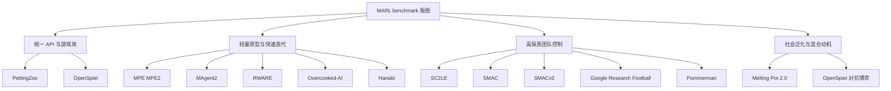

## 执行摘要

多智能体强化学习并不存在一个“万能 benchmark”。如果你的研究问题是**协作控制**，最常用也最稳定的核心组合通常是：用由 Farama Foundation 维护的 PettingZoo/MPE 做算法原型调试，用 SMAC 或更推荐的 SMACv2 做 **CTDE** 协作战术评测，用 Hanabi 和 Overcooked-AI 检验隐式/显式协作与配合，再用 RWARE 或 Google Research Football 压测稀疏奖励、长期规划和多步协作。如果你的问题是**社会泛化、混合动机与未知伙伴适应**，Melting Pot 2.0 几乎是目前最系统的选择；如果你的问题是**博弈论一致性**，则应把 OpenSpiel 纳入主实验线，而不只报 win rate。(https://arxiv.org/abs/2006.07869)

从 2023 年之后的 benchmark 走势看，研究重点明显从“在固定地图上把最终回报刷高”转向“在**随机化场景、未知对手/队友、保留部分可观测性**时是否还能稳定工作”。SMACv2 对原始 SMAC 的主要修正就是这一点：它通过程序化起始位置、随机单位组合和更强的部分可观测性，专门抑制了“按时刻表执行的 open-loop 策略”在固定地图上的投机性高分。Melting Pot 2.0 则把“换伙伴是否还能合作”直接做成正式评测协议。(https://arxiv.org/abs/2212.07489)

指标方面，**合作任务**至少要同时报告 episodic return、success/win rate、sample efficiency、跨随机种子的稳定性，以及 train-test 泛化差距；**竞争与一般和博弈任务**则必须把 regret、exploitability、NashConv 这类博弈一致性指标放回中心位置，否则单纯 win rate 很容易只是在当前对手池上“过拟合赢球”；**社会困境与混合动机**任务则要补充 social welfare、fairness、robustness 和 partner generalization。(https://arxiv.org/abs/1908.09453)

实验设计上，最常见的失误不是“模型不够强”，而是**问题定义和报告协议不干净**：只报最好种子；把 reward shaping 后的 return 与别人的 sparse-return 直接比较；只在训练地图上评估；在 SMAC 类任务上忽略 open-loop sanity check；或者不说明环境版本、地图包、wrapper、随机种子和硬件。Papoudakis 等人的 benchmark 论文已经明确指出：环境、实现细节、参数共享与超参数搜索策略都会显著影响结论，因此“同算法不同实现”与“同环境不同评测协议”都足以改写排序。(https://arxiv.org/abs/2006.07869)

## 基准版图与分类

可以把 MARL benchmark 大致分成四层：**统一 API/游戏库层**、**轻量原型层**、**高保真团队控制层**和**社会泛化层**。前者负责统一接口与博弈分析，后者负责把你真正关心的科学问题做“有难度的任务化”。这也是为什么同样是“常用 benchmark”，PettingZoo、OpenSpiel 更像“生态基座”，而 SMACv2、Melting Pot 2.0、RWARE 更像“明确研究问题的任务族”。(https://pettingzoo.farama.org/index.html)

下表给出一个**研究选型级**的横向比较。这里的“安装/算力”是相对量级，而不是绝对 FLOPs；真正写论文时仍应报告具体 CPU/GPU、并行环境数与 wall-clock。(https://github.com/google-deepmind/pysc2)

| 基准                       |                    典型代理数 | 可观测性                          | 激励结构               | 观测/动作                              | 安装/算力 | 最适合回答的问题                                | 官方/主文献                                                               |
| ------------------------ | -----------------------: | ----------------------------- | ------------------ | ---------------------------------- | ----- | --------------------------------------- | -------------------------------------------------------------------- |
| PettingZoo               |             2 到多体，随子环境变化 | 随子环境变化                        | 合作/对抗/混合           | 离散与连续皆有                            | 低到中   | 统一 API、算法迁移、脚手架复现                       | https://pettingzoo.farama.org/index.html                             |
| OpenSpiel                |      2 到 n-player，70+ 游戏 | 完全/不完全信息皆有                    | 零和/合作/一般和          | 多为离散，少量 gridworld                  | 低     | exploitability、NashConv、regret、PSRO/CFR | https://arxiv.org/abs/1908.09453                                     |
| MAgent2                  |  24 到 162+；原始 MAgent 可更大 | 局部观测 + 全局状态                   | 竞争/混合              | 局部栅格观测，离散动作                        | 中     | many-agent 扩展性、群体行为                     | https://magent2.farama.org/index.html                                |
| SC2LE                    |              多玩家、数十到数百单位 | 强部分可观测                        | 竞争                 | 像素/feature/raw；超大动作空间              | 高     | 长时程规划、层级控制、模仿 + RL                      | https://arxiv.org/abs/1708.04782                                     |
| SMAC                     |             2–27 友军对脚本敌军 | 局部观测                          | 纯合作                | 局部向量观测；离散攻击/移动                     | 中到高   | CTDE、credit assignment、协作战术             | https://github.com/oxwhirl/smac/blob/master/docs/smac.md             |
| SMACv2                   |     常见 5v5、10v10、20v20 等 | 更强部分可观测 + 程序化随机性              | 纯合作                | 与 SMAC API 兼容                      | 中到高   | closed-loop 泛化、OOD 战术协作                 | https://arxiv.org/abs/2212.07489                                     |
| Hanabi                   |                      2–5 | 强不完全信息                        | 纯合作                | 离散回合制                              | 低到中   | 沟通、theory of mind、ad-hoc teamwork       | https://arxiv.org/abs/1902.00506                                     |
| Google Research Football |                1–11 可控球员 | 部分可观测                         | 可做协作或竞争            | raw / simple115v2 / pixels；19 离散动作 | 中到高   | 长时程团队配合、策略与控制耦合                         | https://arxiv.org/abs/1907.11180                                     |
| MPE / MPE2               |                   2–6 常见 | 多数任务近似全观测；speaker-listener 例外 | 合作/对抗/混合           | 连续观测；默认离散、可连续动作                    | 低     | 快速原型、混合动机、通信                            | https://pettingzoo.farama.org/environments/mpe/                      |
| RWARE                    | benchmark 常见 2–4；包支持更大 N | 部分可观测                         | 合作为主，可改奖励设定        | 局部格子观测；离散动作                        | 低     | 稀疏奖励、多机器人物流协调                           | https://github.com/semitable/robotic-warehouse/blob/master/README.md |
| Melting Pot 2.0          |      随 substrate/role 变化 | 通常部分可观测                       | 大量 mixed incentive | Lab2D 像素/任务特定动作                    | 高     | 社会泛化、陌生伙伴、robustness                    | https://github.com/google-deepmind/meltingpot                        |
| Overcooked-AI            |                经典上 2 名厨师 | 官方 README 未强行固定单一 POMDP 规格    | 纯合作                | 网格厨房；具体 tensor 随 wrapper 而变        | 低到中   | 人机协作、任务分解、配合灵活性                         | https://github.com/HumanCompatibleAI/overcooked_ai                   |
| Pommerman                |     常见 4 人 FFA / team 变体 | 不完全信息                         | 竞争/混合              | 视具体 fork/规则集而定                     | 中     | 自博弈、对手建模、隐患推理                           | https://ceur-ws.org/Vol-2282/MARLO_104.pdf                           |

有三个名字在文献中也经常出现，但要单独说明。**Unity ML-Agents、RoboCup、BenchMARL** 更像“平台、league 或 benchmark harness”，而不是一个固定元数据可一键横比的单一 benchmark。真正做比较时，必须把它们绑定到具体 task/scene/league 上，再报告代理数、观测、动作、奖励和 episode 规格；否则“我在 Unity ML-Agents 上做实验”这种表述的可复现性很弱。

## 重点基准画像

**PettingZoo**：它更准确地说是一个 benchmark zoo 加 API 标准，而不是一个单一任务。suite 级别同时支持 AEC API 与 Parallel API，覆盖 Atari、Classic、SISL、Butterfly、MPE 等多个家族，所以**离散/连续、2 体到多体、像素/向量、合作/竞争/混合**都可能出现。好处是工程上最稳定、最适合做统一训练管线、wrapper 对比、算法迁移与复现脚手架；缺点是如果论文只写“在 PettingZoo 上验证”，信息远远不够，必须精确到子环境、版本与 wrapper。官网没有给出 suite 级统一 episode 长度、统一 scenario 数量，也没有统一算力需求，因此这些字段都应按子环境报告。(https://pettingzoo.farama.org/index.html)

**OpenSpiel**：由 DeepMind 推出的 OpenSpiel 也是“游戏研究库”而不是单任务 benchmark。它支持单人与多人、零和/合作/一般和、一次性/序列式、完全与不完全信息游戏，并且文档明确强调它还提供学习动力学与常见评估指标工具。它最适合**博弈一致性评估**，尤其是 exploitability、NashConv、regret、Alpha-Rank、PSRO/CFR 相关实验；对于只关心 CTDE 协作控制的论文，它常常不是主战场，但对于需要严肃讨论 equilibrium quality 的工作，它几乎不可替代。语言与工具链上，它提供文档化的 Python/C++ 使用方式；episode 长度则完全取决于你选的具体博弈。(https://arxiv.org/abs/1908.09453)

**MAgent2 / 原始 MAgent**：MAgent2 是原始 MAgent 的维护分支，主打**大规模栅格 many-agent** 场景。官方文档中的代表环境里，Battle 默认就有 162 个代理，离散动作 21，局部观测形状为 (13\times13\times5)，最大回合数 1000；Adversarial Pursuit 默认 75 个代理，包含 predator/prey 非对称动作与局部栅格观测。原始论文则进一步强调它面向“hundreds to millions of agents”，并给出“单 GPU 服务器可承载一百万代理”的可扩展性目标。它通常是**局部观测、离散动作、竞争或混合动机**，适合测扩展性、群体行为、局部相互作用与局部 credit assignment，不太适合做精细现实物理控制。安装上 `pip install magent2` 相对直接，但训练成本会随地图规模和代理数快速增长。(https://magent2.farama.org/index.html)

**SC2LE**：SC2LE 构建在 StarCraft II 之上，是 DeepMind 与 Blizzard Entertainment 合作推出的完整 RTS 学习环境。它是典型的**竞争、多玩家、强部分可观测、超大状态与动作空间、长时程延迟 credit assignment**任务；官方论文明确写到：动作空间涉及对数百单位的选择与控制，状态只能从原始特征平面或视觉输入里观察，而且主游戏与 mini-games 都可用。PySC2 文档进一步说明了 RGB、feature layer 与 structured/raw observation 三类观测，以及游戏版本绑定、地图包、seed 和记分回放依赖。工程上它需要完整 StarCraft II 安装，且 PySC2 依赖支持 API 的 StarCraft II 版本；这类环境非常适合层级控制、模仿学习、宏观-微观联合策略和长时程规划，但如果你的论文重心只是 MARL 的基础 credit assignment，SC2LE 往往过重。(https://arxiv.org/abs/1708.04782)

**SMAC**：SMAC 把 SC2LE 的完整 RTS 问题收缩成“每个单位由一个 agent 控制”的协作微操 benchmark。它是**纯合作、局部观测、离散动作**，动作通常是四方向移动、攻击/治疗、stop 和 no-op，单 agent 最大动作数会随 scenario 从 7 到 70 变化；局部观测基于 sight range，文档默认视野半径为 9，射程为 6。官方 scenario 列表覆盖对称、非对称与 micro-trick 地图，如 3m、2s3z、MMM、corridor、so_many_banelings 等。奖励可以是稀疏胜负信号，也可以是基于伤害、击杀和胜负 bonus 的 shaped reward；主指标通常是 win rate。它长期是 CTDE 论文主战场，但 SMACv2 论文后来指出：原始 SMAC 的随机性与部分可观测性不足，open-loop 策略在不少图上都能取得不差的 win rate，所以如果你的核心 claim 是“需要闭环决策与泛化”，SMAC 单独使用已经不够。(https://github.com/oxwhirl/smac/blob/master/docs/smac.md)

**SMACv2**：SMACv2 在接口上尽量兼容 SMAC，但在评测哲学上已经明显升级：它通过**随机起始位置、随机单位组合、变化的视野/射程与 held-out evaluation**，把“记地图脚本”压制下去，转而考察 closed-loop policy 与分布内泛化。官方说明里给出了 terran/protoss/zerg 三族的程序化 unit generation；常见场景包括 5v5、10v10、20v20 及不对称版本。论文的核心结论非常明确：SMACv2 旨在解决 SMAC 的低随机性与弱闭环需求问题，并引入 EPO（extended partial observability challenge）让部分可观测性真正有意义。如果你今天做协作 MARL 主实验，**我会把 SMACv2 视为比 SMAC 更应优先纳入的标准项**。工程代价方面，它仍然继承了 SC2 依赖，属于中高成本 benchmark。(https://arxiv.org/abs/2212.07489)

**Hanabi**：Hanabi 是**2–5 人、纯合作、强不完全信息、回合制、沟通受限**的典型 benchmark。官方挑战论文把它定位为 theory of mind 与协作推理前景最鲜明的挑战域之一；PettingZoo/OpenSpiel 封装则给出了非常具体的默认接口，例如 2 人版默认动作为 Discrete(20)、最小观测为 658 维 bit-vector，step 奖励等于当前动作引起的分数变化，若最终输掉则总分归零。游戏何时结束并不是固定 horizon，而是由生命值耗尽、五色烟花完成或牌堆耗尽共同决定。工程上，原始 Hanabi Learning Environment 需要 C++ 编译，且其 GitHub 仓库已在 2024 年归档；今天更稳妥的做法通常是直接用 OpenSpiel 或由其封装出来的接口。它最适合做**受限通信、信念建模、协议形成、ad-hoc teammate 适应**。(https://arxiv.org/abs/1902.00506)

**Google Research Football**：由 Google Research 推出的 Google Research Football 是一个基于物理 3D 足球模拟器的 RL 环境，支持**单个球员控制到多人联合控制**。官方文档给出了 raw observation、simple115/simple115_v2、minimap（extracted）和 pixels 等多种表示，以及默认 19 个离散动作；V2 action set 还额外提供 `builtin_ai`。scenario 方面，它同时提供三档完整 90 分钟 11v11 Benchmark 与 11 个 Football Academy 训练场景，例如 `academy_pass_and_shoot_with_keeper`、`academy_counterattack_hard` 等。官方 README 也提供了复现实验脚本和 TensorFlow 1.15 checkpoint 说明，说明它在 reproducibility 上较强调“版本与脚本绑定”。就研究用途而言，它很适合长期配合、球权转换、局部控制与团队策略的耦合问题。安装方面既可 `pip install gfootball`，也可用 Docker；但构建 C++ 引擎、渲染与多人控制都意味着它比 MPE/RWARE 明显更重。(https://arxiv.org/abs/1907.11180)

**MPE / MPE2**：由 OpenAI 提出的 MPE 是一套二维粒子世界任务，在 PettingZoo 里长期作为 MARL 入门 benchmark，被广泛用于 MADDPG、MAPPO、IPPO 等算法原型验证。它的代表特征是：**连续观测、默认离散但可连续的动作空间、非常快的 CPU 仿真速度**。以 Simple Spread 为例，默认 3 个 agent、3 个 landmark、观测维度 18、action 为 Discrete(5) 或 Box、最大回合数 25；Simple Tag 默认 1 个 good agent、3 个 adversaries、2 个 obstacles，也是 25 step 的短时地剧情景。Papoudakis 的 benchmarking 论文指出：他们使用的四个 MPE 协作任务里，除 Speaker-Listener 外其余基本可视作全观测，因此 MPE 更像“轻量混合动机/通信任务”而不是严苛 POMDP。另一个今天必须写进 reproducibility 的事实是：PettingZoo 已明确把 `pettingzoo.mpe` 迁往独立的 MPE2，原始 OpenAI 仓库也已归档；如果不写清用的是 PettingZoo 旧版、MPE2 还是原始代码，结果很难严谨对齐。(https://pettingzoo.farama.org/environments/mpe/)

**RWARE**：RWARE 是稀疏奖励、多机器人物流协调 benchmark 的代表。它的核心设定是若干机器人在仓库中搬运被请求的货架到工作站；每成功交付一个被请求货架得到 1 分，因此奖励天然稀疏。官方 README 显示，环境尺寸可选 tiny/small/medium/large，请求货架数 (R) 控制难度，benchmark 常用 2–4 个 agent，而包本身支持更一般的 N。观测是以 agent 为中心、可配置范围的局部方格视野；动作是离散式移动与装卸。这里有一个研究写作上很重要的细节：README 叙述性地列出 4 个原语动作，但 `gym.make` 示例里 action space 又显示为 `Tuple(Discrete(5), ...)`；这意味着**不同版本/接口文档之间的动作编码可能并不完全按自然语言直觉对齐**，论文里最好直接打印并附上 `env.action_space` 和 package version。安装非常轻量，`pip install rware` 即可；在所有主流基准里，它是最适合研究**稀疏奖励、多机器人仓储、局部冲突解决、路径协调**的一个。官方 README 没有在顶层概述里给出统一默认 episode 长度，因此如果你改过 `max_steps`，应明确报告。(https://github.com/semitable/robotic-warehouse/blob/master/README.md)

**Melting Pot 2.0**：Melting Pot 2.0 是当前最典型的**社会泛化 benchmark**。它的基本单元不是“地图”，而是“scenario = substrate + background population”：同一个物理底层世界，配上不同背景群体，就形成不同社会情境。官方仓库和技术报告都强调，它包含 50 多个 substrate 和 256 个以上 held-out test scenarios，大多数情境是 mixed incentive，而不是简单的纯合作或纯零和。它测的不是“在训练伙伴上配合得多好”，而是“遇到陌生伙伴、陌生社会结构时还能不能有效行动”。从研究问题上说，它特别适合 generalization、cross-play、robustness、social welfare/fairness、partner adaptation。工程上它依赖 DeepMind Lab2D：若缺少合适 wheel，可能需要从源码构建，因此安装与算力都明显高于轻量格子世界。(https://github.com/google-deepmind/meltingpot)

**Overcooked-AI**：Overcooked-AI 把双人厨房协作任务做成了一个经典的 fully cooperative benchmark。官方 README 的重点不是某个固定 observation tensor，而是任务本身：尽可能快地做汤、交汤，任务需要在线分工与高度协作；代码结构里还显式提供了 planners、A* 搜索与 layout generator，因此它天然适合“规划 + RL”“人机协作”“零样本搭档适应”这类问题。工程上，安装既可用 PyPI 也可从源码用 `uv` 同步，并配有完整测试与经典 layout 实验脚本。研究写作上，Overcooked-AI 的一个关键点是：**你必须报告 layout 集、episode horizon、是否 reward shaping、是否使用 human-aware wrapper 或 generalization challenge**。因为同样叫 Overcooked-AI，研究目标可能是在固定 5 张 layout 上刷分，也可能是在 OGC 这种“新伙伴 + 新关卡”条件下测零样本泛化，这两者容易被混淆。(https://github.com/HumanCompatibleAI/overcooked_ai)

**Pommerman**：Pommerman 的官方 workshop 论文把它明确定位成 MARL 的“playground”，希望它对多智能体学习的作用，类似 ALE 对单智能体强化学习的作用。它是 Bomberman 风格的多智能体对抗环境，天然带有**竞争性、局部信息、危险传播与自博弈**特征。问题在于，从公开仓库活动看，Pommerman 的主组织近年已经很久没有活跃更新，很多当代论文实际上使用的是比赛版或社区 fork。这意味着它今天仍然很有研究价值，但**复现风险和 fork 依赖比 MPE/RWARE 高得多**：你必须写清比赛规则、fork、obs/action 规格和终止条件，而不能只写“在 Pommerman 上评估”。它最适合对手建模、隐性威胁推理、自博弈与 team competition。(https://ceur-ws.org/Vol-2282/MARLO_104.pdf)

## 指标体系与公式

下面这张表把 MARL 里最常见、也最值得同时报告的一组指标系统化了。一个实用原则是：**不要让指标替代研究问题**。如果 benchmark 的目标是社会泛化，仅报最终 return 会严重失真；如果 benchmark 的目标是 equilibrium quality，仅报 win rate 会把“对当前对手池有效”误写成“战略更优”。OpenSpiel/博弈类任务尤其需要把 exploitability/NashConv 放在核心位置；Hanabi、Melting Pot 和 Overcooked 一类任务则需要把 communication、cross-play、generalization 和 fairness 一并纳入。(https://arxiv.org/abs/1908.09453)

| 指标                       | 精确定义                                                                                                                                                      | 何时该用                                                                     | 常见陷阱                                                | 典型语境                                                                                                                                                                       |
| ------------------------ | --------------------------------------------------------------------------------------------------------------------------------------------------------- | ------------------------------------------------------------------------ | --------------------------------------------------- | -------------------------------------------------------------------------------------------------------------------------------------------------------------------------- |
| Episodic return          | $G=\sum_{t=0}^{T-1}\gamma^t r_t$；若 $\gamma=1$就是 $episode$ 总奖励                                                                                             | 几乎所有任务的第一基本指标                                                            | shaped reward 不可跨论文直接比较；不同 horizon/discount 也不可直接横比 | SMAC、GRF、RWARE、Overcooked https://github.com/oxwhirl/smac/blob/master/docs/smac.md                                                                                         |
| Success / win rate       | $W=\frac{N_{\text{win}}}{N_{\text{eval}}}$或 $success episode$ 比例                                                                                          | 有明确胜负/成功条件时必须报告                                                          | 忽略对局长度与代价结构；只报 final win rate 会丢失学习过程               | SMAC/SMACv2、GRF、Pommerman https://github.com/oxwhirl/smac/blob/master/docs/smac.md                                                                                         |
| Sample efficiency        | 常用两种写法：固定预算性能 $J(B)$，或学习曲线面积 $\text{AUC}(B)=\frac1B\int_0^B J(n)\,dn$                                                                                     | 算法是否“学得更快”比“最终能否学会”更重要时                                                  | 只报 best checkpoint；on-policy 与 off-policy 不做预算校准    | benchmark 论文明确同时关注 maximum/average eval return 与训练预算  https://datasets-benchmarks-proceedings.neurips.cc/paper/2021/file/a8baa56554f96369ab93e4f3bb068c22-Paper-round1.pdf |
| Convergence speed        | $t_\tau=\min\{n: J(n)\ge \tau\}$，$\tau$ 为目标阈值                                                                                                             | 工业/机器人里常见，因为训练预算有限                                                       | 若曲线抖动大，第一次过阈值不稳；应配稳定窗口                              | 适合 RWARE、GRF、SMACv2 这类训练成本高任务 https://arxiv.org/abs/2006.07869                                                                                                             |
| Stability                | 跨 seed 的方差、IQR、CV，或 collapse 率；建议配 95% CI                                                                                                                 | 几乎所有深度 MARL 都应报告                                                         | 只画单条最优曲线；忽略 catastrophic collapse                   | benchmark 论文强调实现与参数细节会显著影响排序 https://arxiv.org/abs/2006.07869                                                                                                              |
| Regret                   | 外部 regret 常写为 $R_T=\max_{\pi^*}\sum_{t=1}^T r_t(\pi^*)-\sum_{t=1}^T r_t(a_t)$                                                                             | 重复博弈、在线学习、自适应对手                                                          | 在一般和任务里不说明 regret 类型就会歧义                            | OpenSpiel/博弈论实验主指标之一 https://arxiv.org/abs/1908.09453                                                                                                                      |
| Social welfare           | $SW=\sum_{i=1}^N G_i$                                                                                                                                     | mixed-motive / social dilemma                                            | 高 welfare 不代表公平；可能牺牲个体                              | Melting Pot 一类社会任务尤应报告 https://arxiv.org/abs/2211.13746                                                                                                                    |
| Fairness                 | 常用 Jain 指数 $F=\frac{(\sum_i G_i)^2}{N\sum_i G_i^2}$，也可用 max-min fairness                                                                                  | 资源分配、社会规范、多人协作                                                           | 单独报 fairness 容易掩盖总体效率下降                             | Melting Pot、RWARE、多资源分配任务 https://arxiv.org/abs/2211.13746                                                                                                                 |
| NashConv                 | $( \text{NashConv}(\pi)=\sum_i \big[v_i(\text{BR}_i(\pi_{-i}),\pi_{-i})-v_i(\pi)\big] )$                                                                  | 一般和/零和 extensive-form games                                              | 对非博弈 benchmark 没意义；需有可计算 best response              | OpenSpiel 最常见的 equilibrium-quality 指标 https://arxiv.org/abs/1908.09453                                                                                                     |
| Exploitability           | 两人零和常报告成“相对 Nash 的可被单边最佳响应剥削程度”；实现上常等价于 best-response gain 的函数                                                                                            | 扑克、对抗博弈、自博弈                                                              | 只对当前对手池估计不等于真实 exploitability                       | OpenSpiel/对抗博弈主指标 https://arxiv.org/abs/1908.09453                                                                                                                         |
| Diversity                | 策略间距离的平均值；常写 $D=\frac{2}{K(K-1)}\sum_{i<j} d(\pi_i,\pi_j)$                                                                                                | population-based MARL、PSRO、多样队友训练                                        | 只用 action entropy 代替策略多样性通常过弱                       | Hanabi、Melting Pot、cross-play 训练族群 https://arxiv.org/abs/1902.00506                                                                                                        |
| Robustness               | 在扰动分布 $\xi\sim\mathcal P$ 下的期望或最坏性能： $\mathbb E[J(\pi;\xi)]$或$\min_{\xi\in\Xi}J(\pi;\xi)$                                                                 | domain randomization、噪声、对手变化                                             | 若扰动空间不报告，鲁棒性无法解释                                    | Melting Pot、GRF、SC2LE/SMACv2 https://arxiv.org/abs/2211.13746                                                                                                              |
| Generalization gap       | $\Delta_{\text{gen}} = J_{\text{train}} - J_{\text{test}}$；test 可是新图、新伙伴或程序化样本                                                                            | OOD、partner generalization、程序化 benchmark                                 | 把随机 seed 当 test set；没有 hold-out protocol            | SMACv2、Melting Pot 2.0、OGC https://arxiv.org/abs/2212.07489                                                                                                                |
| Transfer                 | 常用 forward transfer：$FT(B)=J_{\text{pretrained}\rightarrow\text{target}}(B)-J_{\text{scratch}\rightarrow\text{target}}(B)$                                | 多任务、预训练、sim-to-sim 迁移                                                    | 若源任务太近，transfer 指标会高估泛化价值                           | PettingZoo/MPE/Overcooked 多任务或 layout-family 研究 https://pettingzoo.farama.org/index.html                                                                                   |
| Communication efficiency | 任务得分与传输成本联合报告；常见为 $CE=J / \mathbb E[\text{bits}]$，或“固定比特预算下的任务表现”                                                                                         | emergent communication、受限信道                                              | 高压缩率不一定意味着可解释或鲁棒                                    | Hanabi、MPE speaker-listener https://arxiv.org/abs/1902.00506                                                                                                               |
| Credit assignment 质量     | 常见诊断量包括 difference reward $D_i=G(z)-G(z^{-i},c_i)$ 与 counterfactual advantage $A_i=Q(s,\mathbf a)-\sum_{a_i'}\pi_i(a_i'\tau_i)Q(s,(a_i',\mathbf a_{-i}))$ | 研究 contribution estimation、counterfactual baseline、value decomposition 时 | 它更像“诊断指标族”而非单一 benchmark 指标；必须配主任务表现一起解释            | SMAC/CTDE/分解类方法最常见                                                                                                                                                         |

真正写实验时，我建议把指标分成三层同时报。第一层是**任务完成层**：return、success/win rate。第二层是**学习效率层**：AUC、budgeted performance、convergence speed、wall-clock。第三层是**稳健与泛化层**：stability、generalization gap、cross-play、robustness。竞争博弈再外加 exploitability/NashConv/regret；社会任务再外加 welfare/fairness。少任何一层，结论都容易片面。(https://datasets-benchmarks-proceedings.neurips.cc/paper/2021/file/a8baa56554f96369ab93e4f3bb068c22-Paper-round1.pdf)

## 基准与指标的组合建议

下面这张“研究目标 → 基准与指标组合”表，给的是偏论文评审友好的搭配，而不是唯一答案。原则很简单：**benchmark 要对准你声称解决的困难，metric 要对准该 benchmark 真正考察的能力。** (https://arxiv.org/abs/2212.07489)

| 研究目标                                          | 推荐 benchmark 组合                               | 必报 metric                                                        | 不该省略的补充项                                                                                                 |
| --------------------------------------------- | --------------------------------------------- | ---------------------------------------------------------------- | -------------------------------------------------------------------------------------------------------- |
| 协作 CTDE、value decomposition、credit assignment | SMACv2 + SMAC + RWARE                         | return、win rate、AUC、stability                                    | open-loop sanity check、seed CI、reward 设定说明https://arxiv.org/abs/2212.07489                               |
| 轻量原型验证、算法敏感性分析                                | PettingZoo MPE/MPE2 + 若干 PettingZoo family    | return、sample efficiency、方差                                      | wrapper、终止条件、obs/action 版本必须写清 https://pettingzoo.farama.org/index.html                                  |
| 隐式沟通、belief modeling、ad-hoc teamwork          | Hanabi + MPE speaker-listener + Overcooked-AI | 分数/return、communication efficiency、cross-play、generalization gap | 与陌生搭档的零样本评估 https://arxiv.org/abs/1902.00506                                                             |
| 混合动机、社会泛化、伙伴鲁棒性                               | Melting Pot 2.0 + Overcooked OGC              | held-out 测试分数、social welfare、fairness、robustness、cross-play      | train/test scenario 或 partner split 要正式化 https://arxiv.org/abs/2211.13746                                |
| 对抗、自博弈、均衡质量                                   | OpenSpiel + Pommerman                         | exploitability、NashConv、regret、win rate                          | 对手池组成与 best-response 计算方法 https://arxiv.org/abs/1908.09453                                               |
| many-agent 扩展性                                | MAgent2 + Melting Pot 2.0                     | performance-vs-agent-count、AUC、throughput、memory footprint       | 按代理数做 scaling curve，而不只报单点最高分 https://arxiv.org/abs/1712.00600                                           |
| 长时程团队控制与复杂动态                                  | Google Research Football + SC2LE/SMACv2       | return、success/win、sample efficiency、wall-clock                  | 版本、地图、渲染/控制模式、并行设置 https://arxiv.org/abs/1907.11180                                                      |
| ==**“更接近现实”的多机器人协调**                          | RWARE 作为固定基准起点                                | return、任务完成率、AUC、stability、robustness                            | 若转向 3D 机器人平台，应把“平台名”细化为具体 task 再做横比 https://github.com/semitable/robotic-warehouse/blob/master/README.md |

如果你现在要搭建一套**默认不容易被 reviewer 挑毛病**的 MARL benchmark 套餐，而又**不设算力上限**，我会建议用这条主线：  
MPE 负责快速 ablation，RWARE 负责稀疏协作，Hanabi 负责不完全信息与沟通，SMACv2 负责 closed-loop 协作战术，Melting Pot 2.0 负责社会泛化，OpenSpiel 负责博弈一致性。这样一来，你的论文既有“经典主战场”，又不会被批评只在固定场景刷分。(https://pettingzoo.farama.org/environments/mpe/simple_spread/)

## 实验设计与复现规范

实验设计首先要做的是**baseline 分层**，而不是随手挑两个最流行算法。对合作任务，我建议最少覆盖三类：独立学习基线、中心化 critic 的 actor-critic 基线、值分解基线。Papoudakis 等人的 benchmarking 正是按 Independent Learning、Centralised MAPG、Value Decomposition 三类来比较；因此，对合作 benchmark 至少包含 IQL/IPPO、MAPPO/MAA2C、VDN/QMIX 会更有解释力。若是 MPE 这类 mixed cooperative-competitive 环境，再补一类 MADDPG 风格基线会更自然；若是 OpenSpiel 对抗博弈，则应引入 CFR、PSRO 或其近似变体，而不是只用 PPO 系列。(https://arxiv.org/abs/2006.07869)

- 超参数搜索要遵循两条铁律。第一，**按 benchmark 单独搜**，不要拿在 MPE 上调出来的学习率直接去跑 SMACv2，然后宣称“算法 A 普适更强”；第二，**预算要可比**，尤其 on-policy 与 off-policy 不能用同样环境步数就草率下结论。Papoudakis 的 benchmark 论文明确写到，他们分别为每个环境做 grid search，并对 on-policy 与 off-policy 使用不同量级的训练样本预算；这正是严肃比较应有的做法。(https://datasets-benchmarks-proceedings.neurips.cc/paper/2021/file/a8baa56554f96369ab93e4f3bb068c22-Paper-round1.pdf)

- 随机种子方面，我的建议是：轻量 benchmark 至少 5 个 seed，关键主结论最好 10 个 seed；高成本 benchmark 至少要做到“核心结论多 seed，次要 ablation 少 seed，但明确标注”。统计上应优先报告**跨 seed 的均值、95% 置信区间、AUC 与 final performance**，必要时再做 bootstrap CI。不要只报最好种子，也不要在大量 sweep 后只对“挑出来的最优曲线”做显著性检验。

- 对于报告标准，建议把每个 benchmark 都写成一个固定模板：环境版本、任务/地图列表、obs/action 规格、reward 设定、episode 长度、训练预算、评估频率、评估回合数、随机种子数、硬件、软件依赖、主指标和附加指标。像 SC2LE/SMAC 一类任务，一定要写清 StarCraft II 版本与地图包；像 Hanabi Learning Environment 和原始 OpenAI MPE 这样的仓库，既然官方公共仓库已经归档，**就更需要把 commit、封装层和替代实现写清楚**。(https://github.com/google-deepmind/pysc2)

下面这张清单可以直接当“论文复现附录”的骨架：

| 复现项 | 为什么必须写 |
|---|---|
| 环境包名 + 版本 + commit hash | PettingZoo/MPE2、SMACv2、Overcooked 等都存在版本漂移；归档仓库更需要固定来源 |
| 具体 scenario / map / layout / partner split | 同一 benchmark 内部难度差距可能远大于算法差距 |
| obs/action wrapper | 同一环境可有 raw、vector、pixels、simple115v2 等不同表示 |
| reward setting | sparse 与 shaped return 不能混比；social welfare/fairness 也取决于 reward 定义 |
| episode horizon / truncation rule | return 与 success rate 都会被 horizon 直接影响 |
| train/eval 隔离协议 | SMACv2、Melting Pot、OGC 的关键就是 held-out testing |
| seeds 与统计汇总方法 | 这是稳定性与可重复比较的基础 |
| 训练预算与 wall-clock | AUC 与 sample efficiency 不报告预算就失去解释力 |
| 硬件与并行环境数 | MARL 对并行 rollout、CPU 仿真吞吐非常敏感 |
| sanity checks | SMACv2 场景应特别报告是否做过 open-loop/closed-loop 检查 |

在算力预算上，可以粗分三档。**低成本档**是 MPE、Hanabi、RWARE、很多 Overcooked-AI setting，通常 CPU 就能高效完成大部分 ablation。**中成本档**是 MAgent2、部分 GRF Academy、部分 Pommerman 和 PettingZoo Atari family。**高成本档**是 SC2LE、SMAC/SMACv2、大型 GRF 11v11 与 Melting Pot 2.0。这种分档不是为了“省算力”，而是为了实验排程：先在低成本档筛掉没前途的设计，再把主张最强的版本送去高成本 benchmark。(https://pettingzoo.farama.org/environments/mpe/simple_spread/)

## 优先阅读清单

如果你只打算读最少的一批材料，我建议按“先 benchmark 哲学，再任务细节”的顺序来读。下面这张清单已经按照“最值得先读”的次序排过。(https://arxiv.org/abs/2006.07869)

| 优先级 | 建议先读什么                                                                                                                      | 为什么要先读它                                                    |
| --- | --------------------------------------------------------------------------------------------------------------------------- | ---------------------------------------------------------- |
| 高   | **Benchmarking Multi-Agent Deep Reinforcement Learning Algorithms in Cooperative Tasks** (https://arxiv.org/abs/2006.07869) | 这是理解 MARL benchmark 设计、算法分层、超参搜索与评测协议的最好入口之一               |
| 高   | **OpenSpiel paper + docs** (https://arxiv.org/abs/1908.09453)                                                               | 任何涉及 regret / exploitability / NashConv 的论文都离不开它的视角        |
| 高   | **SMAC paper + docs** (https://github.com/oxwhirl/smac/blob/master/docs/smac.md)                                            | 仍是 CTDE 协作实验最常见共同语言                                        |
| 高   | **SMACv2 paper** (https://arxiv.org/abs/2212.07489)                                                                         | 能直接帮你理解为什么很多“SMAC 高分”并不等于“更强协作智能”                          |
| 高   | **The Hanabi Challenge** (https://arxiv.org/abs/1902.00506)                                                                 | 不完全信息、限制沟通和 ad-hoc teamwork 研究的经典文献                        |
| 高   | **Melting Pot 2.0 tech report** (https://arxiv.org/abs/2211.13746)                                                          | 研究 social generalization、陌生伙伴协作时几乎是必读材料                    |
| 中   | **Google Research Football paper + docs** (https://arxiv.org/abs/1907.11180)                                                | 长时程团队控制、表示选择和工程复现都讲得很具体                                    |
| 中   | **MADDPG / MPE paper + PettingZoo MPE docs** (https://arxiv.org/abs/1706.02275)                                             | 混合合作-竞争、连续观测轻量任务的基础读物                                      |
| 中   | **RWARE README + benchmark paper** (https://github.com/semitable/robotic-warehouse/blob/master/README.md)                   | 稀疏奖励多机器人协调实验的最短路径                                          |
| 中   | **Overcooked-AI README + OGC** (https://github.com/HumanCompatibleAI/overcooked_ai)                                         | 人机协作、零样本搭档适应与 task-layout generalization 的核心入口             |
| 中   | **MAgent paper + MAgent2 docs** (https://arxiv.org/abs/1712.00600)                                                          | 若你的问题牵涉 many-agent 扩展性，这是最值得进入的方向                          |
| 中   | **Pommerman paper** (https://ceur-ws.org/Vol-2282/MARLO_104.pdf)                                                            | 对抗、多智能体博弈 playground 的代表性论文                                |
| 参考  | **MARL survey 2023** (https://arxiv.org/abs/2312.10256)                                                                     | 适合把 benchmark、credit assignment、game-theoretic 指标与算法脉络连起来看 |

最后给一个面向“准备做实验”的阅读顺序建议。  
如果你做**合作 CTDE**：先读 benchmark 论文，再读 SMAC、SMACv2、RWARE。  
如果你做**沟通/隐藏信息/人机配合**：先读 Hanabi，再读 Overcooked-AI 和 OGC。  
如果你做**混合动机和社会泛化**：先读 Melting Pot 2.0。  
如果你做**博弈论一致性**：先读 OpenSpiel。  
如果你做**大规模 many-agent**：先读 MAgent。  
这个顺序能最大程度减少“把环境当成算法结论本身”的误用。(https://arxiv.org/abs/2006.07869)