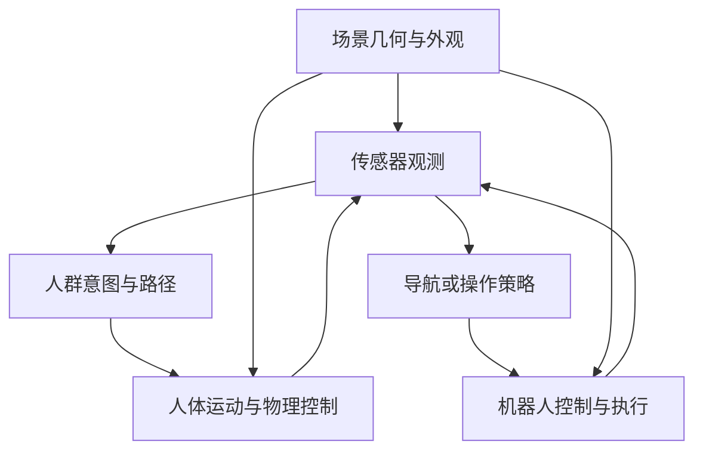

---
{
  "title": "跨论文对照与研究路线",
  "date": "2026-10-09 18:00:00",
  "collection": "research",
  "lang": "zh-CN",
  "permalink": "knowledge/paperread-roadmap/",
  "translation_path": "en/knowledge/paperread-roadmap/",
  "description": "从动作生成、策略适配与实时执行，到人体运动、导航环境和可验证实验。"
}
---

核对日期：2026-10-09。本文是基于逐篇原文阅读的综合分析；事实对应原论文，系统组合与实验建议均为本次总结的独立分析。完整题目、版本、来源和各篇详细方法见《论文总索引》。

## 1. 本项目最清楚的研究主线

这组论文共同围绕一个问题：**如何把从示范或大规模数据中学到的行为，转化为在真实时间、真实接触和动态环境中有效的机器人动作。**各篇处理的层级不同，主要形成五条相互联系的线：动作分布建模，策略适配与强化学习，实时执行，人体运动与交互生成，导航环境及评测。

ACT、Diffusion Policy 和 π₀ 提供动作生成的基础；MetaVLA、π_RL、RL Token 与 RL 泛化研究讨论如何继续提升策略；ADP、FLASH、RTC、Running VLAs、VLASH、DynamicVLA、DOMINO/PUMA 处理计算、时序或动态数据。人体动作与场景论文则提供训练和评测所需的环境变化，但其输出未必直接是物理可执行的控制量。（[ACT / ALOHA](/reading/p07/)；[Diffusion Policy](/reading/p08/)；[π₀](/reading/p09/)；[MetaVLA](/reading/p10/)；[π_RL](/reading/p11/)；[RL Token](/reading/p12/)；[RL 与 VLA 泛化实证](/reading/p13/)）

因此，“生成动作更好”“更新更快”“交互更真实”和“任务成功更多”应分别测量。一个模块的改善可能对下一层有帮助，也可能被接口错误或环境假设抵消。

## 2. 先区分五种时间，才能比较实时性

| 量 | 含义 | 常见误读 |
|---|---|---|
| 控制周期 | 机器人低层每隔多久接收或执行命令 | 把高频插值等同于高频视觉反馈 |
| 预测长度 $H$ | 每次模型输出多少未来动作 | 默认输出的所有动作都会执行 |
| 实际执行长度 $K$ | 新规划替换之前用了多少动作 | 与 $H$、去噪步数混为一谈 |
| 单次推理耗时 $T_{\mathrm{infer}}$ | 一次完整计算的延迟 | 与动作吞吐、任务完成时间混合 |
| 观测年龄 | 某条动作生效时，它依赖的观测已经过去多久 | 只测 GPU 时间而忽略相机、队列和网络 |

对于每次串行生成一个长度为 $H$ 的动作块，$H/T_{\mathrm{infer}}$ 可以描述动作生成吞吐量；它并不表示每秒完成同样多次独立的新视觉决策。流水线并行还会进一步区分延迟与吞吐，所以评测应使用真实时间戳，而非只按模型输出数量换算。（[π₀](/reading/p09/)；[RTC](/reading/p16/)；[DynamicVLA](/reading/p19/)）

### 七篇实时与动态论文分别改变什么

| 论文 | 主要改变 | 是否需要训练或微调 | 应重点核对的边界 |
|---|---|---|---|
| ADP | 按动作幅度与文本相关性剪视觉 token | 方法本身无需再训练 | 主要加速比按 FLOPs 定义；机器人小动作不代表环境静止 |
| FLASH / Realtime-VLA | 快速草稿、并行验证与回退刷新 | 需要训练草稿相关模块 | 草稿与验证器读到的信息新旧不同；快路径时间不是总体平均 |
| RTC | 用旧动作前缀引导新动作块补全，并发执行 | 主要是推理期方法 | 自动微分增加单次计算；已承诺执行部分存在反馈盲区 |
| Running VLAs | CUDA Graph、图变换、矩阵与算子优化 | 主要是实现优化 | 实测完整推理与未完整实现的流式框架需分开 |
| VLASH | 未来本体状态条件、偏移微调与异步执行 | 需要对应微调 | 预测本体状态不等于预测动态目标未来状态 |
| DynamicVLA | 多帧紧凑模型、持续推理、丢弃过期前缀、DOM 数据 | 需要模型训练及动态数据 | 动作索引频率与整块推理不同；有效后缀必须覆盖执行 |
| DOMINO / PUMA | 动态任务数据、历史光流与未来对象特征监督 | 需要对应训练 | 所存版本仿真未纳入真实推理延迟，不能直接与延迟实验排名 |

来源与细节：（[ADP](/reading/p14/)；[Realtime-VLA FLASH](/reading/p15/)；[RTC](/reading/p16/)；[Running VLAs](/reading/p17/)；[VLASH](/reading/p18/)；[DynamicVLA](/reading/p19/)；[DOMINO / PUMA](/reading/p20/)）。

三个具体例子最能说明口径差异。RTC 原文的模型延迟从 76 ms 增至 97 ms，但并发执行和减少重试仍可提高任务吞吐。Running VLAs 的双视图推理为 27.3 ms；完整高频力反馈流式控制在论文中仍是框架设想，接笔实验则只有 10 次连续测试。DynamicVLA 新版正文澄清 0.226 s/chunk、20 步动作块和 25 Hz 动作索引，因此原先 88 Hz 表述不能解释成每秒 88 次新视觉重规划。（[RTC](/reading/p16/)；[Running VLAs](/reading/p17/)；[DynamicVLA](/reading/p19/)）

## 3. 同样叫学习或适配，更新对象并不相同

| 论文 | 适配发生在哪里 | 实际学习信号 | 不能直接外推的结论 |
|---|---|---|---|
| RL² | 循环网络在一次 trial 中更新隐藏状态；外层训练参数 | 多任务跨 episode 累计回报 | 测试期没有参数梯度更新，不等于通用贝叶斯最优适配 |
| SimBa | 归一化、残差和层归一化组成的策略/价值网络 | 所配套 RL 算法的目标 | 参数扩展结果不直接证明图像 VLA 或任意模拟器都会受益 |
| MetaVLA | 读取示范上下文的 MAR 与多任务后训练 | 目标动作监督及上下文条件 | 外部示范读取不等于在线 RL 或未见技能全面泛化 |
| π_RL | 主要更新流模型动作专家与相关价值/噪声模块 | 模拟交互奖励与 PPO 类优化 | 不等于整个视觉语言主干在实机上在线更新 |
| RL Token | 冻结 VLA 和压缩表征后，更新小型 actor/critic | 真实奖励、参考动作约束、人工纠正 | 关键阶段提升不等于完整任务各阶段均已解决 |
| RL 泛化实证 | 在控制条件下比较 SFT 与 RL 适配 | 各算法对应的奖励或偏好目标 | 某些扰动上改善，不意味着所有新语义任务都提高 |

来源：（[RL²](/reading/p05/)；[SimBa](/reading/p06/)；[MetaVLA](/reading/p10/)；[π_RL](/reading/p11/)；[RL Token](/reading/p12/)；[RL 与 VLA 泛化实证](/reading/p13/)）。

这里还要分开两个“token”。动作令牌化综述把语言、代码、轨迹、潜变量等都作为模块接口；RL Token 论文里的 token 是由 VLA 特征压缩得到、供小型 RL 网络读取的连续表征。它不是直接输出给电机的一个离散动作编号。（[动作令牌化综述](/reading/p02/)；[RL Token](/reading/p12/)）

对强化学习结果，最有用的判断不是只有最终成功率，而是：初始 SFT 有多少示范、在线有多少环境交互、哪些参数更新、是否使用仿真真值、如何给奖励、是否包含人工接管与复位时间。π_RL 的少示范高成功率使用了额外模拟交互；RL Token 的有效数据分钟数也不等于总墙钟分钟数。（[π_RL](/reading/p11/)；[RL Token](/reading/p12/)；[RL-VLA 综述](/reading/p04/)）

## 4. 动作生成、人体运动与物理执行之间还有一层

ACT、Diffusion Policy、π₀ 学习机器人动作分布，分别通过 CVAE、扩散、流匹配组织生成过程。它们的动作块能改善模仿与连续行为，但若环境在块执行期间变化，仍需要执行层或动态策略处理反馈。（[ACT / ALOHA](/reading/p07/)；[Diffusion Policy](/reading/p08/)；[π₀](/reading/p09/)）

人体动作三篇有不同重点。MotionBricks 强调模块化运动表示、关键帧和快速动作合成，直接产物主要是运动学参考。Uni-Inter 统一人、物、场景的空间条件与关节概率输出，适合研究交互协调；它依赖时间片条件，实时因果响应仍是后续问题。GRAIL 则从已知三维资产出发，经视频生成、四维交互恢复和物理跟踪，产生机器人可用数据。（[MotionBricks](/reading/p21/)；[Uni-Inter](/reading/p22/)；[GRAIL](/reading/p23/)）

GRAIL 的证据尤其说明应分开评价：88.9% 是特定阈值下的帧级人—物跟踪比例，81.4% 是另一实验中以对象误差判定的 episode 级跟踪成功率，84%/80% 是已见/未见对象的真实拾取成功率。三个数不能放进同一个“成功率”平均值。（[GRAIL](/reading/p23/)）

若要构建导航背景人群，目标选择与避让、根轨迹、全身运动、物理接触和传感器遮挡应独立记录。只播放合理动画可以满足部分视觉评测；涉及推挤、跌倒和接触反馈时，还需要真实的物理控制与碰撞建模。NavIsaacLab 的高层路径与 AMP 低层人体控制正体现这种分层，但其报告仍有动作跟踪失败和吞吐瓶颈。（[NavIsaacLab](/reading/p26/)）

## 5. 视觉逼真不能替代场景几何与交互验证

Lyra 2.0 从图像和相机路径生成可探索世界，通过记忆检索和训练扰动改善回访一致性；生成的未见区域不必与真实房间一致，当前工作也主要针对静态环境。SAGE-3D 把高斯外观、对象语义和碰撞代理对齐，但其碰撞几何来自事先存在的艺术家网格及凸分解。（[Lyra 2.0](/reading/p30/)；[SAGE-3D](/reading/p29/)）

因此，对于“视频或生成场景进入 Isaac Sim”，至少要分别解决视觉外观、尺度与坐标、可碰撞几何、对象身份与物理参数。把一种文件格式转换成另一种格式，不自动完成这些步骤；图像质量分数也不等于导航可通行性或接触准确度。

下面是建议的系统划分，用于理解论文之间的接口，不表示任何单篇已经实现整套系统。

场景层可以研究 Lyra 2.0 与 SAGE-3D 的能力边界；人体层可以连接 MotionBricks、Uni-Inter、GRAIL 或 NavIsaacLab 的不同产物；策略和执行层则需要独立控制新观测时序。这种划分有助于发现究竟是视觉变化、行人行为、碰撞近似还是策略本身造成性能变化。

## 6. 社交导航需要统一指标分母和事件定义

NavDP 的特权几何监督主要用于训练数据与候选评分，不意味着部署读取全局真值地图，也不等于已经学习完整社交规范。FLUX 增加动态学习与 DynBench；Arena-Bench 2.0 强调 Nav2 接入与可复用评测；社交导航综述比较多类规划器，但改造、训练预算和代码公开程度影响可复现性。（[NavDP](/reading/p24/)；[FLUX](/reading/p25/)；[Arena-Bench 2.0](/reading/p27/)；[社交导航综述](/reading/p28/)）

| 指标 | 应固定的定义 | 跨论文中发现的关键问题 |
|---|---|---|
| 成功率 SR | 到达阈值、超时、允许碰撞次数、分母 | Arena-Bench 附录允许少于两次碰撞的成功口径与严格无碰撞到达不同 |
| SPL | 同一 episode 的成功指示、最短路径与实际路径 | 标准定义下 SPL 不应超过 SR；FLUX、SAGE-3D 部分表项需解释 |
| Collision | 真实接触、距离阈值事件、按步计数还是独立事件 | FLUX 的 Coll. 是近距离侵入代理，不能直接当作物理接触率 |
| 社会距离成本 | 阈值、持续时间、是否按人群人数归一化 | 名叫 Social Compliance 的 FLUX SC 实际越低越好 |
| 平滑性 | 差分周期、速度/加速度/jerk、坐标系 | 停滞或失败策略可能在部分平滑指标上占优 |
| 并行速度 | 总 agent steps/s、单代理频率、环境步和墙钟时间 | 合计吞吐不能当作每个行人的实时控制频率 |

具体原文定位和公式分析见各篇总结。（[Arena-Bench 2.0](/reading/p27/)；[FLUX](/reading/p25/)；[SAGE-3D](/reading/p29/)；[NavIsaacLab](/reading/p26/)）

对项目基准，应同时保留任务完成、真正接触、个人空间侵入、恢复行为、效率和运动质量。社会距离与朝向是可重复的代理量，但它们不等同于已通过真实参与者验证的舒适度或礼让规范。

## 7. 用四条阅读路线把论文连接起来

**理解动作生成**：先读 ACT 的动作块与 CVAE，再读 Diffusion Policy 的多模态分布与滚动执行，最后读 π₀ 的视觉语言先验和流动作专家。动作令牌化综述用于比较模块之间传递什么信息。

**研究动态 VLA**：从 RTC 的时序问题进入，再看 Running VLAs 的计算优化、FLASH 的草稿验证、VLASH 的未来本体状态、DynamicVLA 的动态数据与后缀执行，最后比较 DOMINO/PUMA 的动态表示。ADP 用来讨论何时减少视觉计算，而不是默认动态环境已经静止。

**研究策略提升**：RL² 提供“通过历史更新行为”的经典概念，SimBa 提供网络结构层面的 RL 扩展思路；RL-VLA 综述整理路线，再用 RL 泛化实证、π_RL、RL Token 和 MetaVLA 分别理解泛化证据、动作专家更新、小模型在线 RL 与上下文适配。

**研究 Isaac Sim 社交导航**：NavDP → FLUX → NavIsaacLab → Arena-Bench 与社交导航综述；人体运动补充 MotionBricks、Uni-Inter、GRAIL，环境层再读 SAGE-3D 与 Lyra 2.0。始终区分行人行为、全身动作、物理执行和机器人策略。

## 8. 从文献空白到可验证实验

以下为结合本项目的研究建议，不是这些论文已经给出的实验结论。

| 问题 | 最小有信息量的对照 | 关键记录 |
|---|---|---|
| 动态剪枝是否丢掉关键事件 | 固定策略与计算预算，分别在机器人静止/运动时触发目标位移 | 事件时间、保留 token、观测年龄、恢复率 |
| 异步收益来自哪里 | 同一基座比较同步、朴素异步、前缀补全、未来状态训练 | 成功率、实际执行块长、等待、重试、轨迹突变 |
| RL 是否提高未见任务能力 | 把视觉扰动、位置扰动、指令重述与全新技能分开留出 | 训练交互量、示范量、ID/OOD 分项及失败类型 |
| 生成场景是否改变策略排名 | 固定碰撞几何只换外观；固定外观只换几何代理 | 通行性误差、接触事件、排名与真实场景一致性 |
| 更自然的人体是否改善导航 | 固定根轨迹只换关节动作，再固定动作风格只换避让策略 | 导航结果、脚滑、朝向、近距离侵入和算力 |
| 精细接触提升是否可迁移 | 关键阶段和完整任务分别评估，改变进入关键阶段的初始状态 | 接管次数、复位时间、成功吞吐和全任务失败位置 |

建议优先完成能够单独归因的对照，之后再组合多个模块。把数据、模型、执行协议与环境同时替换，可能得到更高成功率，却很难判断哪一篇方法真正贡献了收益。

## 9. 版本与来源使用规则

本次主体以项目附件版本为准；联网资料用于核对正式题名、版本、官方实现及重要勘误。π₀ 的附件是 2024 年首版，文件名年份不作为发表年份；Uni-Inter 是 2025 年论文的 2026 年修订；MetaVLA 的 Adaption/Adaptation 拼写差异保留说明；VLASH 和 DynamicVLA 的新版指标或定义单独标注，不混入旧版表格。

综述中的排行榜与分类也不能替代原论文：Din 综述的控制频率和仿真器条目、中文综述的 HPT/RT-2 描述与数据规模均有需回查之处。逐篇稿已把原文主张、实验事实、独立推导和复现建议分开注明。本文没有运行论文代码、重新训练模型或复测机器人，所有实验数值均说明其原文来源和计量范围。
